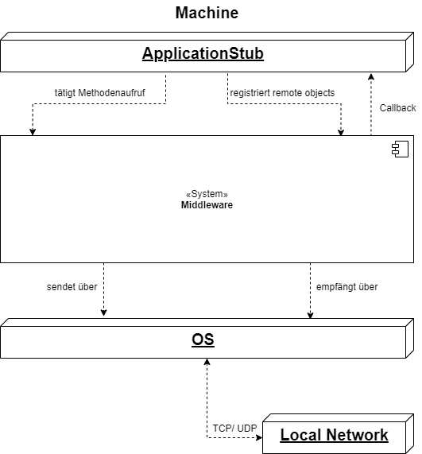
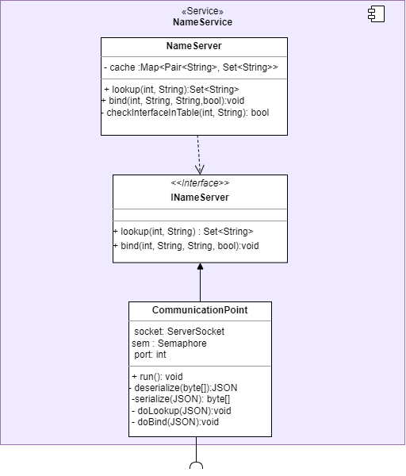
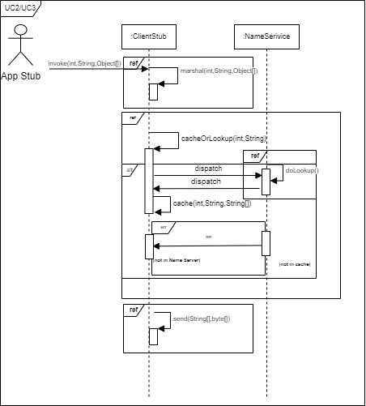

# 

**Über arc42**

arc42, das Template zur Dokumentation von Software- und
Systemarchitekturen.

Template Version 8.1 DE. (basiert auf AsciiDoc Version), Mai 2022

Created, maintained and © by Dr. Peter Hruschka, Dr. Gernot Starke and
contributors. Siehe <https://arc42.org>.

# Einführung und Ziele

Es wird eine Middleware für die verteilte Anwendung Game Of Trons entwickelt.

## Aufgabenstellung 

1. Callees in Application Stubs können sich als Remote Objects bei der Middleware mit ihrer physikalischen Adresse registrieren
2. Entgegennehmen und Weiterleitung eines Methodenaufrufs auf ein Remote Object
3. Umwandlung von Funktionsaufrufen in Nachrichten 
4. Vereinheitlicht Methodenaufrufe in ein vordefiniertes Nachrichtenformat
5. Die physikalische Adresse von Diensten kann abgefragt werden.
6. Kommunikation mit dem Betriebssystem, um Nachrichten zu versenden und zu empfangen
7. Nachrichten, die vom Betriebssystem empfangen wurden, können entgegengenommen werden
8. Umwandlung von Nachrichten in Funktionssignaturen
9. Funktionssignaturen werden an die ausführende Komponente weitergegeben


## Qualitätsziele 

| ID | Qualitätsziel | Kurzbeschreibung |
| --- | --- | --- |
| Q1 | Verteilungstransparenz| Entfernte Zugriffe, Bewegungen, Migrationen und Replikationen werden vom Nutzer versteckt|
| Q2 | Offenheit (Openness) |  Schnittstellen müssen gut definierte Ablauf- und Fehlersemantik haben, Komponenten sollten austauschbar sein, Erweiterung um Komponenten sollte möglich sein|
| Q3 | Geographische Skalierung | Die Benutzer können sich überall auf der Welt befinden |


## Stakeholder 

|Rolle|Kontakt|Erwartungshaltung|
|-|-|-|
|Kunde  |Martin Becke   |Entwicklung eines Tron-Spiels als verteiltes System, gut dokumentiert (Code <-> Dokumentation), Konzepte aus der Vorlesung sinnvoll angewendet und verstanden|
|Entwickler|Kathleen Neitzel, Kjell May, Viviam Ribeiro| - Funktionsfähige Middleware mit gewünschter Funktionalität entwickeln, dass das Spiel an mehreren Rechnern gespielt werden kann|
|Kunde|GameOfTrons|Möglichkeit auf mehreren Rechnern gespielt werden zu können|


# Randbedingungen 

# Kontextabgrenzung 

## Fachlicher Kontext 


| Use Case |Vorbedingung |Ablaufsemantik |Nachbedingung |Fehlerfälle | Erweiterungsfälle |
| --- | --- | --- | --- | --- | --- |
| UC1 Register Method | Ein definiertes Interface soll für RPCs erreichbar sein | **1.** Der Application Stub ruft den Server-Stub der Middleware auf <br> **2.**  Der ServerStub ruft den Name-Server auf <br>**3.** Der NameServer prüft, ob die Schnittstelle nicht bereits in der Tabelle eingetragen ist.<br> **4.** Der NameServer trägt den Schnittstellenidentifikator und die dazugehörige Adresse in eine Tabelle ein<br> | In der Tabelle des NameServers ist die Schnittstelle und ihre Adresse eingetragen. | |**3.a.1** Die Schnittstelle ist bereits m NameServer eingetragen <br> **3.a.2** Die eingetragene Adresse wird mit der neuen überschrieben |
| UC2 Invoke Method |In der Anwendung wird eine Methode einer Remote-Komponente aufgerufen | **1.** Das System ruft den Application-Caller-Stub der aufrufenden Komponente auf <br> **2.** Der  Application Stub ruft die Middleware-Schnittstelle auf <br> **3.** Es wird geprüft, ob eine Adresse und Portnummer zur aufgerufenen Methode eingetragen ist  (siehe UC5) <br> **4.** Die Adresse und die Portnummer werden aus dem Name Server geholt <br> **5.** Der Client Stub wandelt den Methodenaufruf in eine Nachricht um (siehe UC3) <br> **6.** Der Client Stub ruft die Senderkomponente auf (siehe UC 3.1)| Die Nachricht wurde verschickt|**3.a.1** Die aufgerufene Komponente ist nicht bei der Middleware registriert <br> **3.a.2** Das System wirft eine Exception auf.| |
| UC3 Marshaling Method Call| UC2 bis Schritt 2 | **1.** Der Client Stub serialisiert den Methodenaufruf in ein Nachrichtenformat <br> **2.** Weiter mit UC 3.1| Der Methodenaufruf ist als Nachricht vorhanden | | |
| UC3.1 send |Eine Nachricht wurde in der Middleware erzeugt und soll versendet werden.|**1.** Der Client Stub ruft den Sender auf <br> **2.** Der Sender erstellt ein Socket  <br> **3.** Den Sender erstellt ein UDP-Datagramm mit der zu versendenden Nachricht, die Empfänger-Adresse und die Empfänger-Portnummer. |Die Nachricht wurde versendet|||
| UC4 Unmarshaling Message | Der Receiver in der Middleware hat eine Nachricht empfangen| **1.** Der Receiver ruft die ServerStub-Komponente auf <br> **2.** Der ServerStub nutzt den Unmarshaler, um die Nachricht in einen Methodenaufruf umzuwandeln <br> **3.** Der Server Stub ruft die Application-Stub-Callee-Schnittstelle der Komponente auf, die den Methodenaufruf empfangen soll (siehe UC5)| Ein Methodenaufruf wurde erzeugt| | |
| UC4.1 receive | UC 3.1: Eine Nachricht wurde über das Netzwerk versendet  |**1.** Der Socket im Receiver der Middleware des Empfängers bekommt ein UDP-Datagramm <br> **2.** Der Receiver ruft die Server-Stub-Komponente auf (siehe UC4)| Eine Nachricht liegt in der Middleware des Empfängers vor|||
| UC5 lookup | UC2: Invoke Method bis Schritt 2 | **1.** Der Client Stub ruft den Nameserver auf <br> **2.** Der NameServer prüft,ob die aufgerufene Methode mit der dazugehörigen Adresse und Portnummer in der Tabelle eingetragen ist<br> **3.** Der NameServer liefert die zugehörige IP-Adresse und Portnummer zurück | Die  IP-Adresse und die Portnummer zu der gesuchten Funktion werden zurückgegeben | Es gibt keinen Eintrag mit dieser ID. Dann wird der RPC verworfen. ||
| UC6 Call Method | UC 4 : Der Server Stub hat eine Nachricht in einen Methodenaufruf umgewandelt |**1.** Der ServerStub ruft die Call-Schnittstelle des Application-Callee-Stubs <br> **2.** Der Application-Callee-Stub ruft die dazugehörige Komponente lokal auf. | Die aufgerufene Methode wird ausgeführt.|


## Technischer Kontext




# Lösungsstrategie 

## Methodenliste

| Usecase | Akteur |Funktionssignatur| Vorbedingung | Nachbedingung | Ablaufsemantik | Fehlersemantik |
|---|---|---|---|---|---|---|
|UC1| ServerStub| void register(int, IRemoteObject remoteObject, String, InetAddress, int, bool) | Ein CalleeStub aus dem ApplicationStub möchte sich als RemoteObject registrieren | Das Remote Object wurde im Name Server und in der lokalen Tabelle im Server Stub aufgenommen.| Der Server Stub erstellt eine Nachricht aus den Daten in den Aufrufparametern (Aufruf serializeNS()) und schickt eine Nachricht nach dem TCP-Protokoll an den Name Server. Der Name Server schickt die eingetragene Multicast-Adresse, wenn eine neue Multicast-Adresse zugewiesen wurde, ein leerer String über eine Nachricht zurück. Die Adresse (oder leerer String) wird aus der Nachricht entpackt (Aufruf deserializeNS() ). Die im Aufrufparameter angegebene Interface-ID und das angegebene RemoteObject werden in der lokalen Tabelle eingetragen (wenn die ID noch nicht vorhanden ist). Wenn die vom Name Server erhaltene Antwort kein leerer String ist, wird die Methode addGroup(InetAddress) aufgerufen. | |
|UC1| ServerStub | void addGroup(InetAddress)| Ein Remote-Object 
|UC1|  NameServer | int bind(int, String InetAddress, int) | Eine Nachricht ist aus einem ServerStub angekommen, die Daten wurde aus der Nachricht entpackt und als Aufrufparameter genutzt | Das RemoteObject wurde im NameServer gespeichert | Der NameServer prüft, ob zur mitgegebenen ID und Methodennamen bereits ein Eintrag vorhanden ist(Aufruf checkInterfaceInTable).  Aus der übergebenen Interface-ID wird eine eindeutige Object-ID erzeugt. Die Object-ID und der Methodenname werden mit der übergebenen InetAddress und Portnummer eingetragen. Die erzeugte Object-ID wird an den anfragenden Server Stub zurückgeschickt.| Eintrag mit der ID und dem Methodennamen existiert bereits. Dann wird der Eintrag überschrieben. Wenn es sich um eine Modelschnittstelle handelt und eine andere Model-Komponente hat sich bereits eingetragen, dann wird keine weitere Model-Komponente registriert. Der Name Server schickt in dem Fall -1 an den Server Stub zurück. |
|UC1| NameServer | boolean checkInterfaceInTable(int, String) | Ein CalleeStub möchte sich als RemoteObject eintragen und hat register() aufgerufen | Es wird true zurückgegeben, wenn bereits ein Eintrag existiert sonst false| Der Name Server prüft, ob zur übergebenen ID und Methodennamen bereits ein Eintrag in der Tabelle existiert| |
|UC2| ClientStub | void invoke(int, String, Object[]) | Eine Komponente ruft eine Remote-Komponente über eine Application Stub Schnittstelle auf | Der Aufruf wurde geprüft und die Methode marshal() wurde aufgerufen |  Prüft mithilfe von lookup() ob die übergebene Objekt-ID (erster Parameter) und die Methode (zweiter Parameter) registriert ist. Dann wird die Methode marshal() aufgerufen | Wenn die Objekt-ID nicht registriert ist, wird eine Exception geworfen|
|UC3| ClientStub | byte[] marshal(int,String, Object[]) | Funktionsaufruf über invoke wurde getätigt, zugehörige InetAddress und Portnummer wurde durch NameResolver ermittelt | Funktionsaufruf wurde marshaled und zurückgegeben | Es wird eine Nachricht im JSON-Format aus den übergebenen Parametern InterfaceID, Methodenname und Methodenparameter (Object[]) zusammengebaut. Das JSON-Objekt wird in ein byte-Array umgewandelt und zurückgegeben | |
|UC3.1| ClientStub | void send(InetAdress, int, byte[]) | Funktionsaufruf wurde marshaled, zugehörige InetAddress und Portnummer druch NameResolver ermittelt | Nachricht wurde verschickt | Die marshaled Nachricht wird über einen Socket an die passende InetAddress und Portnummer verschickt. | |
|UC4| ServerStub | JSON unmarshal(byte[]) | Nachricht wurde über receive empfangen | Nachrichteninhalt wurde extrahiert und kann für call genutzt werden | | (checksum stimmt nicht überein -> ignorieren) |
|UC4.1| ServerStub |  receive(DatagramPacket)) | Ein Socket im Server Stub hat eine Nachricht empfangen | Nachricht wurde aus dem Packet entpackt und dem Marshaler übergeben. | Die Nachricht wird aus dem übergebenen Datagram-Paket herausgeholt und dem Unmarshaler übergeben | |
|UC5| Client Stub | String[] cacheOrLookup(int,String) | Ein Application Stub hat invoke aufgerufen, um eine Remote-Methode aufzurufen. Der Client Stub muss im nächsten Schritt prüfen, ob die aufgerufene Methode im Cache des Client Stubs eingetragen ist. | Die Adresse und die Portnummer der angefragten Methode werden zurückgegeben.| Es wird in der Cache-Tabelle des Client-Stubs nachgeschaut, ob es einen Eintrag zur angegebenen ID(int) und dem angegebenen Methodenname(String) existiert. Wenn ja, dann wird ein Array mit der eingetragenen IP-Adresse (Index 0) und Portnummer (Index 1) zurückgegeben. Wenn nicht, dann wird eine Nachricht aus der angegebenen ID und dem Methodennamen erstellt (Aufruf serializeNS() ) und an den Name Server über TCP geschickt. Die erhaltene Antwort vom Name Server wird entpackt (Aufruf deserializeNS() ) im selben Array-Format zurückgegeben.| Es gibt auch im Name Server keinen Eintrag mit der ID und dem Methodennamen (leere Strings als Antwort erhalten). Der RPC wird abgebrochen|
|UC5| Name Server | void lookup(int, String) | Eine angefragte Methode ist nicht im Cache des Client Stubs gespeichert. Der Client Stub schickt eine Nachricht an den Name Server mit einer Lookup-Anfrage.| Die Adresse und die Portnummer der angefragten Methode werden über eine Nachricht zurückgeschickt.|Der Name Server prüft, ob es einen Eintrag in der Tabelle mit der übergebenen Interface-ID und Methodenname gibt. Wenn ja, dann werden die IP-Adresse und die Portnummer an den anfragenden Client Stub zurückgeschickt.| Es gibt keinen Eintrag mit der ID und dem Methodennamen. Es werden leere Strings zurückgeschickt. |
|UC6| ServerStub | void callRemoteObjectInterface(JSON) | Nachricht wurde vom ServerStub empfangen und unmarshaled | Der Server Stub holt die Interface-ID, den Methodennamen und die Aufrufparameter aus dem JSON-Objekt heraus und ruft das korrekte Remote-Object-Interface auf.|Das RemoteObject-Interface wurde aufgerufen  | | 


## Nachrichtenformat
Um RPCs durchzuführen müssen Methodenaufrufe in Nachrichten umgewandelt werden. Dafür bringen wir die Methodenaufrufe erstmal in ein einheitliches JSON-Format.
<br>
<br>
JsonObjectInvoke = {<br>
    "interfaceID": 12,<br>
    "methodName": "changeDir",<br>
    "args": [<br>
        "type1": "int",<br>
        "val1": 1,<br>
        "typeN": "TYP",<br>
        "valN": val<br>
    ]<br>
}
<br>

Die Nachricht im JSON-Format wird dann in ein byte-Array umgewandelt und über das Netzwerk verschickt.
<br>
<br>
<br>

Für die Anfrage an den Name Server (siehe Lösungsstrategie register und lookup) werden ebenfalls Nachrichten benötigt. Für diesen Anwendungsfall haben wir das folgende JSON-Nachrichtenformate definiert:

**JsonObjectLookUp** = { <br>
    "method": 0(lookup), <br>
    "args": [<br>
        "ifaceID": Int,<br>
        "methodName": Str,<br>
        ("playerID": Int)<br>
    ]<br>
}
<br>
<br>
**JsonObjectRegister** = {<br>
    "method": 1(register),<br>
    "args": [<br>
        "ifaceID": Int,<br>
        "methodName": Str,<br>
        "IpAddr": "XXX.XXX.XXX.XXX",<br>
        "Port": "YYYYY"<br>
    ]<br>
}
<br>
<br>

Auf beide Anfragen an den Name Server wird eine Antwort erwartet. Im Folgenden definieren wir die Antwortformate vom Name Server an den Client Stub bzw. Server Stub:
<br>

**Format für die Antwort auf eine Register-Anfrage:**
int<br>
--> Die Antwort kommt als ein Byte-Array zurück. Das Byte-Array wird als ein int interpretiert.

<br>
<br>

**Format für die Antwort auf eine Lookup-Anfrage:**
<br>
JSONObjectLookupResponse = {<br>
  "IpAddr": "XXX.XXX.XXX.XXX",<br>
  "Port": "YYYYY"<br>
 }
  
 <br>
 
 Wenn die Lookup-Anfrage **fehlgeschlagen** ist (kein Eintrag vorhanden), dann werden leere Strings zurückgeschickt:
 <br>
JSONObjectLookupResponseError = {
  "IpAddr": "",<br>
  "Port": ""<br>
 }
 <br>
 
# Bausteinsicht 

## Whitebox Gesamtsystem


Die Middleware ist in drei Komponenten aufgeteilt: Client Stub, Server Stub und Name Service. Des Weiteren werden die Middleware-Schnittstellen hinter einer Fassade gekapselt.
Die Funktionen der einzelnen Komponenten werden im weiteren Verlauf aufgeführt.


### Blackbox Client Stub

Der Client Stub nimmt Funktionsaufrufe vom Application Stub entgegen und wandelt diese in ein vordefiniertes Nachrichtenformat um.
Die Nachricht wird an eine Remote-Komponente über das Betriebssystem geschickt. Dafür fragt der Client-Stub erstmal nach der physikalischen Adresse der Remote-Komponente.

*Schnittstelle IRemoteInvocation*
<br>
Die Schnittstelle IRemoteInvocation kann aufgerufen werden, um eine Remote-Methode aufruzufen.

|Methode| Kurzbeschreibung |
| --- | --- |
|invoke(int interfaceID, String methodName, Object[] args) | Erzeugt eine Nachricht aus dem Funktionsaufruf und ruft die Betriebssystemschnittstelle zum Versenden der Nachricht auf. |

### Blackbox Server Stub

Der Server Stub empfängt Nachrichten über das Betriebssystem und wandelt sie in Funktionsaufrufe um. Die Funktion wird dann an das zuständige Remote Object im Application Stub weitergeleitet. Dafür müssen sich die Remote Objects erstmal über den Server Stub beim Name Service registrieren.

*Schnittstelle IRegister**

Die Schnittstelle IRegister kann aufgerufen werden, um sich als Remote-Object im Name Server einzutragen.

|Methode| Kurzbeschreibung |
|---|---|
| register(int interfaceID, String, InetAdress, int)| Schickt eine Nachricht an die NameService-Komponenten mit den Informationen, die für das Eintragen notwendig sind. Diese Informationen werden über die Aufrufparameter übergeben.|

### Blackbox Name Service

Der NameService verwaltet die IDs der Remote Objects, die sich registriert haben und die dazugehörigen IP-Adressen und Portnummern.
Beim Name Service kann man die physikalische Adresse eines Remote Objects anfragen oder sich als Remote Object registrieren. Dafür werden Nachrichten über TCP ausgetauscht.

**Diese Komponente bietet keine Schnittstellen an. Die Dienste können über Nachrichtenaustausch genutzt werden**

Nachrichtenfromate unter Lösungsstrategie.


## Ebene 2 
 

## Ebene 3


### Whitebox Client Stub
<br>

 

<br>

|Methode| Kurzbeschreibung|
| --- | --- |
|invoke(int, String, Object[]) | Ruft die Methoden marshal(), dann cacheOrLookup(), dann send() auf|
|serializeNS(int, String) | Packt die Aufurfparameter in ein JSON-Nachrichtenformat. Wandelt das JSON-Objekt in ein byte-Array um.|
| deserializeNS(byte[]) | Entpackt die Daten aus der Nachricht und gibt sie in einem String[]-Array der Länge 2 (Index 0: IP-Adresse, Index 1: Portnummer) zurück.|
|byte[] marshal(int,String,Object[]) | erzeugt ein JSON-Objekt aus den übergebenen Parametern und wandelt es in ein byte-Array um, das zurückgegeben wird. |
|cacheOrLookup(int,String,String[]):String[]| Gibt ein String-Array mit der IP-Adresse und Portnummer des gesuchten Remote-Objects zurück. Sucht erstmal im lokalen Cache-Speicher und wenn der Eintrag dort nicht vorhanden ist, wird eine Nachricht erstellt (Aufruf serializeNS() ) und an den Name Server geschickt. Das Ergebnis wird aus der Nachricht entpackt (Aufruf deserialize() )im Cache gespeichert (Aufruf cache() ) und zurückgegeben. |
|cache(int, String, String[]| Trägt den String-Array mit IP-Adresse und Portnummer unter der angegebenen ID und Methodennamen im Cache-Speicher ein.|
|send(InetAddress, int, byte[]| Verpackt die angegebene Nachricht in ein UDP-Datagramm und schickt die das Paket an die angegebne IP-Adresse und Portnummer.|


### Whitebox Server Stub
<br>


<br>

|Methode| Kurzbeschreibung|
| --- | --- |
|register(int, IRemoteObject, String, InetAddress, int, bool)| Packt Aufrufparameter in eine Nachricht (Aufruf serializeNS() ) und schickt sie an den Name Server mit den notwendigen Registrierungsdaten. Empfängt und entpackt (Aufruf deserializeNS() die Antwort vom Name Server, wenn die Antwort nicht -1 ist, wird das RemoteObject in den Aufrufparametern zusammen mit der ID in den Aufrufparametern in der lokalen Tabelle eingetragen. Wenn die erhaltene Antwort kein leerer String ist, wird sie für den Aufruf von addGroup(InetAddress) genutzt, wen.|
|serializeNS(int, String,String,int)| Erstellt eine Nachricht im JSON-Format aus den Aufrufparametern und wandelt das JSON-Objekt in ein byte-Array um, das zurückgegeben wird.|
|deserializeNS(byte[])| Wandelt das angegebene byte[]-Array in ein int um, der zurückgegeben wird.|
| run() | Eine Endlosschleife, die auf ankommende Pakete wartet. Wenn ein Paket ankommt, wird ein neuer Thread erzeugt, der die Methode receive() aufruft und das angekommene Paket übergibt.|
| receive(DatagramPacket) | Entpackt den Nachrichtinhalt aus dem UDP-Paket und ruft die Methode unmarshal() auf.|
|addGroup(InetAdress multicastAddres)| Ruft die MultiSocket-Methode joinGroup(multicastAddress) auf. |
| unmarshal(byte[]) | Wandelt das übergebene byte-Array in ein JSON-Objekt um und ruft die Methode callRemoteObjectInterface() auf. |
| callRemoteObjectInterface(JSON)| Entpackt die Daten aus dem angegebenen JSON-Objekt, sucht in der lokalen Tabelle nach dem Remote Object, das unter der im JSON angegebenen ID eingetragen ist. Ruft mit Methode call() des eingetragenen Remote Objects.|


### Whitebox Name Service
<br>



<br>

|Methode| Kurzbeschreibung|
| --- | --- |
|lookup(int, String)| Prüft ob gesuchtes Interface und Methode eingetragen sind (Aufruf checkInterfaceInTable). Wenn ja, wird ein String-Array der Länge 2 (Index 0: IP-Adresse, Index 1: Portnummer) zurückgegeben.|
|bind(int, String, InetAddress, int)| Prüft, ob das zu registrierende Interface bereits in der Tabelle ist. Prüft, ob das zu registrierende Interface ein Model ist (Aufruf checkIfModel() ). Wenn beide Fälle zutreffen, dann wird die Tabelle nicht verändert und es wird -1 zurückgegeben. Sonst wird das Interface unter der eingegeben IP-Adresse und Portnummer eingetragen.|
|checkInterfaceInTable(int, String)|Prüft, ob das zu registrierende Interface und die Methode bereits in der Tabelle ist|
|checkIfModel(int)| Prüft, ob die das zu registrierende Interface ein Model ist |
|run()| Endlosschleife, die TCP-Pakete entgegennimmt. Wenn ein Paket ankommt, wird ein neuer Thread zur Behandlung erzeugt. Der neue Thread entpackt den Nachrichteninhalt aus dem Paket (Aufruf deserialize() ), prüft, welche Anfrage geschickt wurde (lookup oder register), ruft die entsprechende Methode auf. Packt das Ergebnis in eine Nachricht (Aufruf serialize() ) und schickt die Nachricht zurück an den Sender.|
|deserialize(byte[])|entpackt den Nachrichteninhalt aus dem Paket|
|serialize(JSON)|Packt das Ergebnis von lookup() in eine Nachricht. Gibt ein byte-Array zurück.|


# Laufzeitsicht 

## Use Case 1 Register Method


## Use Case 2/3 Invoke Method / Lookup Method



## AD register


## AD bind


## AD lookup


# Verteilungssicht {#section-deployment-view}

**Einordnung der Middleware im Gesamtsystem**


## Infrastruktur Ebene 1 {#_infrastruktur_ebene_1}

***\<Übersichtsdiagramm>***

Begründung

:   *\<Erläuternder Text>*

Qualitäts- und/oder Leistungsmerkmale

:   *\<Erläuternder Text>*

Zuordnung von Bausteinen zu Infrastruktur

:   *\<Beschreibung der Zuordnung>*

## Infrastruktur Ebene 2 {#_infrastruktur_ebene_2}

### *\<Infrastrukturelement 1>* {#__emphasis_infrastrukturelement_1_emphasis}

*\<Diagramm + Erläuterungen>*

### *\<Infrastrukturelement 2>* {#__emphasis_infrastrukturelement_2_emphasis}

*\<Diagramm + Erläuterungen>*

...

### *\<Infrastrukturelement n>* {#__emphasis_infrastrukturelement_n_emphasis}

*\<Diagramm + Erläuterungen>*

# Querschnittliche Konzepte {#section-concepts}
Auf folgende querschnittlichen Konzepte haben wir uns gemeinsam mit unserer Partnergruppe Gamma 4 geeinigt:

## Nachrichtenformat
Um RPCs durchführen zu können müssen Methodenaufrufe in Nachrichten umgewandelt werden. Dafür werden die Methodenaufrufe in ein einheitliches JSON-Format transformiert. Verschickt wird ein JSON-Objekt mit der Interface-ID des adressierten Interfaces, der Methodenname und die Aufrufparameter der Methode mit jeweiligem Typ und Wert in einem Array.

```json
(JsonObjectMessage = {
    "interfaceID": Interface-ID als int,
    "methodName": Methodenname als String,
     "args": [
        "type1": primitiver Datentyp des ersten Aufrufparameters als String,
        "val1": der Wert des ersten Aufrufparameters,
        "typeN": primitiver Datentyp des n-ten Aufrufparameters als String,
        "valN": der Wert des n-ten Aufrufparameters
    ]
})
```

Das JSON-Objekt wird in ein Byte-Array umgewandelt, und über das Netzwerk verschickt.
Einige beispielhafte RPCs sind im Folgenden skizziert:

```json
(JsonObjectInvoke = {
    "interfaceID": 12,
    "methodName": "changeDir",
    "args": [
        "playerNumber": 1,
        "direction": 2
    ]
})
JsonObjectInvoke = {
    "interfaceID": 12,
    "methodName": "changeDir",
    "args": [
        "type1": "int",
        "val1": 1,
        "typeN": "TYP",
        "valN": val
    ]
}
JsonObjectLookUp = {
    "method": 0(lookup),
    "args": [
        "ifaceID": Int,
        "methodName": Str,
        ("playerID": Int)
    ]
}
JsonObjectRegister = {
    "method": 1(register),
    "args": [
        "ifaceID": Int,
        "methodName": Str,
        "IpAddr": "XXX.XXX.XXX.XXX",
        "Port": "YYYYY"
    ]
}
```

## *\<Konzept 2>* {#__emphasis_konzept_2_emphasis}

*\<Erklärung>*

...

## *\<Konzept n>* {#__emphasis_konzept_n_emphasis}

*\<Erklärung>*

# Architekturentscheidungen {#section-design-decisions}

# Qualitätsanforderungen {#section-quality-scenarios}

::: formalpara-title
**Weiterführende Informationen**
:::

Siehe [Qualitätsanforderungen](https://docs.arc42.org/section-10/) in
der online-Dokumentation (auf Englisch!).

## Qualitätsbaum {#_qualit_tsbaum}

## Qualitätsszenarien {#_qualit_tsszenarien}

# Risiken und technische Schulden {#section-technical-risks}

# Glossar {#section-glossary}

+-----------------------+-----------------------------------------------+
| Begriff               | Definition                                    |
+=======================+===============================================+
| *\<Begriff-1>*        | *\<Definition-1>*                             |
+-----------------------+-----------------------------------------------+
| *\<Begriff-2*         | *\<Definition-2>*                             |
+-----------------------+-----------------------------------------------+
