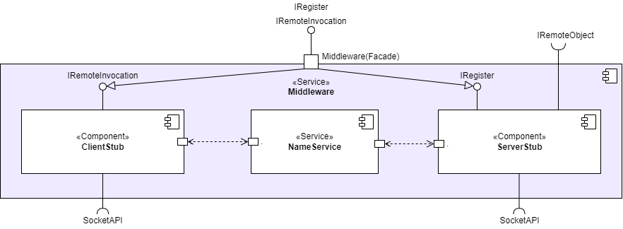

# 

**Über arc42**

arc42, das Template zur Dokumentation von Software- und
Systemarchitekturen.

Template Version 8.1 DE. (basiert auf AsciiDoc Version), Mai 2022

Created, maintained and © by Dr. Peter Hruschka, Dr. Gernot Starke and
contributors. Siehe <https://arc42.org>.

# Einführung und Ziele

## Aufgabenstellung 

**Grundlegende Aufgaben der Middleware**
1. Funktionsaufrufe werden in Nachrichten umgewandelt
2. Nachrichten werden in Funktionsaufrufe umgewandelt
3. Die Middleware soll message-oriented sein
4. Vereinheitlicht die Kommunikationsdatentypen durch RPC
5. Application Stubs können sich als Remote objects bei der Middleware anmelden

## Qualitätsziele 

| ID | Qualitätsziel | Kurzbeschreibung |
| --- | --- | --- |
| Q1 | Verteilungstransparenz| Entfernte Zugriffe, Bewegungen, Migrationen und Replikationen werden vom Nutzer versteckt|
| Q2 | Offenheit (Openness) |  Schnittstellen müssen gut definierte Ablauf- und Fehlersemantik haben, Komponenten sollten austauschbar sein, Erweiterung um Komponenten sollte möglich sein|

## Stakeholder 

+-----------------+-----------------+-----------------------------------+
| Rolle           | Kontakt         | Erwartungshaltung                 |
+=================+=================+===================================+
| *\<Rolle-1>*    | *\<Kontakt-1>*  | *\<Erwartung-1>*                  |
+-----------------+-----------------+-----------------------------------+
| *\<Rolle-2>*    | *\<Kontakt-2>*  | *\<Erwartung-2>*                  |
+-----------------+-----------------+-----------------------------------+

# Randbedingungen {#section-architecture-constraints}

# Kontextabgrenzung {#section-system-scope-and-context}

## Fachlicher Kontext 

| Use Case |Vorbedingung |Ablaufsemantik |Nachbedingung |Fehlerfälle | Erweiterungsfälle |
| --- | --- | --- | --- | --- | --- |
| UC1 Register Method | | | | | |
| UC2 Invoke Method |In der Anwendung wird eine Methode einer Remote-Komponente aufgerufen | **1.** Das System ruft den Application-Caller-Stub der aufrufenden Komponente auf   **2.** Der  Application Stub ruft die Middleware-Schnittstelle auf   **3.** Die Middleware prüft, ob die aufgerufene Komponente registriert ist   **4.**Die Middleware wandelt den Methodenaufruf in eine Nachricht um (siehe UC3)   **5.** Die Middleware ruft das Betriebssystem auf| Die Nachricht wurde verschickt|**3.a.1** Die aufgerufene Komponente ist nicht bei der Middleware registriert   **3.a.2** Das System wirft eine Exception auf.| |
| UC3 Marshaling Method Call| UC2 bis Schritt 2 | **1.** Der Marshaler serialisiert den Methodenaufruf wird in das Nachrichtenformat  **2.** Weiter mit UC Schritt 4| Der Methodenaufruf ist als Nachricht vorhanden | | |
| UC4 Unmarshaling Message | Die Middleware hat eine Nachricht empfangen| **1.** Der Unmarshaler wandelt die Nachricht in einen Methodenauf um   **2.** Der Unmarshler ruft den Application-Stub der Komponente auf, die den Methodenaufruf empfangen soll (siehe UC5)| Ein Methodenaufruf wurde erzeugt| | |
| UC5 Call Method | UC 4 : Der Unmarsharler hat eine Nachricht in einen Methodenauf umgewandelt |**1.** Der Unmarshler ruft die Call-Schnittstelle des Application-Callee-Stubs   **2.** Der Application-Callee-Stub ruft die dazugehörige Komponente lokal auf. | Die aufgerufene Methode wird ausgeführt.|

## Technischer Kontext {#_technischer_kontext}

# Lösungsstrategie 

| Akteur | Vorbedingung | Nachbedingung | Methodensignatur | Ablaufsemantik | Fehlersemantik |
|---|---|---|---|---|---|
| ClientStub | Eine Komponente ruft eine Remote-Komponente über eine Application Stub Schnittstelle auf | Der Aufruf wurde geprüft und die Methode marshall() wurde aufgerufen |invoke(int, String, Object[] )|  Prüft ob die übergebene Objekt-ID (erster Parameter) registriert ist. Dann wird die Methode marshall() aufgerufen | Wenn die Objekt-ID nicht registriert ist, wird eine Exception geworfen|
| ServerStub | | | call() | | |
| | | |register()| | |
| | | | send() | | |
| | | receive() | | |
| | | marshall() | | |
| | | unmarshall() | | |

# Bausteinsicht 

## Whitebox Gesamtsystem 

Wichtige Schnittstellen

:   *\<Beschreibung wichtiger Schnittstellen>*

### \<Name Blackbox 1> {#__name_blackbox_1}

*\<Zweck/Verantwortung>*

*\<Schnittstelle(n)>*

*\<(Optional) Qualitäts-/Leistungsmerkmale>*

*\<(Optional) Ablageort/Datei(en)>*

*\<(Optional) Erfüllte Anforderungen>*

*\<(optional) Offene Punkte/Probleme/Risiken>*

### \<Name Blackbox 2> {#__name_blackbox_2}

*\<Blackbox-Template>*

### \<Name Blackbox n> {#__name_blackbox_n}

*\<Blackbox-Template>*

### \<Name Schnittstelle 1> {#__name_schnittstelle_1}

...

### \<Name Schnittstelle m> {#__name_schnittstelle_m}

## Ebene 2 {#_ebene_2}

### Whitebox *\<Baustein 1>* {#_whitebox_emphasis_baustein_1_emphasis}

*\<Whitebox-Template>*

### Whitebox *\<Baustein 2>* {#_whitebox_emphasis_baustein_2_emphasis}

*\<Whitebox-Template>*

...

### Whitebox *\<Baustein m>* {#_whitebox_emphasis_baustein_m_emphasis}

*\<Whitebox-Template>*

## Ebene 3 {#_ebene_3}

### Whitebox \<\_Baustein x.1\_\> {#_whitebox_baustein_x_1}

*\<Whitebox-Template>*

### Whitebox \<\_Baustein x.2\_\> {#_whitebox_baustein_x_2}

*\<Whitebox-Template>*

### Whitebox \<\_Baustein y.1\_\> {#_whitebox_baustein_y_1}

*\<Whitebox-Template>*

# Laufzeitsicht {#section-runtime-view}

## *\<Bezeichnung Laufzeitszenario 1>* {#__emphasis_bezeichnung_laufzeitszenario_1_emphasis}

-   \<hier Laufzeitdiagramm oder Ablaufbeschreibung einfügen>

-   \<hier Besonderheiten bei dem Zusammenspiel der Bausteine in diesem
    Szenario erläutern>

## *\<Bezeichnung Laufzeitszenario 2>* {#__emphasis_bezeichnung_laufzeitszenario_2_emphasis}

...

## *\<Bezeichnung Laufzeitszenario n>* {#__emphasis_bezeichnung_laufzeitszenario_n_emphasis}

...

# Verteilungssicht {#section-deployment-view}

## Infrastruktur Ebene 1 {#_infrastruktur_ebene_1}

***\<Übersichtsdiagramm>***

Begründung

:   *\<Erläuternder Text>*

Qualitäts- und/oder Leistungsmerkmale

:   *\<Erläuternder Text>*

Zuordnung von Bausteinen zu Infrastruktur

:   *\<Beschreibung der Zuordnung>*

## Infrastruktur Ebene 2 {#_infrastruktur_ebene_2}

### *\<Infrastrukturelement 1>* {#__emphasis_infrastrukturelement_1_emphasis}

*\<Diagramm + Erläuterungen>*

### *\<Infrastrukturelement 2>* {#__emphasis_infrastrukturelement_2_emphasis}

*\<Diagramm + Erläuterungen>*

...

### *\<Infrastrukturelement n>* {#__emphasis_infrastrukturelement_n_emphasis}

*\<Diagramm + Erläuterungen>*

# Querschnittliche Konzepte {#section-concepts}

## *\<Konzept 1>* {#__emphasis_konzept_1_emphasis}

*\<Erklärung>*

## *\<Konzept 2>* {#__emphasis_konzept_2_emphasis}

*\<Erklärung>*

...

## *\<Konzept n>* {#__emphasis_konzept_n_emphasis}

*\<Erklärung>*

# Architekturentscheidungen {#section-design-decisions}

# Qualitätsanforderungen {#section-quality-scenarios}

::: formalpara-title
**Weiterführende Informationen**
:::

Siehe [Qualitätsanforderungen](https://docs.arc42.org/section-10/) in
der online-Dokumentation (auf Englisch!).

## Qualitätsbaum {#_qualit_tsbaum}

## Qualitätsszenarien {#_qualit_tsszenarien}

# Risiken und technische Schulden {#section-technical-risks}

# Glossar {#section-glossary}

+-----------------------+-----------------------------------------------+
| Begriff               | Definition                                    |
+=======================+===============================================+
| *\<Begriff-1>*        | *\<Definition-1>*                             |
+-----------------------+-----------------------------------------------+
| *\<Begriff-2*         | *\<Definition-2>*                             |
+-----------------------+-----------------------------------------------+
