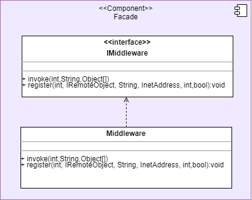

# **Dokumentation Middleware für Game of Trons**

**Autoren**: Kathleen Neitzel, Kjell May, Viviam Ribeiro

**Modul**: Verteilte Systeme

- [**Dokumentation Middleware für Game of Trons**](#dokumentation-middleware-für-game-of-trons)
- [Einführung und Ziele](#einführung-und-ziele)
  - [Aufgabenstellung](#aufgabenstellung)
  - [Qualitätsziele](#qualitätsziele)
  - [Stakeholder](#stakeholder)
- [Randbedingungen](#randbedingungen)
  - [Technisch](#technisch)
  - [Organisatorisch](#organisatorisch)
- [Kontextabgrenzung](#kontextabgrenzung)
  - [Fachlicher Kontext](#fachlicher-kontext)
  - [Technischer Kontext](#technischer-kontext)
- [Lösungsstrategie](#lösungsstrategie)
  - [Methodenliste](#methodenliste)
- [Bausteinsicht](#bausteinsicht)
  - [Whitebox Gesamtsystem](#whitebox-gesamtsystem)
    - [Blackbox Client Stub](#blackbox-client-stub)
    - [Blackbox Server Stub](#blackbox-server-stub)
    - [Blackbox Name Service](#blackbox-name-service)
    - [Blackbox Facade](#blackbox-facade)
  - [Ebene 2](#ebene-2)
  - [Ebene 3](#ebene-3)
    - [Whitebox Client Stub](#whitebox-client-stub)
    - [Whitebox Server Stub](#whitebox-server-stub)
    - [Whitebox Name Service](#whitebox-name-service)
    - [Whitebox Facade](#whitebox-facade)
- [Laufzeitsicht](#laufzeitsicht)
  - [Use Case 1 Register Method](#use-case-1-register-method)
  - [Use Case 2/3 Invoke Method / Lookup Method](#use-case-23-invoke-method--lookup-method)
  - [AD register](#ad-register)
  - [AD bind](#ad-bind)
  - [AD lookup](#ad-lookup)
- [Verteilungssicht](#verteilungssicht)
- [Querschnittliche Konzepte](#querschnittliche-konzepte)
  - [Nachrichtenformat](#nachrichtenformat)
  - [Adaptionstabelle mit Partnergruppe](#adaptionstabelle-mit-partnergruppe)
- [Architekturentscheidungen](#architekturentscheidungen)
- [Qualitätsanforderungen](#qualitätsanforderungen)
  - [Qualitätsbaum](#qualitätsbaum)
  - [Qualitätsszenarien](#qualitätsszenarien)
- [Risiken und technische Schulden](#risiken-und-technische-schulden)
- [Glossar](#glossar)

# Einführung und Ziele

Es wird eine Middleware für die verteilte Anwendung Game Of Trons entwickelt.

## Aufgabenstellung

1. Callees in Application Stubs können sich als Remote Objects bei der Middleware mit ihrer physikalischen Adresse registrieren
2. Entgegennehmen und Weiterleitung eines Methodenaufrufs auf ein Remote Object
3. Umwandlung von Funktionsaufrufen in Nachrichten
4. Vereinheitlicht Methodenaufrufe in ein vordefiniertes Nachrichtenformat
5. Die physikalische Adresse von Diensten kann abgefragt werden.
6. Kommunikation mit dem Betriebssystem, um Nachrichten zu versenden und zu empfangen
7. Nachrichten, die vom Betriebssystem empfangen wurden, können entgegengenommen werden
8. Umwandlung von Nachrichten in Funktionssignaturen
9. Funktionssignaturen werden an die ausführende Komponente weitergegeben

## Qualitätsziele

| ID | Qualitätsziel | Kurzbeschreibung |
| --- | --- | --- |
| Q1 | Gemeinsame Ressourcennutzung | Um das System nicht mit Replikation und Synchronisation zu belasten wollen wir eine Node mit Datenhoheit nutzen, welche die anderen informiert und aktualisiert |
| Q2 | Verteilungstransparenz| <ul><li>Access: Gleiche Darstellung von Objekten soll durch taktgebende Node sichergestellt werden</li><li>Location: Der Nutzer weiß nicht, auf welcher Node sich die Datenhoheit und damit die Objekte befinden</li><li>Relocation: Soll sichergestellt werden sein, weil die Objekte auf der taktgebenden Node bleiben</li><li>Migration: Wenn ein Spieler während des Spielens seine IP-Adresse ändern würde, könnte er nicht mehr mitspielen.</li><li>Replication: Alle Nodes werden aktualisiert, Replikation wird  nicht sichtbar sein</li><li>Concurrency: Objekte befinden sich in der Node mit Datenhoheit und werden daher nicht von mehreren Spielern gleichzeitig genutzt</li><li>Failure: Wird leider nicht sichergestellt werden, denn wenn unsere zentrale Node abstürzt, funktioniert das Spiel für alle nicht mehr. Da die Spieldauer aber immer sehr kurz sein wird, kann schnell ein neues gestartet werden</li></ul>|
| Q3 | Offenheit (Openness) | Schnittstellen müssen gut definierte Ablauf- und Fehlersemantik haben, Komponenten sollten austauschbar sein, Erweiterung um Komponenten sollte möglich sein |
| Q4 | Skalierbarkeit | <ul><li>Größe: 2-6 Spieler sollten miteinander spielen können</li><li>geografisch: Bisher wird unser Spiel nur in einem lokalen Netzwerk oder über VPN spielbar sein</li><li>administrativ: Eine Node soll die Datenhoheit besitzen</li></ul> |

## Stakeholder

|Rolle|Kontakt|Erwartungshaltung|
|-|-|-|
|Kunde  |Martin Becke   |Entwicklung eines Tron-Spiels als verteiltes System, gut dokumentiert (Code <-> Dokumentation), Konzepte aus der Vorlesung sinnvoll angewendet und verstanden|
|Entwickler|Kathleen Neitzel, Kjell May, Viviam Ribeiro| - Funktionsfähige Middleware mit gewünschter Funktionalität entwickeln, dass das Spiel an mehreren Rechnern gespielt werden kann|
|Kunde|GameOfTrons|Möglichkeit auf mehreren Rechnern gespielt werden zu können|

# Randbedingungen

## Technisch

| Randbedingung           | Erläuterung                                 |
|-------------------------|---------------------------------------------|
| Programmiersprache | Die Vorgabe der Aufgabenstellung erfordert die Nutzung einer objektorientierten Programmiersprache. Die Nutzung von Java wird empfohlen, da in dieser Sprache Code-Beispiele in den Vorlesungen gezeigt werden. Wir haben uns aus diesem Grund für Java entschieden. |
| Versionsverwaltung | Die Nutzung von unserem hochschuleigenen Gitlab ist ebenfalls vorgeschrieben. Aufgrund eines Hackerangriffs in der Hochschule sind wir später im Projekt auf GitHub umgestiegen. |
| Schnittstellen     | Kommunikation mit RPC  |
| Netzwerksvoraussetzungen | Aufgrund des Hackerangriffs findet die Abnahme nicht im LAN des Labors statt, sondern online über VPN. Wir haben uns dabei für ZeroTier entschieden |

## Organisatorisch

| Randbedingung   | Erläuterung |
|-----------------|-------------|
| Team            | Kjell May, Viviam Ribeiro und Kathleen Neitzel aus dem Studiengang der Angewandten Informatik. Fachsemester 6 und 7. |
| Zeit            |Abgabe am 19. Januar 2023. |
| Vorgehensmodell | Die Entwicklung wird iterativ und inkrementell betrieben. Zur Dokumentation wird arc42 genutzt|

# Kontextabgrenzung

## Fachlicher Kontext


| Use Case |Vorbedingung |Ablaufsemantik |Nachbedingung |Fehlerfälle | Erweiterungsfälle |
| --- | --- | --- | --- | --- | --- |
| UC1 Register Method | Ein definiertes Interface soll für RPCs erreichbar sein | **1.** Der Application Stub ruft den Server-Stub der Middleware auf <br> **2.**  Der ServerStub ruft den Name-Server auf <br>**3.** Der NameServer prüft, ob die Schnittstelle nicht bereits in der Tabelle eingetragen ist.<br> **4.** Der NameServer trägt den Schnittstellenidentifikator und die dazugehörige Adresse in eine Tabelle ein<br> | In der Tabelle des NameServers ist die Schnittstelle und ihre Adresse eingetragen. | |**3.a.1** Die Schnittstelle ist bereits m NameServer eingetragen <br> **3.a.2** Die eingetragene Adresse wird mit der neuen überschrieben |
| UC2 Invoke Method |In der Anwendung wird eine Methode einer Remote-Komponente aufgerufen | **1.** Das System ruft den Application-Caller-Stub der aufrufenden Komponente auf <br> **2.** Der  Application Stub ruft die Middleware-Schnittstelle auf <br> **3.** Es wird geprüft, ob eine Adresse und Portnummer zur aufgerufenen Methode eingetragen ist  (siehe UC5) <br> **4.** Die Adresse und die Portnummer werden aus dem Name Server geholt <br> **5.** Der Client Stub wandelt den Methodenaufruf in eine Nachricht um (siehe UC3) <br> **6.** Der Client Stub ruft die Senderkomponente auf (siehe UC 3.1)| Die Nachricht wurde verschickt|**3.a.1** Die aufgerufene Komponente ist nicht bei der Middleware registriert <br> **3.a.2** Das System wirft eine Exception auf.| |
| UC3 Marshaling Method Call| UC2 bis Schritt 2 | **1.** Der Client Stub serialisiert den Methodenaufruf in ein Nachrichtenformat <br> **2.** Weiter mit UC 3.1| Der Methodenaufruf ist als Nachricht vorhanden | | |
| UC3.1 send |Eine Nachricht wurde in der Middleware erzeugt und soll versendet werden.|**1.** Der Client Stub ruft den Sender auf <br> **2.** Der Sender erstellt ein Socket  <br> **3.** Den Sender erstellt ein UDP-Datagramm mit der zu versendenden Nachricht, die Empfänger-Adresse und die Empfänger-Portnummer. |Die Nachricht wurde versendet|||
| UC4 Unmarshaling Message | Der Receiver in der Middleware hat eine Nachricht empfangen| **1.** Der Receiver ruft die ServerStub-Komponente auf <br> **2.** Der ServerStub nutzt den Unmarshaler, um die Nachricht in einen Methodenaufruf umzuwandeln <br> **3.** Der Server Stub ruft die Application-Stub-Callee-Schnittstelle der Komponente auf, die den Methodenaufruf empfangen soll (siehe UC5)| Ein Methodenaufruf wurde erzeugt| | |
| UC4.1 receive | UC 3.1: Eine Nachricht wurde über das Netzwerk versendet  |**1.** Der Socket im Receiver der Middleware des Empfängers bekommt ein UDP-Datagramm <br> **2.** Der Receiver ruft die Server-Stub-Komponente auf (siehe UC4)| Eine Nachricht liegt in der Middleware des Empfängers vor|||
| UC5 lookup | UC2: Invoke Method bis Schritt 2 | **1.** Der Client Stub ruft den Nameserver auf <br> **2.** Der NameServer prüft,ob die aufgerufene Methode mit der dazugehörigen Adresse und Portnummer in der Tabelle eingetragen ist<br> **3.** Der NameServer liefert die zugehörige IP-Adresse und Portnummer zurück | Die  IP-Adresse und die Portnummer zu der gesuchten Funktion werden zurückgegeben | Es gibt keinen Eintrag mit dieser ID. Dann wird der RPC verworfen. ||
| UC6 Call Method | UC 4 : Der Server Stub hat eine Nachricht in einen Methodenaufruf umgewandelt |**1.** Der ServerStub ruft die Call-Schnittstelle des Application-Callee-Stubs <br> **2.** Der Application-Callee-Stub ruft die dazugehörige Komponente lokal auf. | Die aufgerufene Methode wird ausgeführt.|


## Technischer Kontext


# Lösungsstrategie 

## Methodenliste

| Usecase | Akteur |Funktionssignatur| Vorbedingung | Nachbedingung | Ablaufsemantik | Fehlersemantik |
|---|---|---|---|---|---|---|
|UC1| ServerStub| void register(int interfaceID, IRemoteObject remoteObject, String methodName, InetAddress ipAddr, bool isSingleton) | Ein CalleeStub aus dem ApplicationStub möchte sich als RemoteObject registrieren | Das Remote Object wurde im Name Server und in der lokalen Tabelle im Server Stub aufgenommen.| Der Server Stub erstellt eine JSON-Nachricht aus den Daten in den Aufrufparametern und wandelt das JSON-Objekt in ein byte-Array um (Aufruf serializeNS). <br> **interfaceID**: Id des RemoteObjects, <br> **methodName**: Die Methode des RemoteObjects, die registriert werden soll <br> **ipAddr**: Die IP-Adresse, unter der das RemoteObject erreichbar ist <br> **isSingleton**:Flag, um zu bestimmen, ob mehrere RemoteObjects mit dieser Id registriert werden dürfen<br> Die Nachricht nach dem TCP-Protokoll an den Name Server geschickt. Die Id und die Referenz auf das RemoteObject werden in die lokale Map eingetragen. | |
|UC1| NameServer | void doBind(JSON) | Eine Nachricht wurde empfangen und in JSON umgewandelt (Aufruf doBind)| Die Parameter werden aus dem JSON entpackt und damit wird bind() aufgerufen. | |
|UC1|  NameServer | void bind(int id, String methodName, String ipAddr, bool isSingleton) | Eine Nachricht ist aus einem ServerStub angekommen, die Daten wurde aus der Nachricht entpackt und als Aufrufparameter genutzt | Die InterfaceID und der Methodenname wurden im NameServer gespeichert | Der NameServer prüft, ob zur mitgegebenen ID bereits ein Eintrag vorhanden ist(Aufruf checkInterfaceInTable(int,String). Wenn ja und isSingleton false ist, dann wird unter dem Schlüssel (id, methodName) die IP-Adresse hinzugefügt. Wenn isSingleton true ist, dann wird die IP-Adresse nicht eingetragen. <br> Wenn der Methodenname und/oder die übergebene ID noch nicht eingetragen ist, dann wird ein neuer Schlüssel (id,methodName) erzeugt. Darunter wird die die IP-Adresse eingetragen. | |
|UC1| NameServer | boolean checkInterfaceInTable(int, String) | Ein CalleeStub möchte sich als RemoteObject eintragen und hat register() aufgerufen | Es wird true zurückgegeben, wenn bereits ein Eintrag  für ein InterfaceID existiert, sonst false| Der Name Server prüft, ob zur übergebenen ID und Methodennamen bereits ein Eintrag in der Tabelle existiert| |
|UC2| ClientStub | void invoke(int, String, Object[]) | Eine Komponente ruft eine Remote-Komponente über eine Application Stub Schnittstelle auf | Der Aufruf wurde geprüft und die Methode marshal() wurde aufgerufen |  Prüft mithilfe von lookup() ob die übergebene Objekt-ID (erster Parameter) und die Methode (zweiter Parameter) registriert ist. Dann wird die Methode marshal() aufgerufen | Wenn die Objekt-ID nicht registriert ist, wird eine Exception geworfen|
|UC3| ClientStub | byte[] marshal(int,String, Object[]) | Funktionsaufruf über invoke wurde getätigt, zugehörige InetAddress und Portnummer wurde durch NameResolver ermittelt | Funktionsaufruf wurde marshaled und zurückgegeben | Es wird eine Nachricht im JSON-Format aus den übergebenen Parametern InterfaceID, Methodenname und Methodenparameter (Object[]) zusammengebaut. Das JSON-Objekt wird in ein byte-Array umgewandelt und zurückgegeben | |
|UC3.1| ClientStub | void send(InetAdress, int, byte[]) | Funktionsaufruf wurde marshaled, zugehörige InetAddress und Portnummer druch NameResolver ermittelt | Nachricht wurde verschickt | Die marshaled Nachricht wird über einen Socket an die passende InetAddress und Portnummer verschickt. | |
|UC4| ServerStub | JSON unmarshal(byte[]) | Nachricht wurde über receive empfangen | Nachrichteninhalt wurde extrahiert und kann für call genutzt werden | | (checksum stimmt nicht überein -> ignorieren) |
|UC4.1| ServerStub |  receive(DatagramPacket)) | Ein Socket im Server Stub hat eine Nachricht empfangen | Nachricht wurde aus dem Packet entpackt und dem Marshaler übergeben. | Die Nachricht wird aus dem übergebenen Datagram-Paket herausgeholt und dem Unmarshaler übergeben | |
|UC5| Client Stub | String[] cacheOrLookup(int id, String methodName) | Ein Application Stub hat invoke aufgerufen, um eine Remote-Methode aufzurufen. Der Client Stub muss im nächsten Schritt prüfen, ob die aufgerufene Methode im Cache des Client Stubs eingetragen ist. | Die Adresse  der angefragten Methode werden zurückgegeben.| Es wird in der Cache-Tabelle des Client-Stubs nachgeschaut, ob es einen Eintrag zur angegebenen ID und dem angegebenen Methodenname existiert. Wenn ja, dann wird ein Array mit allen eingetragenen IP-Adressen zurückgegeben. Die IP-Adressen werden gecached (Aufruf cache() ). Wenn nicht, dann wird eine Nachricht aus der angegebenen ID und dem Methodennamen erstellt (Aufruf serializeNS() ) und an den Name Server über TCP geschickt. Die erhaltene Antwort vom Name Server wird entpackt (Aufruf deserializeNS() ) im selben Array-Format zurückgegeben.| Es gibt auch im Name Server keinen Eintrag mit der ID und dem Methodennamen (leere Strings als Antwort erhalten). Der RPC wird abgebrochen|
|UC5| Name Server| Set<String> lookup(String id, String methodName) | Die Methode doLookup() wurde aufgerufen| Die Adressen der angefragten Methode werden in einem Set zurückgegeben | Der Name Server prüft, ob es einen Eintrag in der Tabelle mit der übergebenen Interface-ID und Methodenname gibt. Wenn ja, dann werden die eingetragenen IP-Adressen an den anfragenden Client Stub zurückgegegben|Es gibt keinen Eintrag mit der ID und dem Methodennamen. Es werden leere Strings zurückgeschickt. |
|UC5| Name Server | void doLookup(JSON) | Eine angefragte Methode ist nicht im Cache des Client Stubs gespeichert. Der Client Stub schickt eine Nachricht an den Name Server mit einer Lookup-Anfrage.| Die Adressen der angefragten Methode werden über eine Nachricht zurückgeschickt.| Holt die Paramater aus dem JSON-Objekt und ruft damit die Methode lookup() auf. Das Ergebnis wird wieder in einen JSON verpackt, in ein byte-Array umgewandelt und an den anfragenden Client Stub zurückgeschickt.| |
|UC5| Client Stub | void cache(String id, String methodName, String[] IpAddr) | Eine Antwort auf eine lookup-Anfrage ist im Client-Stub angekommen| Die IP-Adresse wurde im Cache gespeichert| Es wird ein Schlüssel aus der Interface-ID und dem Methodennamen erzeugt. Darunter werden die IP-Adressen eingetragen.| |
|UC6| ServerStub | void callRemoteObjectInterface(JSON) | Nachricht wurde vom ServerStub empfangen und unmarshaled | Der Server Stub holt die Interface-ID, den Methodennamen und die Aufrufparameter aus dem JSON-Objekt heraus und ruft das korrekte Remote-Object-Interface auf.|Das RemoteObject-Interface wurde aufgerufen  | | 

 
# Bausteinsicht 

## Whitebox Gesamtsystem


Die Middleware ist in drei Komponenten aufgeteilt: Client Stub, Server Stub und Name Service. Des Weiteren werden die Middleware-Schnittstellen hinter einer Fassade gekapselt.
Die Funktionen der einzelnen Komponenten werden im weiteren Verlauf aufgeführt.


### Blackbox Client Stub

Der Client Stub nimmt Funktionsaufrufe vom Application Stub entgegen und wandelt diese in ein vordefiniertes Nachrichtenformat um.
Die Nachricht wird an eine Remote-Komponente über das Betriebssystem geschickt. Dafür fragt der Client-Stub erstmal nach der physikalischen Adresse der Remote-Komponente.

*Schnittstelle IRemoteInvocation*
<br>
Die Schnittstelle IRemoteInvocation kann aufgerufen werden, um eine Remote-Methode aufruzufen.

|Methode| Kurzbeschreibung |
| --- | --- |
|invoke(int interfaceID, String methodName, Object[] args) | Erzeugt eine Nachricht aus dem Funktionsaufruf und ruft die Betriebssystemschnittstelle zum Versenden der Nachricht auf. |

### Blackbox Server Stub

Der Server Stub empfängt Nachrichten über das Betriebssystem und wandelt sie in Funktionsaufrufe um. Die Funktion wird dann an das zuständige Remote Object im Application Stub weitergeleitet. Dafür müssen sich die Remote Objects erstmal über den Server Stub beim Name Service registrieren.

*Schnittstelle IRegister**

Die Schnittstelle IRegister kann aufgerufen werden, um sich als Remote-Object im Name Server einzutragen.

|Methode| Kurzbeschreibung |
|---|---|
| register(int interfaceID, String methodName, InetAdress ipAddr, bool isSingleton)| Schickt eine Nachricht an die NameService-Komponenten mit den Informationen, die für das Eintragen notwendig sind. Diese Informationen werden über die Aufrufparameter übergeben.|

### Blackbox Name Service

Der NameService verwaltet die IDs der Remote Objects, die sich registriert haben und die dazugehörigen IP-Adressen und Portnummern.
Beim Name Service kann man die physikalische Adresse eines Remote Objects anfragen oder sich als Remote Object registrieren. Dafür werden Nachrichten über TCP ausgetauscht.

**Diese Komponente bietet keine Schnittstellen an. Die Dienste können über Nachrichtenaustausch genutzt werden**

Siehe [Querschnittliche Konzepte](#querschnittliche-konzepte).
  
  
### Blackbox Facade
  
Das Facade-Pattern wird eingesetzt, um die beiden extern angebotenen Funktionalitäten der Middleware hinter einer Schnittstelle zu kapseln.
Dafür wird die Schnittstelle IMiddleware angeboten.
  
|Methode| Kurzbeschreibung |
|---|---|
| register(int interfaceID, String methodName, InetAdress ipAddr, bool isSingleton)| Die register-Methode der IRegister-Schnittstelle wird aufgerufen|
 |invoke(int interfaceID, String methodName, Object[] args) | Die invoke-Methode der IRemoteInvocation-Schnittstelle wird aufgerufen|
  
  


## Ebene 2 
 

## Ebene 3


### Whitebox Client Stub
<br>

 

<br>

|Methode| Kurzbeschreibung|
| --- | --- |
|invoke(int interfaceID, String methodName, Object[] args) | Ruft die Methoden marshal(), dann cacheOrLookup(), dann send() auf|
|serializeNS(int interfaceID, String methodName) | Packt die Aufrufparameter in ein JSON-Nachrichtenformat. Wandelt das JSON-Objekt in ein byte-Array um.|
| deserializeNS(byte[] msg) | Entpackt die Daten aus der Nachricht und gibt sie in einem String[]-Array der Länge 2 (Index 0: IP-Adresse, Index 1: Portnummer) zurück.|
|marshal(int interfaceID,String methodName, Object[] args) | erzeugt ein JSON-Objekt aus den übergebenen Parametern und wandelt es in ein byte-Array um, das zurückgegeben wird. |
|cacheOrLookup(int interfaceID,String methodName):String[]| Gibt ein String-Array mit dem engetragenen IP-Adressen des gesuchten Remote-Objects zurück. Sucht erstmal im lokalen Cache-Speicher und wenn der Eintrag dort nicht vorhanden ist, wird eine Nachricht erstellt (Aufruf serializeNS() ) und an den Name Server geschickt. Das Ergebnis wird aus der Nachricht entpackt (Aufruf deserialize() ), im Cache gespeichert (Aufruf cache() ) und zurückgegeben. |
|cache(int interfaceID, String methodName String[] ipAddr| Trägt die IP-Adressen der angegebenen ID und Methodennamen im Cache-Speicher ein.|
|send(String[] ip, byte[]| Verpackt die angegebene Nachricht in ein UDP-Datagramm und schickt die das Paket an die angegebne IP-Adresse und Portnummer.|


### Whitebox Server Stub
<br>


<br>

|Methode| Kurzbeschreibung|
| --- | --- |
|register(int interfaceId, IRemoteObject remoteObject, String methodName, InetAddress ipAddr, bool isSingleton)| Ruft serializeNS() auf und schickt das zurückgegebene byte-Array an den Name Server mit den notwendigen Registrierungsdaten. Trägt das RemoteObject unter übergebenen Id in die lokale Tabelle ein. |
|serializeNS(int interfaceId, String methodName, InetAddress ipAddr, bool isSingleton)| Erstellt aus einer Nachricht im JSON-Format ein byte-Array um.|
| run() | Eine Endlosschleife, die auf ankommende Pakete wartet. Wenn ein Paket ankommt, wird ein neuer Thread erzeugt, der die Methode receive() aufruft und das angekommene Paket übergibt.|
| receive(DatagramPacket packet) | Entpackt den Nachrichtinhalt aus dem UDP-Paket und ruft die Methode unmarshal() auf.|
| unmarshal(byte[] msg) | Wandelt das übergebene byte-Array in ein JSON-Objekt um und ruft die Methode callRemoteObjectInterface() auf. |
| callRemoteObjectInterface(JSON msg)| Entpackt die Daten aus dem angegebenen JSON-Objekt, sucht in der lokalen Tabelle nach dem Remote Object, das unter der im JSON angegebenen ID eingetragen ist. Ruft mit Methode call() des eingetragenen Remote Objects.|
| convertValueToType(String type, String value) | Erzeugt eine neue Instanz vom übergebenen Typen mit dem übergebenen Wert.|


### Whitebox Name Service
<br>


<br>

|Methode| Kurzbeschreibung|
| --- | --- |
|doLookup(JSON args) | Entpackt die Parameter aus dem JSON, ruft lookup() auf und schickt die Antwort an den anfragenden Client Stub zurück |
|lookup(int, String)| Prüft ob gesuchtes Interface und Methode eingetragen sind (Aufruf checkInterfaceInTable). Wenn ja, wird ein Set von Strings mit den IP-Adressen zurückgegeben.|
|doBind(JSON args) |  Entpackt die Parameter aus dem JSON, ruft bind() auf |
|bind(int interfaceID, String methodName, String ip, bool isSingleton)| Prüft, ob die zu registrierende Methode bereits in der Tabelle ist. Wenn ja und isSingleton false ist, wird die IP-Adresse unter der eingegeben IP-Adresse und eingetragen. Wenn isSingleton true ist, wird die IP-Adresse nicht eingetragen. Wenn die Methode noch nicht eingetragen ist, wird ein neuer Schlüssel aus der InterfaceID und dem Methodennamen erzeugt und die IP-Adresse wird darunter eingetragen.|
|checkInterfaceInTable(int interfaceID, String methodName)|Prüft, ob das zu registrierende Interface und die Methode bereits in der Tabelle ist|
|run()| Endlosschleife, die TCP-Pakete entgegennimmt. Wenn ein Paket ankommt, wird ein neuer Thread zur Behandlung erzeugt. Der neue Thread entpackt den JSON- Nachrichteninhalt aus dem Paket (Aufruf deserialize() ), holt den Parameter-Array aus dem JSON und prüft, welche Anfrage geschickt wurde (lookup oder register), ruft die entsprechende Methode auf. |
|deserialize(byte[] msg)|entpackt den JSON-Nachrichteninhalt aus dem Paket|
|serialize(JSON msg)|Wandelt die JSON-Antwortnachricht von der lookup-Anfrage in ein byte-Array.|
  

 ### Whitebox Facade
  <br>
  
  
  
  <br>
  
|Methode| Kurzbeschreibung |
|---|---|
| register(int interfaceID, String methodName, InetAdress ipAddr, bool isSingleton)| Die register-Methode der IRegister-Schnittstelle wird aufgerufen|
|invoke(int interfaceID, String methodName, Object[] args) | Die invoke-Methode der IRemoteInvocation-Schnittstelle wird aufgerufen|
  


# Laufzeitsicht 

## Use Case 1 Register Method


## Use Case 2/3 Invoke Method / Lookup Method


## AD register


## AD bind


## AD lookup


# Verteilungssicht

**Einordnung der Middleware im Gesamtsystem**


# Querschnittliche Konzepte
Auf folgende querschnittlichen Konzepte haben wir uns gemeinsam mit unserer Partnergruppe Gamma 4 geeinigt:

## Nachrichtenformat
Um RPCs durchführen zu können müssen Methodenaufrufe in Nachrichten umgewandelt werden. Dafür werden die Methodenaufrufe in ein einheitliches JSON-Format transformiert. Verschickt wird ein JSON-Objekt mit der Interface-ID des adressierten Interfaces, der Methodenname und die Aufrufparameter der Methode mit jeweiligem Typ und Wert in einem Array.

```json
(JsonObjectMessage = {
    "interfaceID": Interface-ID als int,
    "methodName": Methodenname als String,
     "args": [
        "type1": primitiver Datentyp des ersten Aufrufparameters als String,
        "val1": der Wert des ersten Aufrufparameters,
        "typeN": primitiver Datentyp des n-ten Aufrufparameters als String,
        "valN": der Wert des n-ten Aufrufparameters
    ]
})
```

Das JSON-Objekt wird in ein Byte-Array umgewandelt, und über das Netzwerk verschickt.
Einige beispielhafte RPCs sind im Folgenden skizziert:

```json
(JsonObjectInvoke = {
    "interfaceID": 0,
    "methodName": "changeDir",
    "args": [
        "type1": int,
        "val1": 1,
        "type2": "RIGHT"
    ]
})
(JsonObjectLookUp = {
    "method": 0(lookup),
    "args": [
        "ifaceID": I,
        "methodName": Str,
    ]
})
(JsonObjectRegister = {
    "method": 1(register),
    "args": [
        "ifaceID": Int,
        "methodName": Str,
        "ipAddr": "XXX.XXX.XXX.XXX",
        "isSingleton": "true" || "false"
    ]
})
```

Auf eine Lookup-Anfrage an den Name Server wird eine Antwort erwartet. Im Folgenden definieren wir das Antwortformat vom Name Server an den Client Stub:

Format für die Antwort auf eine Lookup-Anfrage:

```json
(JSONObjectLookupResponse = {
"IpAddr1": "XXX.XXX.XXX.XXX",
... "IpAddrN": "XXX.XXX.XXX.XXX",

})
```


Wenn die Lookup-Anfrage fehlgeschlagen ist (kein Eintrag vorhanden), dann werden leere Strings zurückgeschickt:
```json
(JSONObjectLookupResponseError = { "IpAddr1": "",
})
```

## Adaptionstabelle mit Partnergruppe

| RemoteObject | Methode Beta-3 | Methode Gamma-4 | Beschreibung |
| - | - | - | - |
| Model | ``changePlayerDirection(int,String)`` | ``changeDirection(int,String)`` | Für Inputs zur Richtungsänderung |
| Model | ``startGame(int,int)`` | ``initGame()`` | Um das Spiel zu starten |
| Model | ``join(int)`` | ``setPlayerCount(int)`` | Anzahl Spieler für die Lobby werden gesetzt |
| Model | ``cancelWait()`` | - | Spielabbruch nach Ablauf der Wartezeit oder Klick auf Cancel |
| Model | - | ``updateBoard()`` | gameloop/ tick-Methode. Ist bei Beta-3 privat |
| View | ``updateNumPlayer(int)`` | ``updatePlayersReady(int)`` | Anzahl wartender Spieler in der Lobby |
| View | ``updatePlayer(int,int,int,int)`` | ``setBoard(int[][])`` | Aktualisieren des Spielfelds. Beta-3 nutzt Deltas, Gamma-4 schickt gesamtes Spielfeld |
| View | ``informUser(String)`` | - | Für Darstellen von Infonachrichten für den Spieler |
| View | - | ``newGame()`` | Initialisiert Spielbildschirm(?) |
| View | - | ``playerCrashed(int)`` | Um Spieler in der View zu löschen(?) |
| View | - | ``setWinner(int)`` | Sieger anzeigen. Beta-3 hat endGame(int) im Controller dafür |
| Controller | ``setCurrentState(String)`` | ``setState(String)`` | Verändert den Zustand der StateMachine |
| Controller | ``endGame(int)`` | - | Spiel beenden und Sieger anzeigen (wird intern auf View aufgerufen) |
| Controller | - | ``registerRemoteView()`` | Master-Controller registriert Remote-View(?) |
| Controller | - | ``registerRemoteController()`` | Master-Controller registriert Remote-Controller(?) |
| Controller | - | ``setLocalPlayer(int)`` | Teilt ID des lokalen Spieler mit(?) |

# Architekturentscheidungen
  
  Die entwickelte Middleware dient dem Zweck das von uns entwickelte Spiel "Game of Trons" verteilt zu spielen. Dafür müssen die teilnehmenden Node sich gegenseitig aktualisieren und Operationen anstoßen.
  Um diesem Zweck nachzukommen, haben wir uns darauf geeinigt, dass sie teilnehmenden Nodes über RPC kommunizieren, da die Kommunikation zwischen den Spielkomponente sich problemlos auf RPCs abbilden lassen. Des Weiteren können mit RPCs geringe Verarbeitungszeiten erreicht werden.
  
  Die entwickelte Middleware kann jedoch wiederverwendet werden, da keine Anwendungsspezifische Details integriert wurden. Durch die Kommunikation über Nachrichten, die im einfachen und weit verbreiteten JSON-Format definiert sind, kann die Kommunikation zwischen unterschiedlichen Applikationen und Systemen recht einfach implementiert werden.
  
 Falls nur ein Node des verteilten Systems über Datenhoheit verfügen soll, kann dies über die entwickelte Middleware erfolgen. Beim Registrieren kann nämlich ein isSingleton-Flag gesetzt werden, sodass die Komponente, die die Datenhoheit besitzen soll, sich beim Registrieren als solche gekennzeichnen kann. Die Implementierungsdetails davon werden von der Middleware weggekapselt.
 
# Qualitätsanforderungen

::: formalpara-title
**Weiterführende Informationen**
:::

Siehe [Qualitätsanforderungen](https://docs.arc42.org/section-10/) in
der online-Dokumentation (auf Englisch!).

## Qualitätsbaum

## Qualitätsszenarien

# Risiken und technische Schulden

## Risiken
  Im Folgenden führen wir tabellarisch unsere im Vorfeld identifizierten Risiekn auf:
  
| Risiko | Erläuterung | Risikominderung
|-|-|
| Deadline kann nicht eingehalten werden | Unser Team ist klein und in der Middleware-Entwicklung komplett unerfahren. Es besteht das Risiko, dass theoretische Konzepte nicht schnell genug erfasst und in die Praxis umgesetzt werden können. | Frühzeitig anfangen und Rat einholen. |
| VPN funktioniert nicht | Da das Spiel nicht online gespielt werden kann, kann das Spiel nur in einem LAN oder VPN getestet werden. Wenn LAN keine Möglichkeit ist, dann muss VPN eingesetzt werden, dessen Funktionsfähigkeit nicht garantiert ist. | LAN anstreben, VPN frühzeitig testen. |
  

## Technische Schulden

  Im Folgenden führen wir tabellarisch unsere im Nachhinein festgestellten technische Schulden auf:
  
| Technische Schuld | Erläuterung |
|-|-|
| Verfügbarkeit | Sowohl unser NameServer als auch die Spielelogik (Model) laufen nur auf einem Node. Wenn eins ausfällt, lässt sich nicht weiterspielen. Dies bietet auch die Möglichkeit eines Bottlenecks. |
| Ausbaufähige Fehlersemantik | Unser Spielfeld und damit auch die GUI wird mit Deltas der Spielerpositionen als Unicast an alle Teilnehmer von der Model-Node aus mit UDP geschickt. Bei verlorengegangenen Nachrichten könnten dadurch also Lücken in den Spuren entstehen. |
| Spielanzahl | Innerhalb des Netzwerks kann pro gestarteten Nameserver nur ein Spiel zur Zeit gespielt werden. |
| Performanceminderung | Durch die fehlende Möglichkeit der Multicast-Durchführung über RPC, führt ein Cache für die lookup-Anfragen im ClientStub zu Fehlerzuständen, weshalb jedes Mal ein lookup über TCP an den Nameserver geschickt werden muss. Dadurch ist das Spiel langsamer. |

# Glossar
  
| Begriff | Definition|
| --- | --- |
| Node| Teilnehmende Komponenten des verteilten Systems. Nodes kommunizieren in dem verteilten System miteinander. |
| RPC | Remote Procedure Call: Aufruf von Funktionen auf entfernten Systemen |

