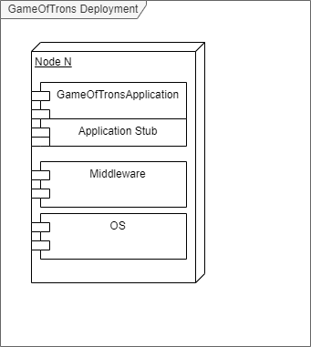

# 

**Über arc42**

arc42, das Template zur Dokumentation von Software- und
Systemarchitekturen.

Template Version 8.1 DE. (basiert auf AsciiDoc Version), Mai 2022

Created, maintained and © by Dr. Peter Hruschka, Dr. Gernot Starke and
contributors. Siehe <https://arc42.org>.

# Einführung und Ziele

Es wird eine Middleware für die verteilte Anwendung Game Of Trons entwickelt.

## Aufgabenstellung 

1. Umwandlung von Funktionsaufrufen in Nachrichten 
2. Umwandlung von Nachrichten in Funktionsaufrufen
3. Kommunikation mit dem Betriebssystem, um Nachrichten zu versenden und zu empfangen.
4. Vereinheitlicht Nachrichten in ein RPC-Nachrichtenformat
5. Callees in Application Stubs können sich als Remote Objects bei der Middleware anmelden
6. Die physikalische Adresse von Diensten kann abgefragt werden.

## Qualitätsziele 

| ID | Qualitätsziel | Kurzbeschreibung |
| --- | --- | --- |
| Q1 | Verteilungstransparenz| Entfernte Zugriffe, Bewegungen, Migrationen und Replikationen werden vom Nutzer versteckt|
| Q2 | Offenheit (Openness) |  Schnittstellen müssen gut definierte Ablauf- und Fehlersemantik haben, Komponenten sollten austauschbar sein, Erweiterung um Komponenten sollte möglich sein|
| Q3 | Geographische Skalierung | Die Benutzer können sich überall auf der Welt befinden |

## Stakeholder 

|Rolle|Kontakt|Erwartungshaltung|
|-|-|-|
|Kunde  |Martin Becke   |Entwicklung eines Tron-Spiels als verteiltes System, gut dokumentiert (Code <-> Dokumentation), Konzepte aus der Vorlesung sinnvoll angewendet und verstanden|
|Entwickler|Kathleen Neitzel, Kjell May, Viviam Ribeiro| - Funktionsfähige Middleware mit gewünschter Funktionalität entwickeln, dass das Spiel an mehreren Rechnern gespielt werden kann|
|Kunde|GameOfTrons|Möglichkeit auf mehreren Rechnern gespielt werden zu können|

# Randbedingungen 

# Kontextabgrenzung 

## Fachlicher Kontext 

| Use Case |Vorbedingung |Ablaufsemantik |Nachbedingung |Fehlerfälle | Erweiterungsfälle |
| --- | --- | --- | --- | --- | --- |
| UC1 Register Method | Ein definiertes Interface soll für RPCs erreichbar sein | **1.** Der Application Stub ruft den Server-Stub der Middleware auf   **2.**  Der ServerStub ruft den Name-Server auf  **3.** Der NameServer prüft, ob die Schnittstelle nicht bereits in der Tabelle eingetragen ist.  **4.** Der NameServer trägt den Schnittstellenidentifikator und die dazugehörige Adresse in eine Tabelle ein  | In der Tabelle des NameServers ist die Schnittstelle und ihre Adresse eingetragen. | |**3.a.1** Die Schnittstelle ist bereits m NameServer eingetragen   **3.a.2** Die eingetragene Adresse wird mit der neuen überschrieben |
| UC2 Invoke Method |In der Anwendung wird eine Methode einer Remote-Komponente aufgerufen | **1.** Das System ruft den Application-Caller-Stub der aufrufenden Komponente auf   **2.** Der  Application Stub ruft die Middleware-Schnittstelle auf   **3.** Es wird geprüft, ob eine Adresse und Portnummer zur aufgerufenen Methode eingetragen ist  (siehe UC5)   **4.** Die Adresse und die Portnummer werden aus dem Name Server geholt   **5.** Der Client Stub wandelt den Methodenaufruf in eine Nachricht um (siehe UC3)   **6.** Der Client Stub ruft die Senderkomponente auf (siehe UC 3.1)| Die Nachricht wurde verschickt|**3.a.1** Die aufgerufene Komponente ist nicht bei der Middleware registriert   **3.a.2** Das System wirft eine Exception auf.| |
| UC3 Marshaling Method Call| UC2 bis Schritt 2 | **1.** Der Client Stub serialisiert den Methodenaufruf in ein Nachrichtenformat   **2.** Weiter mit UC 3.1| Der Methodenaufruf ist als Nachricht vorhanden | | |
| UC3.1 send |Eine Nachricht wurde in der Middleware erzeugt und soll versendet werden.|**1.** Der Client Stub ruft den Sender auf   **2.** Der Sender erstellt ein Socket    **3.** Den Sender erstellt ein UDP-Datagramm mit der zu versendenden Nachricht, die Empfänger-Adresse und die Empfänger-Portnummer. |Die Nachricht wurde versendet|||
| UC4 Unmarshaling Message | Der Receiver in der Middleware hat eine Nachricht empfangen| **1.** Der Receiver ruft die ServerStub-Komponente auf   **2.** Der ServerStub nutzt den Unmarshaler, um die Nachricht in einen Methodenaufruf umzuwandeln   **3.** Der Server Stub ruft die Application-Stub-Callee-Schnittstelle der Komponente auf, die den Methodenaufruf empfangen soll (siehe UC5)| Ein Methodenaufruf wurde erzeugt| | |
| UC4.1 receive | UC 3.1: Eine Nachricht wurde über das Netzwerk versendet  |**1.** Der Socket im Receiver der Middleware des Empfängers bekommt ein UDP-Datagramm   **2.** Der Receiver ruft die Server-Stub-Komponente auf (siehe UC4)| Eine Nachricht liegt in der Middleware des Empfängers vor|||
| UC5 lookup | UC2: Invoke Method bis Schritt 2 | **1.** Der Client Stub ruft den Nameserver auf   **2.** Der NameServer prüft,ob die aufgerufene Methode mit der dazugehörigen Adresse und Portnummer in der Tabelle eingetragen ist  **3.** Der NameServer liefert die zugehörige IP-Adresse und Portnummer zurück | Die  IP-Adresse und die Portnummer zu der gesuchten Funktion werden zurückgegeben | Es gibt keinen Eintrag mit dieser ID. Dann wird der RPC verworfen. ||
| UC6 Call Method | UC 4 : Der Unmarshaler hat eine Nachricht in einen Methodenaufruf umgewandelt |**1.** Der Unmarshaler ruft die Call-Schnittstelle des Application-Callee-Stubs   **2.** Der Application-Callee-Stub ruft die dazugehörige Komponente lokal auf. | Die aufgerufene Methode wird ausgeführt.|

## Technischer Kontext

# Lösungsstrategie 

## Methodenliste

| Usecase | Akteur |Funktionssignatur| Vorbedingung | Nachbedingung | Ablaufsemantik | Fehlersemantik |
|---|---|---|---|---|---|---|
|UC1| ServerStub, NameServer | void register(int, String InetAddress, int) | Ein CalleeStub aus dem ApplicationStub möchte sich als RemoteObject registrieren | Das RemoteObject wurde im NameServer gespeichert | Der NameServer wird aufgerufen. Der NameServer prüft, ob zur mitgegebenen ID und Methodennamen bereits ein Eintrag vorhanden ist(Aufruf checkInterfaceInTable).  Die ID und der Methodenname wird mit der übergebenen InetAddress und Portnummer eingetragen | Eintrag mit der ID und dem Methodennamen existiert bereits. Dann wird der Eintrag überschrieben |
|UC1| NameServer | boolean checkInterfaceInTable(int, String) | Ein CalleeStub möchte sich als RemoteObject eintragen und hat register() aufgerufen | Es wird true zurückgegeben, wenn bereits ein Eintrag existiert sonst false| Der Name Server prüft, ob zur übergebenen ID und Methodennamen bereits ein Eintrag in der Tabelle existiert| |
|UC2| ClientStub | void invoke(int, String, Object[]) | Eine Komponente ruft eine Remote-Komponente über eine Application Stub Schnittstelle auf | Der Aufruf wurde geprüft und die Methode marshal() wurde aufgerufen |  Prüft mithilfe von lookup() ob die übergebene Objekt-ID (erster Parameter) und die Methode (zweiter Parameter) registriert ist. Dann wird die Methode marshal() aufgerufen | Wenn die Objekt-ID nicht registriert ist, wird eine Exception geworfen|
|UC3| ClientStub | byte[] marshal(int,String, Object[]) | Funktionsaufruf über invoke wurde getätigt, zugehörige InetAddress und Portnummer wurde durch NameResolver ermittelt | Funktionsaufruf wurde marshaled und zurückgegeben | Es wird eine Nachricht im JSON-Format aus den übergebenen Parametern InterfaceID, Methodenname und Methodenparameter (Object[]) zusammengebaut. Das JSON-Objekt wird in ein byte-Array umgewandelt und zurückgegeben | |
|UC3.1| ClientStub | void send(InetAdress, int, byte[]) | Funktionsaufruf wurde marshaled, zugehörige InetAddress und Portnummer druch NameResolver ermittelt | Nachricht wurde verschickt | Die marshaled Nachricht wird über einen Socket an die passende InetAddress und Portnummer verschickt. | |
|UC4| ServerStub | JSON unmarshal(byte[]) | Nachricht wurde über receive empfangen | Nachrichteninhalt wurde extrahiert und kann für call genutzt werden | | (checksum stimmt nicht überein -> ignorieren) |
|UC4.1| ServerStub | byte[] receive(DatagramPacket)) | Ein Socket im Server Stub hat eine Nachricht empfangen | Nachricht wurde aus dem Packet entpackt und dem Unmarshler übergeben | Die Nachricht wird aus dem übergebenen Datagram-Paket herausgeholt und dem Unmarshaler übergeben | |
|UC5| Name Server | String lookup(int, String) | Ein Application Stub hat invoke aufgerufen, um eine Remote-Methode aufzurufen. Der Client Stub muss im nächsten Schritt prüfen, ob die aufgerufene Methode im Name Server eingetragen ist.|Der Name Server prüft, ob es einen Eintrag in der Tabelle mit der übergebenen Interface-ID und Methodenname gibt. Wenn ja, dann wird ein String zurückgegeben, der sich aus der IP-Adresse und der Portnummer zusammensetzt.| Es gibt keinen Eintrag mit der ID und dem Methodennamen. Der RPC abgebrochen |
|UC6| ServerStub | void callRemoteObjectInterface(JSON) | Nachricht wurde vom ServerStub empfangen und unmarshaled | Der Server Stub holt die Interface-ID, den Methodennamen und die Aufrufparameter aus dem JSON-Objekt heraus und ruft das korrekte Remote-Object-Interface auf.|Das RemoteObject-Interface wurde aufgerufen  | | 

## Nachrichtenformat
Um RPCs durchzuführen müssen Methodenaufrufe in Nachrichten umgewandelt werden. Dafür bringen wir die Methodenaufrufe erstmal in ein JSON-Format.

message = 
{
    "interface" : Interface-ID als String
    "method": Methodenname als String
    "type1": primitiver Datentyp des ersten Aufrufparameters als String
    "value1" : der Wert des ersten Aufrufparameters
    ...
    "typeN": 
    "valueN":
}

Die Nachrricht im JSON-Format wird dann in ein byte-Array umgewandelt, und über das Netzwerk verschickt.

# Bausteinsicht 

## Whitebox Gesamtsystem

Wichtige Schnittstellen

### \<Name Blackbox 1> {#__name_blackbox_1}

*\<Zweck/Verantwortung>*

*\<Schnittstelle(n)>*

*\<(Optional) Qualitäts-/Leistungsmerkmale>*

*\<(Optional) Ablageort/Datei(en)>*

*\<(Optional) Erfüllte Anforderungen>*

*\<(optional) Offene Punkte/Probleme/Risiken>*

### \<Name Blackbox 2> {#__name_blackbox_2}

*\<Blackbox-Template>*

### \<Name Blackbox n> {#__name_blackbox_n}

*\<Blackbox-Template>*

### \<Name Schnittstelle 1> {#__name_schnittstelle_1}

...

### \<Name Schnittstelle m> {#__name_schnittstelle_m}

## Ebene 2 {#_ebene_2}

### Whitebox *\<Baustein 1>* {#_whitebox_emphasis_baustein_1_emphasis}

*\<Whitebox-Template>*

### Whitebox *\<Baustein 2>* {#_whitebox_emphasis_baustein_2_emphasis}

*\<Whitebox-Template>*

...

### Whitebox *\<Baustein m>* {#_whitebox_emphasis_baustein_m_emphasis}

*\<Whitebox-Template>*

## Ebene 3 {#_ebene_3}

Client Stub Implementierung

Client Stub Sender

Name Server

Server Stub Implementierung

Server Stub Receiver

### Whitebox \<\_Baustein x.1\_\> {#_whitebox_baustein_x_1}

*\<Whitebox-Template>*

### Whitebox \<\_Baustein x.2\_\> {#_whitebox_baustein_x_2}

*\<Whitebox-Template>*

### Whitebox \<\_Baustein y.1\_\> {#_whitebox_baustein_y_1}

*\<Whitebox-Template>*

# Laufzeitsicht {#section-runtime-view}

## *\<Bezeichnung Laufzeitszenario 1>* {#__emphasis_bezeichnung_laufzeitszenario_1_emphasis}

-   \<hier Laufzeitdiagramm oder Ablaufbeschreibung einfügen>

-   \<hier Besonderheiten bei dem Zusammenspiel der Bausteine in diesem
    Szenario erläutern>

## *\<Bezeichnung Laufzeitszenario 2>* {#__emphasis_bezeichnung_laufzeitszenario_2_emphasis}

...

## *\<Bezeichnung Laufzeitszenario n>* {#__emphasis_bezeichnung_laufzeitszenario_n_emphasis}

...

# Verteilungssicht {#section-deployment-view}

Gesamtsystem

Zoom in Middleware

## Infrastruktur Ebene 1 {#_infrastruktur_ebene_1}

***\<Übersichtsdiagramm>***

Begründung

:   *\<Erläuternder Text>*

Qualitäts- und/oder Leistungsmerkmale

:   *\<Erläuternder Text>*

Zuordnung von Bausteinen zu Infrastruktur

:   *\<Beschreibung der Zuordnung>*

## Infrastruktur Ebene 2 {#_infrastruktur_ebene_2}

### *\<Infrastrukturelement 1>* {#__emphasis_infrastrukturelement_1_emphasis}

*\<Diagramm + Erläuterungen>*

### *\<Infrastrukturelement 2>* {#__emphasis_infrastrukturelement_2_emphasis}

*\<Diagramm + Erläuterungen>*

...

### *\<Infrastrukturelement n>* {#__emphasis_infrastrukturelement_n_emphasis}

*\<Diagramm + Erläuterungen>*

# Querschnittliche Konzepte {#section-concepts}

## *\<Konzept 1>* {#__emphasis_konzept_1_emphasis}

*\<Erklärung>*

## *\<Konzept 2>* {#__emphasis_konzept_2_emphasis}

*\<Erklärung>*

...

## *\<Konzept n>* {#__emphasis_konzept_n_emphasis}

*\<Erklärung>*

# Architekturentscheidungen {#section-design-decisions}

# Qualitätsanforderungen {#section-quality-scenarios}

::: formalpara-title
**Weiterführende Informationen**
:::

Siehe [Qualitätsanforderungen](https://docs.arc42.org/section-10/) in
der online-Dokumentation (auf Englisch!).

## Qualitätsbaum {#_qualit_tsbaum}

## Qualitätsszenarien {#_qualit_tsszenarien}

# Risiken und technische Schulden {#section-technical-risks}

# Glossar {#section-glossary}

+-----------------------+-----------------------------------------------+
| Begriff               | Definition                                    |
+=======================+===============================================+
| *\<Begriff-1>*        | *\<Definition-1>*                             |
+-----------------------+-----------------------------------------------+
| *\<Begriff-2*         | *\<Definition-2>*                             |
+-----------------------+-----------------------------------------------+
