# **Dokumentation Game of Trons**

**Autoren**: Kathleen Neitzel, Kjell May, Viviam Ribeiro  
**Modul**: Verteilte Systeme

- [**Dokumentation Game of Trons**](#dokumentation-game-of-trons)
- [Einführung und Ziele](#einführung-und-ziele)
  - [Aufgabenstellung](#aufgabenstellung)
    - [**Weitere Storyboard Ansichten**](#weitere-storyboard-ansichten)
    - [**UseCases**](#usecases)
  - [Qualitätsziele](#qualitätsziele)
  - [Stakeholder](#stakeholder)
- [Randbedingungen](#randbedingungen)
  - [Technisch](#technisch)
  - [Organisatorisch](#organisatorisch)
- [Kontextabgrenzung](#kontextabgrenzung)
  - [Fachlicher Kontext](#fachlicher-kontext)
  - [Technischer Kontext](#technischer-kontext)
- [Lösungsstrategie](#lösungsstrategie)
- [Bausteinsicht](#bausteinsicht)
  - [Ebene 1](#ebene-1)
    - [Whitebox Gesamtsystem](#whitebox-gesamtsystem)
    - [Model (Blackbox)](#model-blackbox)
    - [View (Blackbox)](#view-blackbox)
    - [Controller (Blackbox)](#controller-blackbox)
    - [Factory](#factory)
    - [Application Stub (Blackbox)](#application-stub-blackbox)
  - [Ebene 2](#ebene-2)
    - [Whitebox Model](#whitebox-model)
    - [Whitebox View](#whitebox-view)
    - [Whitebox Controller](#whitebox-controller)
    - [Whitebox Factory](#whitebox-factory)
    - [Whitebox Application Stub](#whitebox-application-stub)
  - [Ebene 3](#ebene-3)
    - [Whitebox Model](#whitebox-model-1)
    - [Whitebox View](#whitebox-view-1)
    - [Whitebox Controller](#whitebox-controller-1)
    - [Whitebox Factory](#whitebox-factory-1)
    - [Whitebox AppStub](#whitebox-appstub)
- [Laufzeitsicht](#laufzeitsicht)
  - [Usecase 1 Create](#usecase-1-create)
  - [Usecase 2a CancelWait](#usecase-2a-cancelwait)
  - [Usecase 2b TimeUp](#usecase-2b-timeup)
  - [Usecase 3 Start](#usecase-3-start)
  - [Usecase 4 Spieler steuern](#usecase-4-spieler-steuern)
  - [Usecase 5 gegen Spielobjekt kollidieren](#usecase-5-gegen-spielobjekt-kollidieren)
    - [AD View: updatePlayer()](#ad-view-updateplayer)
    - [AD View:  kill()](#ad-view--kill)
  - [UC6 Win](#uc6-win)
  - [UC7 Lose](#uc7-lose)
  - [UC8 Tie](#uc8-tie)
  - [AD Start Applikation/ Entrypoint](#ad-start-applikation-entrypoint)
  - [AD join](#ad-join)
  - [AD cancelWait](#ad-cancelwait)
  - [AD startGame](#ad-startgame)
  - [AD init](#ad-init)
  - [AD update](#ad-update)
  - [AD changePlayerDirection](#ad-changeplayerdirection)
  - [AD calcNextPos](#ad-calcnextpos)
  - [AD getPlayerPositions](#ad-getplayerpositions)
  - [AD updatePlayers](#ad-updateplayers)
  - [AD movePlayer](#ad-moveplayer)
  - [AD checkForCollision](#ad-checkforcollision)
  - [AD killPlayers](#ad-killplayers)
- [Verteilungssicht](#verteilungssicht)
- [Querschnittliche Konzepte](#querschnittliche-konzepte)
  - [Spielfeldaktualisierungen](#spielfeldaktualisierungen)
- [Architekturentscheidungen](#architekturentscheidungen)
- [Qualitätsanforderungen](#qualitätsanforderungen)
  - [Qualitätsbaum](#qualitätsbaum)
  - [Qualitätsszenarien](#qualitätsszenarien)
- [Risiken und technische Schulden](#risiken-und-technische-schulden)
- [Glossar {#section-glossary}](#glossar-section-glossary)

# Einführung und Ziele
## Aufgabenstellung

Die Anforderungen wurden mit Hilfe der Storyboard-Methode aufgenommen. Dafür wurden die Bildschirmanzeigen aller Use Cases skizziert und die dazu zugehörigen Anforderungen aufgenommen. Die Anforderungen werden in der unteren Tabelle neben der Verlinkung zur zugehörigen Bildschirmskizze aufgeführt.

| Bildschirmanzeige  | Anforderungen |
| --- | --- |
| 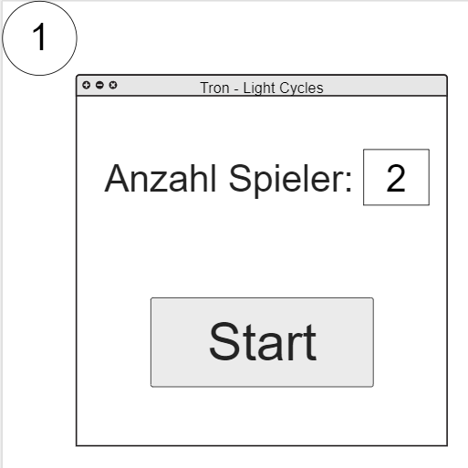 | <ul><li>Der Übergang zum Wartebildschirm erfolgt über das Anklicken des Start-Buttons</li><li>Das Spiel kann mit 2 bis 6 Spielern gespielt werden</li><li>Die gewünschte Anzahl von Spielern wird über ein Eingabefeld eingestellt</li><li>Die Spieleranzahl wird bei falscher Benutzerangabe der Default-Wert aus der Config-Datei geladen</li></ul> |
| 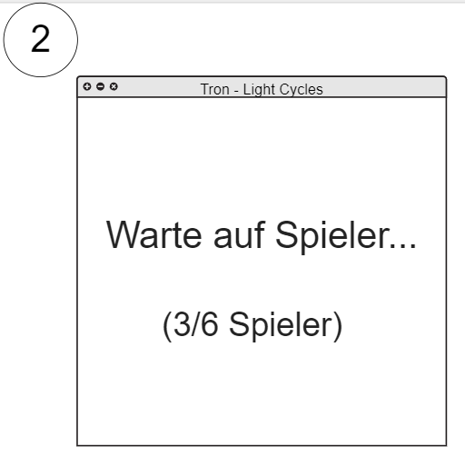 | <ul><li>Der Wartebildschirm zeigt an, wie viele Spieler bereits dem Spiel beigetreten sind und wie viele Spieler fehlen, bis die gewünschte Spieleranzahl erreicht ist.</li><li>Die maximale Wartezeit auf die gewünschte Anzahl von Spielern ist parametrisierbar (Default: 120 Sekunden)</li><li>Das Warten wird automatisch abgebrochen nach Ablauf der maximalen Wartezeit.</li><li>Das Warten auf anderen Spieler kann über den Cancel-Button abgebrochen werden, wenn man alleine wartet</li><li>Wenn das Warten abgebrochen wird, wird automatisch zum Startbildschirm gewechselt.</li><li>Das Spiel startet automatisch, wenn alle Spieler beigetreten sind</li></ul> |
| 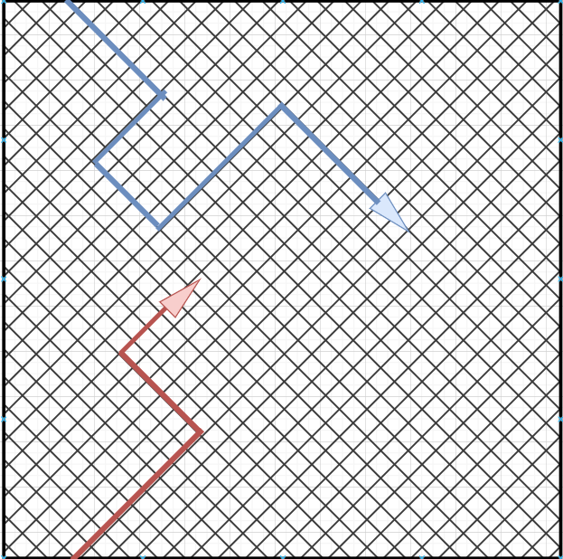 | <ul><li>Alle Spieler spielen gegen einander</li><li>Das Spielfeld ist rasterförmig mit sichtbarem Raster</li><li>Die Spielfeldgröße soll über die Config-Datei parametrisierbar sein</li><li>Der Parameter der Spielfeldgröße bestimmt die Anzahl der Reihen und Spalten (Default: Geschwindkeit * 5, Minimum:Geschwindigkeit * 5 , Maximum: Geschwindigkeit * 12)</li><li>Beim Start des Spiels gibt es einen Countdown von 3 Sekunden</li><li>Es müssen faire Startkonditionen für alle Spieler geben</li><li>Ein Spieler stirbt bei Kollision mit einer Wand, einem Motorrad oder einer Spur</li><li>Bei einer Frontalkollision zwischen zwei Spielern sterben beide Spieler</li><li>Wenn die letzten zwei Spieler durch eine Frontalkollision sterben, endet das Spiel unentschieden</li><li>Wenn die letzten zwei Spieler im Spiel gleichzeitig durch Kollision mit einer Wand und/oder Spur sterben, dann endet das Spiel unentschieden</li><li>Die zugehörige Spur verschwindet beim Tod des Spielers</li><li>Es soll erkennbar sein, welcher Spieler zum Nutzer gehört</li><li>Die Geschwindigkeit soll zwischen 1-500 Bewegungen pro Sekunde parametrisierbar sein. Bei ungültiger Eingabe, wird Geschwindigkeit auf den Default-Wert 100 gesetzt.</li><li>Das Motorrad bewegt sich automatisch geradeaus und kann nach rechts oder links gesteuert werden</li></ul> |
| 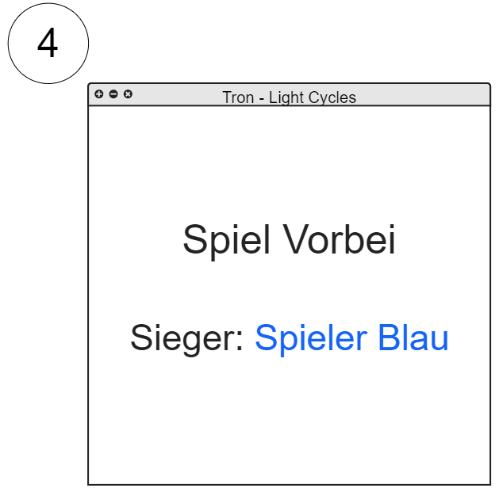  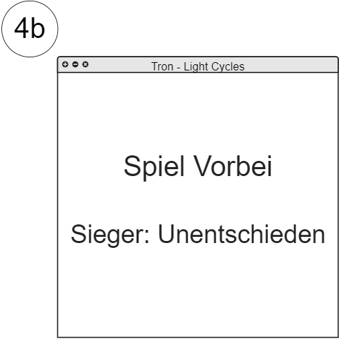| <ul><li>Der Endbildschirm erscheint, wenn das Spiel vorbei ist</li><li>Im Endbildschirm wird angezeigt, wer gewonnen hat oder ob das Spiel unentschieden ausgegangen ist</li><li>Nach 3 Sekunden wird zum Startbildschirm gewechselt</li><li>Der Endbildschirm wird erst angezeigt, wenn das Spiel vorbei ist und nicht sobald man stirbt</li></ul>
| **Konfiguration** | <ul><li>Die Konfigurationsdatei wird beim Start des Spiels geladen</li><li>Die Konfigurationsdatei kann vom Nutzer bearbeitet werden</li><li>Darüber wird der Default-Wert 2 der Spieleranzahl, die maximale Wartezeit bis zum Spielstart, die Spielfeldgröße, die Geschwindigkeit und die Tastenbelegung für die Steuerung konfiguriert</li></ul>

### **Weitere Storyboard Ansichten**

**Spielstart**

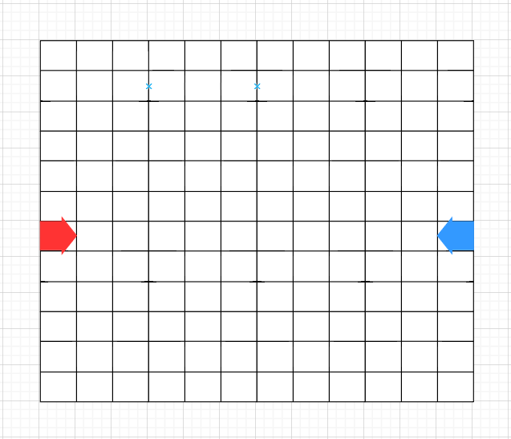
 

**Im Spiel**

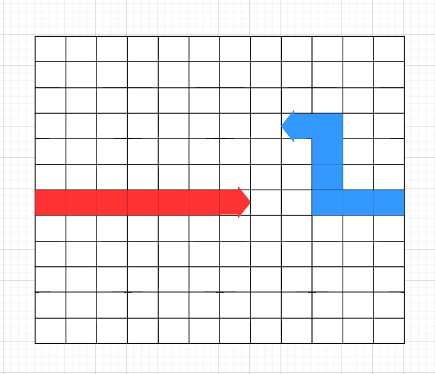
 

**Kollision mit der Wand**

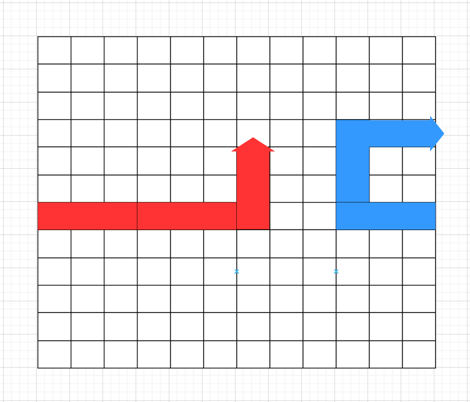
 

**Gleichzeitige Kollision zweier Spieler**

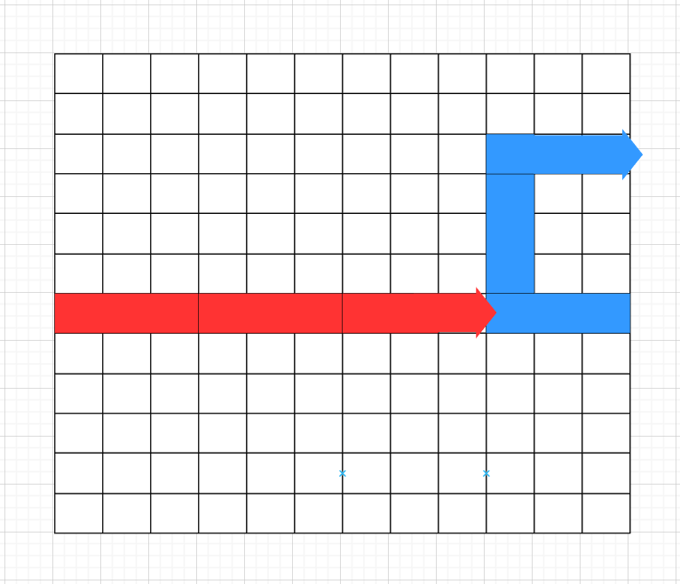
 

**Frontalkollision**

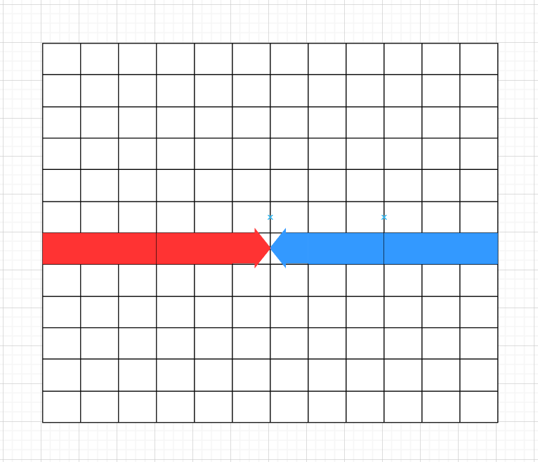
 

### **UseCases**

| Usecase | Objekt/Klasse | Vorbedingungen | Nachbedingungen |Erfolgsfall | Erweiterungsfälle| Fehlerfälle |
|---|---|---|---|---|---|---|
|**UC1** Create|Game|Der Spieler befindet sich im Startbildschirm.|Der Spieler befindet sich in der Lobby und wartet auf weitere Spieler. Der Wartebildschirm wird angezeigt. Die Spieleranzahl in der Lobby wurde aktualisiert. Dem Spieler wird seine Farbe im Spiel angezeigt|**1.** Der Nutzer gibt die gewünschte Spieleranzahl in das Eingabefeld ein und klickt den Start-Knopf an.   **2.** Falls der betreffende Spieler der Erste ist, eröffnet das System eine Lobby für die entsprechende Spieleranzahl und startet einen Timer mit der maximalen Wartezeit aus der Config.   **3.** Es wird geprüft, ob die festgelegte Spieleranzahl bereits erreicht wurde. Falls dies nicht der Fall ist, tritt der Spieler der Lobby bei und ihm wird der Wartebildschirm angezeigt.   **4.** Das System zeigt den Wartebildschirm an||**1a** Die vom Nutzer eingegebene Spieleranzahl ist nicht zwischen 2-6.    **1a.1** Das System übernimmt den Default-Wert aus der Config-Datei    **1a.2** Das System informiert den Nutzer über die altenative Spieleranzahl über eine Fehlermeldung   **2a** Die maximale Wartezeit in der Config-Datei ist nicht gültig    **2a.1** Der hinterlegte Default-Wert wird eingesetzt.   **2a.2** Der Nutzer wird über eine Meldung darüber informiert, dass die Wartezeit auf ihren Default-Wert gesetzt wurde.|
|**UC2a** Cancel Wait|Game|Der Spieler befindet sich alleine in der Lobby (Wartebildschirm).|Der Spieler befindet sich wieder im Startbildschirm. Die Spielinstanz wurde gelöscht.|**1.** Der Nutzer drückt auf den Button "Cancel".  **2.** Das System leitet ihn zum Startbildschirm zurück.  **3.** Das System löscht die Spielinstanz inkl. des Spielers. | |
|**UC2b** Time Up|Game|Eine unzureichende Spieleranzahl befindet sich in der Lobby (Wartebildschirm).|Alle Spieler befinden sich wieder im Startbildschirm. Die Spielinstanz inkl. der Spieler wurde gelöscht.|**1.** Die maximale Wartezeit aus der Config-Datei ist abgelaufen.  **2.** Das System informiert alle wartenden Spieler, dass die Wartezeit überschritten wurde.  **3.** Das System löscht die Spielinstanz und alle Spieler. | |
|**UC3** Start|Game|Alle bis auf den letzten Mitspieler befinden sich im Warteraum. Der letzte fehlende Spieler betritt den Warteraum.|Das Spiel wurde gestartet und allen Spielern wird der Spielbildschirm angezeigt.|**1.** Die benötigte Spieleranzahl wird erreicht.  **2.** Das System zeigt den 3-Sekunden-Countdown an.  **3.** Das System wechselt zum Spielbildschirm und zeigt die Farbe des Spielers an.|||
|**UC4** Steer|Spieler|Der Spieler befindet sich im Spiel und ist noch am Leben.|Das Motorrad des Spielers bewegt sich in einer Richtung weiter|**1.** Der Nutzer drückt keine Taste an    **2.** Das System zeigt die Bewegung des Motorrades in der aktuellen Richtung und Geschwindigkeit an| **1.a** Der Nutzer drückt auf eine der Steuerungstasten gemäß der angegebenen Tastenbelegung in der Config-Datei.    **1.a.2** Das System registriert den Tastendruck    **1.a.3** Das System berechnet die neue Richtung und aktualisiert die Richtung des Spielers entsprechend der gedrückten Taste    **1.a.4** Das System zeigt die neue Richtung des Motorrads des Spielers an.||
|**UC5** Collide on|Game Field|Der Spieler ist noch am Leben und bewegt sich auf dem Spielfeld|Der Spieler ist gestorben und wurde aus dem Spiel inkl. seiner Spur entfernt.|**1.** Das System stellt fest, dass sich auf der neuen Position des Motorrads des Spielers eine Wand, eine Spur oder ein anderes Motorrad befindet.   **2.** Das System entfernt die Spur des Spielers und entfernt den Spieler aus dem Spiel.   **3.** Das System zeigt eine Meldung an, um den Nutzer zu informieren, dass er gestorben ist.|||
|**UC6** Win |Game|Der Spieler befindet sich mit nur einem weiteren Spieler auf dem Spielfeld|Das Spiel wurde gelöscht und alle Nutzer wurden zum Startbildschirm weitergeleitet.|**1.** Der andere Spieler kollidiert (siehe UC5).   **2.** Das System legt den letzten überlebenden Spieler als Sieger fest    **3.** Das System zeigt allen Nutzern den Endschirm an, wo angezeigt wird, welcher Spieler gewonnen hat.   **4.** Nach 3 Sekunden löscht das System die Spielinstanz und zeigt allen wieder den Startbildschirm an.| |
|**UC7** Lose|Game|Der Spieler befindet sich mit mindestens einem weiteren Spieler auf dem Spielfeld|Der Spieler wurde aus dem Spiel entfernt|**1.** Der Spieler kollidiert (siehe UC5).   **2.** Das System entfernt den Spieler aus dem Spiel| | |
|**UC8** Tie|Game|Der Spieler befindet sich mit nur einem weiteren Spieler auf dem Spielfeld|Das Spiel wurde gelöscht und alle Nutzer wurden zum Startbildschirm weitergeleitet.|**1.** Beide Spieler kollidieren gleichzeitig (siehe UC5).   **2.** Das System legt fest, dass das Spiel unentschieden ist.   **3.** Das System zeigt allen Nutzern den Endschirm an, wo angezeigt wird, dass das Spiel unentschieden ist.   **4.** Nach 3 Sekunden löscht das System die Spielinstanz und zeigt allen wieder den Startbildschirm an.| |

## Qualitätsziele

|Qualitätsziel  |Erklärung|
|---------------|---------|
|Kompatibilität |Es können mindestens zwei Spieler auf unterschiedlichen Geräten miteinander spielen|
|Fehlertoleranz/ Stabilität| Das Spiel soll bestehen/ stabil bleiben, auch wenn Teilnehmer abstürzen|
|Zuverlässigkeit|Das Spiel soll immer gleich schnell laufen (kein "Jittering")|
|Ein Spiel am Stück (Rematch-Option)|Es reicht aus, wenn ein Spiel am Stück spielbar ist (Keine "direkte" Rematch-Option)|

## Stakeholder

|Rolle  |Kontakt        |Erwartungshaltung|
|-------|---------------|-----------------|
|Kunde  |Martin Becke   |Entwicklung eines Tron-Spiels als verteiltes System, gut dokumentiert (Code <-> Dokumentation), Konzepte aus der Vorlesung sinnvoll angewendet und verstanden|
|Entwickler|Kathleen Neitzel, Kjell May, Viviam Ribeiro| - Das Spiel als verteiltes System entwickeln und dabei die Inhalte aus der Vorlesung praktisch verstehen und anwenden können  - PVL erhalten|

# Randbedingungen

## Technisch

| Randbedingung           | Erläuterung                                 |
|-------------------------|---------------------------------------------|
| Programmiersprache | Die Vorgabe der Aufgabenstellung erfordert die Nutzung einer objektorientierten Programmiersprache. Die Nutzung von Java wird empfohlen, da in dieser Sprache Code-Beispiele in den Vorlesungen gezeigt werden. Wir haben uns aus diesem Grund für Java entschieden. |
| Versionsverwaltung | Die Nutzung von unserem hochschuleigenen Gitlab ist ebenfalls vorgeschrieben. Aufgrund eines Hackerangriffs in der Hochschule sind wir später im Projekt auf GitHub umgestiegen. |
| Schnittstellen     | Kommunikation mit RPC  |

## Organisatorisch

| Randbedingung   | Erläuterung |
|-----------------|-------------|
| Team            | Kjell May, Viviam Ribeiro und Kathleen Neitzel aus dem Studiengang der Angewandten Informatik. Fachsemester 6 und 7. |
| Zeit            |Abgabe am 19. Januar 2023. |
| Vorgehensmodell | Die Entwicklung wird iterativ und inkrementell betrieben. Zur Dokumentation wird arc42 genutzt|

# Kontextabgrenzung

## Fachlicher Kontext

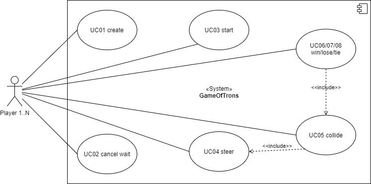

## Technischer Kontext

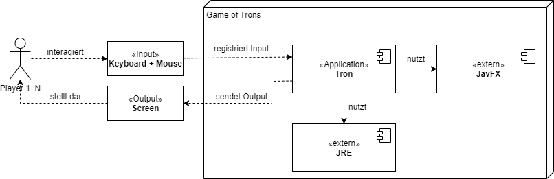

# Lösungsstrategie

|Use Case| Akteur | Funktionssignatur |Vorbedingung| Nachbedingung | Ablaufsemantik | Fehlersemantik |
| --- | --- | --- | --- | --- | --- | --- |
|UC1 | Controller | int handleInputPlayerCount() | Der Nutzer hat die gewünschte Spieleranzahl eingegeben und auf den Button "Start" gedrückt. | Die Spieleranzahl der Spielinstanz wird im Model gespeichert. |Die Methode liefert die durch den Benutzer eingegebenen Spieleranzahl | Wenn die Spieleranzahl keine Zahl zwischen 2 und 6 ist, wird die Methode loadDefaultPlayerCount() aufgerufen |
|UC1 | Controller | int loadDefaultPlayerCount() | Der Nutzer hat eine ungültige Spieleranzahl eingegeben. | Die Default-Spieleranzahl wird im Model gespeichert.  |Die Methode liefert den Default-Wert für die Spieleranzahl aus der Config-Datei und ruft die Methode informUser("Spieleranzahl muss eine Zahl zwischen 2 und 6 sein. Der Default-Wert <<Default-Wert>> wird gesetzt") | Wenn keine Zahl geladen werden konnte, wird eine Exception mit Fehlerbeschreibung geworfen. |
|UC1 | Controller |int[] loadConfigParams() | Eine gültige Spieleranzahl wurd im Model gespeichert.  | Es wurde eine Liste mit Spielparametern erzeugt. |Die Methode liefert die Parameter aus der Config-Datei in einem int-Array der Länge 4.   **Index 0:** Die maximale Wartezeit   **Index 1:** Die Tastenbelegung (0: Steuerung über die Pfeiltasten rechts/links; 1: Steuerung über die Tasten 'A'/'D')   **Index 2:** Die Geschwindigkeit  **Index 3:** Die Spielfeldgröße | Wenn ein Parameter nicht im gültigen Wertebereich liegt oder nicht geladen werden konnte, wird der entsprechende Default-Wert gesetzt:   **Default maximale Wartezeit:** 120 Sekunden  **Default Geschwindkeit:** 100 (Einheit: Bewegungen/Sekunde)   **Default Spielfeldgröße:** Geschwindigkeit * 5    Anschließend wird die Methode informUser("Ein oder mehr Parameter aus der Konfigurationsdatei waren ungültig oder konnten nicht geladen werden. Die betroffenen Parameter wurde auf Default-Werte gesetzt.") aufgerufen |
|UC1| Model | ``void join(int, int)`` | Ein Spieler möchte dem Spiel durch Drücken auf Start beitreten oder ist der erste und erstellt damit ein Spiel | Der Spieler wurde im Spiel registriert. Wenn das Spiel voll ist, wird es gestartet | Nach Klick auf Start wird diese Methode mit der Anzahl der Spieler aus dem Feld des Startbildschirms und der maximalen Wartezeit aufgerufen. Ist noch kein `fullPlayerCount` gesetzt, ist die übergebene Anzahl die Lobbygröße. Die Anzahl der Spieler in der Lobby werden hochgezählt. Dann wird geschaut, ob die Lobby voll ist und dann entweder das Spiel gestartet oder die Anzahl der wartenden Spieler in der View aktualisiert und der Warte-Timer zurückgesetzt | 1. Ein Spieler tritt mit seiner eingetragenen Anzahl an Spielern bei, die Lobby hat aber schon eine gesetzte Größe. Dann wird der Spieler darüber informiert (`informUser()`) |
|UC2a+b | Model | ``void cancelWait()`` | Der Cancel-Button wurde gedrückt oder die maximale Wartezeit ist abgelaufen | Das Spiel wurde abgebrochen und alles zurückgesetzt | fullPlayerCount und numPlayers werden auf 0 gesetzt, der Timer abgebrochen, der User informiert und die Spielinstanz im Controller gelöscht | |
|UC3| Model |``void startGame(int, int)``| Es sind genug Spieler beigetreten|Das Spiel wurde initialisiert und alle Spieler befinden sich auf ihrer Startposition und sehen den Spielbildschirm | startGame() wird mit Anzahl Reihen (Spalten entfallen, da das Spielfeld quadratisch ist) und Spielgeschwindigkeit aufgerufen. Das Spielfeld und die Spieler werden initialisiert und die Spieler auf ihre Startpositionen gesetzt ||
|UC1, UC2, UC5 | View | void informUser(String) | Ein Fehler ist aufgetreten | Dem Nutzer wird ein Text mit der entsprechenden Fehlerbeschreibung angezeigt. |Zeigt die übergebene Fehlerbeschreibung dem Nutzer an | |
|UC1, UC2, UC6, UC8 | View |void showScreen(String) | Der Spielzustand wurde im Controller gewechselt. | Dem Nutzer wird einen anderen Bildschirm angezeigt. |Die Methode zeigt den Bildschirm an, der zum übergebenen Bildschirmzustand passt.  | Wenn zum übergebenen Zustandsparameter kein anzuzeigenden Bildschirm gehört, wird eine Exception mit einer Fehlerbeschreibung geworfen. |
|UC2 | Controller | void handleWaitingButtonClick() | Der Nutzer befindet sich alleine in der Lobby und hat auf den Button "Cancel" geklickt.| Der Spieler wird  zum Startbildschirm zurückgeleitet. |Die Methode bricht den Wartevorgang ab. | |
|UC2, UC6, UC8 | Controller | void deleteGameInstance() | Der Wartevorgang wurde durch Nutezraktion oder Timerablauf abgebrochen oder das Spiel wurde zu Ende gespielt. | Die Spielinstanz wurde gelöscht. |Die Methode löscht die aktuelle Spielinstanz. |  |
|UC2 | Controller| void cancelWaitingTimer() | Der Nutzer befindet sich im Warteraum und der Timer des Warteraums ist abgelaufen, weil zu lange auf anderen Spieler gewartet wurde. |Der Nutzer wird zum Startbildschirm weitergeleitet. |Die Methode bricht den Wartevorgang ab und informiert den Nutzer über den Aufruf der Methode informUser("Wartezeit zu lang. Der Wartevorgang wird abgebrochen ...").| |
|UC3 | Controller | void notifyCountdownOver() | Der Countdown wurde von der View dem Nutzer angezeigt. | Der Controller bekommt mit, dass der Countdown vorbei ist und ruft die Methode startGame() des Models auf. | Die Methode erzeugt einen Event für den Controller, dass der Countdown vorbei ist.|  |
|UC4 | View | void drawPlayers() | Der Nutzer befindet sich im Spielbildschirm und die Spielfeldanzeige soll die aktuelle Positionen der Spieler zeigen | Auf dem Spielfeld werden die aktuell lebenden Spieler an ihren aktuellen Positionen angezeigt. |Die Methode iteriert über alle Spieler, holt ihre Koordinaten und zeichnet sie an ihrer aktuellen Position ein. | Im Fehlerfall wird eine Exception mit Fehlerbeschreibung geworfen |
|UC4 | View | void drawTileColors(int id, int oldX, int oldY, int difX, int difY, String oldOrientation) | Der Nutzer befindet sich im Spielbildschirm und die Methode updatePlayer() wurde aufgerufen. | Die Daten zur Einfärbung des Spielfeldes werden auf den aktualisierten Stand gebracht. |Die Methode berechnet, welche Tiles mit der Farbe des übergebenen Spielers eingefärbt werden sollen und ihren Wert auf die Farbe des Spielers. | |
|UC4| Controller | String handleDirectionKeyboardInput() |Der Nutzer hat eine Taste füe die Steuerung seines Spielers gedrückt.| Die gewünschte Richtungsänderung wird zurückgegeben. | Die Methode liefert die Richtung, die über die Tastatur vom Nutzer eingegeben wurde. Wenn die entsprechende Tastenbelegung für die Steuerung des Motorrads nach links gedrückt wurde, gibt die Methode den String 'left' zurück.   Wenn die entsprechende Tastenbelegung für die Steuerung des Motorrads nach rechts gedrückt wurde, gibt die Methode den String 'right' zurück.| Im Fehlerfall wird eine Exception mit Fehlerbeschreibung geworfen |
|UC4 | Model | ``void changePlayerDirection(int, String)`` | Der Nutzer hat eine Taste für die Richtungsänderung gedrückt und die gewünschte Richtung wurde ermittelt. | Der Spieler wurde um 90° in die gewünschte Richtung gedreht.|Der Methode werden als Parameter die Spieler-ID und ein String übergeben, welche die Information liefert, ob der Spieler nach links oder nach rechts gesteuert wird. Der Spieler mit der ID wird in der Liste der Spieler gesucht. Es wird überprüft, ob der Spieler noch am Leben ist und ob er in diesem Tick bereits eine Aktion getätigt hat. Aus der aktuellen front und der Richtung des Spielers bezogen aufs Spielfeld werden die neue front und die neue Richtung berechnet und gesetzt. Außerdem wird gespeichert, dass der Spieler diesen Tick eine Aktion getätigt hat. | Wenn der Spieler mit der übergebenen ID nicht unter den Spielern gefunden wurde, nicht am Leben ist oder bereits eine Aktion diesen Tick gemacht hat, wird die Eingabe ignoriert. |
|UC4,5,6,7,8 | Model | ``void update()`` | Das Spiel befindet sich im Zustand RUNNING. | Alle lebenden Spieler wurden bewegt, das Spiel ist möglicherweise vorbei. | Diese Methode ist die tick-Methode/ der Gameloop des Spiels. Sie wird also in festen Zeitintervallen ausgeführt. Diese Methode ruft intern `updatePlayers()` zum Aktualisieren der Spieler auf (Bewegen und Töten). Dann wird der GameState geprüft. Ist das Spiel RUNNING, werden alle neuen Positionen der Spieler an die View mittels `getPlayerPositions()` und ``updatePlayer()`` übermittelt. Tote Spieler werden hier auch mitgeschickt mit der Info, dass sie entfernt werden sollen. Ist das Spiel OVER wird stattdessen der Sieger erfragt und an den Controller übermittelt, um das Spiel zu beenden.||
|UC4,5,6,7,8 | Model | ``void updatePlayers()`` | Das Spiel befindet sich im Zustand RUNNING. Diese Methode wurde in ``update()`` aufgerufen. | Alle Spieler wurden bewegt und eventuell Spieler getötet. | Es wird zu Beginn eine leere Liste initialisiert für Spieler, die diesen Zug sterben könnten. Dann werden alle Spieler bewegt, von denen diesen Tick kein Input kam (mit ``movePlayersNoInput()``). Danach wird über alle lebenden Spieler iteriert. Spieler werden der Liste hinzugefügt, wenn es eine Kollision an ihrer front gibt (geprüft durch ``checkForCollision()``). Wenn es keine Kollision für den aktuell betrachteten Spieler gibt, wird `movePlayer` aufgerufen, um den Spieler zu bewegen. Wurden alle Spieler abgehandelt, werden in der Methode ``killPlayers()`` alle Spieler in der Liste getötet.||
|UC4 | Model | ``void movePlayersNoInput()`` | Das Spiel befindet sich im Zustand RUNNING. Diese Methode wurde in ``updatePlayers()`` aufgerufen. | Alle Spieler wurden diesen tick bewegt | Es wird über alle Spieler iteriert. Für jeden, der keine `currentAction` hat, wird mit ``calcNextPos()`` die nächste Position in der aktuellen Richtung berechnet und als front des Spielers gesetzt |  |
|UC4 | Model | ``Position calcNextPos(Position, Direction, String)`` | Die neue Position eines Spielers soll ermittelt werden | Die neue Position wurde berechnet und zurückgegeben | Zuerst wird ein int[] initialisert mit den Änderungen für x und y je nach Richtung (LEFT,UP,RIGHT,DOWN). Dann wird anhand der übergebenen Richtung und der `action` als String die resultierende Richtung ermittelt. Anhand der ordinalen Ordnung dieser Richtung im enum werden die Änderungen für x und y mithilfe des int[] bestimmt und zurückgegeben | |
|UC5 | Model | ``boolean checkForCollision(Position)`` | Das Spiel befindet sich im Zustand RUNNING. Diese Methode wurde in ``updatePlayers()`` aufgerufen. | Eine Kollision wurde korrekt erkannt und zurückgegeben. | Der Methode wird die front eines Spielers übergeben. Befindet sich diese außerhalb des Spielfelds - x > Anzahl Spalten oder y > Anzahl Reihen oder eins der beiden < 0 - wird true zurückgegeben. Wenn  front gleich der front eines anderen lebenden Spielers ist, wird auch true zurückgegeben. Ist das nicht der Fall wird geschaut, ob sich die front in einem trail eines lebenden Spielers (auch des Spielers selbst) befindet. Auch hier wird demnach true zurückgegeben, sonst false. ||
|UC4 | Model | ``void movePlayer(Player)`` | Das Spiel befindet sich im Zustand RUNNING. Diese Methode wurde in ``updatePlayers()`` aufgerufen.| Der Spieler wurde bewegt, indem die front dem trail angefügt wurde | Die front des übergebenen Spielers wird an den trail angehangen. Die currentAction wird auf null gesetzt ||
|UC4,5,6,7,8 | Model | ``void killPlayers(List<Player>)`` | Das Spiel befindet sich im Zustand RUNNING. Diese Methode wurde in ``updatePlayers()`` aufgerufen. | Zu tötende Spieler wurden getötet und eventuell ein Sieger des Spiels bestimmt. | Ist die übergebene Liste leer, wird einfach zurückgekehrt. Dann wird geprüft, ob die Listengröße gleich Anzahl lebender Spieler ist. In dem Fall hat man ein Unentschieden, der gameWinner wird auf -1 und der GameState auf OVER gesetzt und es wird returned. Andernfalls werden alle Spieler der Liste auf tot gesetzt. Ist danach nur noch ein Spieler übrig, ist dies der Gewinner, gameWinner wird auf seine ID und der GameState auf OVER gesetzt. ||
|UC5, UC7| View |removeTileColor(int) | Ein Spieler ist gestorben und die Methode kill() wurde in der View aufgerufen. | Die Felder, die mit als Parameter eingegebenen Farbe eingefärbt waren, sind nicht mehr eingefärbt, sondern haben die gleiche Farbe wie der Spielhintergrund.| Die Methode ändert die Farbe von jedem Feld mit der als Parameter übergebenen Farbe zur Hintergrundfarbe. | |
|UC5, UC7| View |kill(int) | Die View wurde informiert, dass ein Spieler gestorben ist. | Der tote Spieler wurde aus der Spielerliste entfernt und seine eingefärbten Felder wurden zurückgesetzt.| Ruft die Methode removeTileColor() auf und entfernt den Spieler aus der Spielerliste. |   |
| UC1-8 | View |updatePlayer(int ID, int X, int Y, int orientation) |Im Model wurden Daten zu den Spielern geändert. | Die View hat ihre Daten aktualisiert. | Die Methode aktualisiert die Position des Spieler mit der übergebenen ID auf die übergebenen Koordinaten. Wenn sich die Ausrichtung des Spielers auch geändert hat, wird die neue Richtung in der View gezeigt. Dann wird die Methode drawTileColors() aufgerufen Wenn die Koordinaten <0 sind, dann ist der Spieler tot und die Methode kill() wird aufgerufen. | |
| UC3 | View | setGameFieldSize(int)| Alle Spieler haben den Warteraum betreten.|Die Spielfeldgröße wird in der View gespeichert.  |Die Methode setzt die Spielfeldgröße in der View, die aus der Config-Datei geladen wurde. Dann werden die Spieldaten benutzt, um das Spielfeld zu initialisieren.| |
|UC6,7,8| Controller| void endGame(int)| Im Model wurde ein Gewinner festgelegt oder das Spiel wurde als unentschieden entschieden. | Die State Maschine im Controller befindet sich im Zustand "End" | Die Methode ändert die State Maschine im Controller zum Zustand "End"| |
|UC6,7,8|View|notifyGameResult(int)| Die State Maschine des Controllers befindet sich im Zustand "End"| Die View weiß, wie das Spiel ausgegangen ist und zeigt im nächsten Schitt den Endbildschirm an.| Die Methode setzt den Gewinner des Spiels in der View-Komponente.| |
| UC1,2a,2b,3,6,7,8 | Controller | void setCurrentState(String) | Der Controller wurde gestartet oder ist bereits am laufen und befindet sich in einem State.  | Der State des Controllers wurde gewechselt und die behavior() Methode des aktuellen States kann ausgeführt werden. | Die Methode kann vom Controller (bzw. der State Machine) selbst innerhalb der behavior() Methode aufgerufen werden oder von außen durch das Model. In einem String wird der Folgezustand übergeben. Beim setzen des nächsten States wird direkt die behavior()-Methode ausgeführt. |  |   
| UC1,2a,2b,3,6,7,8 | Controller | void behavior() | Die State Machine hat ihren Zustand gewechselt und führt die behavior Methode aus. | Die behvaior()-Methode wurde ausgeführt und ggf. der Zustand gewechselt. | Je nachdem in welchem State sich die State Machine aktuell befindet, wird die entsprechende behvior()-Methodenimplementierung ausgewählt und ausgeführt. |  |   

# Bausteinsicht
## Ebene 1

### Whitebox Gesamtsystem

Game Of Trons ist in drei Komponenten aufgeteilt, die in der unteren Abbildung zu sehen sind.
Die Komponenten bieten über Schnittstellen ihre Funktionalitäten an und nutzen ebenso über Schnittstellen die Funktionalitäten anderer Komponenten.

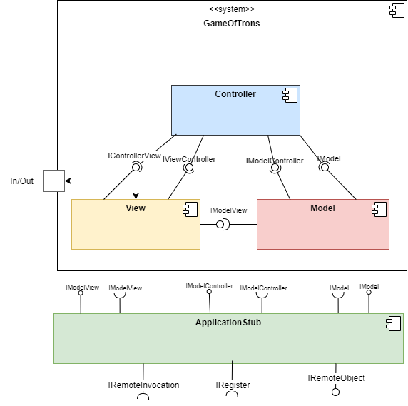 

Die Komponentenaufteilung richtet sich nach dem eingesetzten MVC-Architekturmuster. 

**Enthaltene Bausteine**

| Baustein | Kurzbeschreibung |
| --- | --- |
| Model | Enthält das Datenmodell und die Spielelogik |
| View | Verantwortlich für die GUI-Anzeige und das Empfangen von Nutzereingaben|
|Controller | Regelt die Ablaufsemantik außerhalb des Spiels und vermittelt zwischen Model und View.|
| Application Stub | Fängt Methodenaufrufe auf und leite sie an die Middleware weiter. Wird von der Middleware aufgerufen, um Methodenaufrufe an die aufgerufene Klasse weiterzuleiten. |

### Model (Blackbox)

**Zweck/ Verantwortung**

Das Model ist in unserem Spiel für die Lobby- und die Spielelogik zuständig. Für die Lobby registriert es neue Spieler und startet das Spiel bei voller Lobby oder bricht es im Bedarfsfall ab. Für das Spiel berechnet es den aktuellen Spielstand anhand der Eingaben und gibt die Informationen an die View weiter

**Schnittstelle(n)**

Um einen Spielstart und ein Spielende zu signalisieren, benötigt das Model die angebotene Schnittstelle *IContext* vom Controller. Um die angezeigten Daten in der View zu aktualisieren, benötigt das Model die Schnittstelle *IModelView* von der View. Das Model selbst bietet die Schnittstelle *IModel* für den Controller an, um die Lobby zu steuern, das Spiel zu initialisieren und über Tasteneingaben informiert zu werden.

| Methode | Kurzbeschreibung |
| --- | --- |
| ``join(int, int)`` | Zum Erstellen oder Beitreten einer Lobby |
| ``cancelWait()`` | Zum Abbrechen der Lobby durch Ablaufen der Wartezeit oder Drücken auf 'Cancel' |
| ``startGame(int,int)`` | Lässt das Spiel mit den übergebenen Einstellungen (Spielfeldgröße und Spielgeschwindigkeit) starten |
| ``changePlayerDirection(int,String)`` | Für Verarbeitung der Tasteneingaben für einen Spieler |
| ``setNumPlayers`` | Zum Setzen der Spieleranzahl |

### View (Blackbox) 

**Zweck/ Verantwortung**

 Das View-Subsystem implementiert die gleichnamige View des eingesetzten MVC-Patterns.
 Die Komponente stellt die grafische Benutzeroberfläche bereit. Es nimmt Aktionen vom Nutzer entgegen und leitet diese zum Controller weiter. 

 Bei Bedarf, im Falle einer Änderung im Datenmodell (Datenmodell wird im Subsystem Model verwaltet), wird die View darüber informiert und passt die angezeigten Inhalte an.

**Schnittstelle(n)**

Die View bietet die Bildschirmanzeigefunktionalität, das Setzen der Spielfeldgröße und das Setzen des Spielergebnisses über die Schnittstelle **IControllerView** an.

| Methode | Kurzbeschreibung |
| --- | --- |
| showScreen(String) | Zeigt den Bildschirm an, der zum als String übergebenen Programmzustand passt. |
| setGameFieldSize(int)| setzt die Spielfeldgröße in der View. Der Aufrufparameter bestimmt die Anzahl der Reihen und Spalten des rasterförmigen Spielfeldes.|
| notifyGameResult(int) | setzt ein Spielergebnis in der View. Die Methode wird mit der SpielerID des Gewinners aufgerufen oder mit -1, wenn das Spiel unentschieden ist. |

Die View erlaubt das Aktualisieren der Spielerdaten über die Schnittstelle **IModelView**

| Methode | Kurzbeschreibung |
| --- | --- |
|updatePlayer(int, int, int, int) | Aktualisiert die Spielerliste, die in der View gehalten wird. Der erste Parameter ist die ID des zu aktualisierenden Spielers. Der zweite und dritte Parameter sind die neuen X- und Y-Koordinate des Spielers. Wenn die Koordinaten -1 und -1 betragen, dann ist der Spieler tot. |

### Controller (Blackbox) 

**Zweck/ Verantwortung**

Der Controller steuert den gesamten Ablauf rund um das Spiel. Dieser umfasst das Weiterleiten vom Startbildschirm in die Lobby, das Warten auf weitere Mitspieler, das Mitteilen des Siegers am Ende des Spiels, das Löschen der beendeten Runde und das Zurückleiten zum Startbildschirm. Außerdem setzt der Controller die Kommunikation zwischen der View- und der Modelkomponente sowohl vor und nach als auch während der laufenden Runde über mehrere Schnittstellen um.
Während des Spiels nimmt der Controller die Benutzereingaben zur Steuerung des Spielers an und leitet diese an das Model weiter.

**Schnittstelle(n)**

Der Controller bietet Funktionalitäten für das Model v.a. zur Kommunikation mit der View über die Schnittstelle **IModelController** an.

| Methode | Kurzbeschreibung |
| --- | --- |
| void endGame(int) | Das Model ruft die Methode endGame() auf und übergibt als Parameter das Spielergebnis in Form eines int. Die State Machine wechselt vom Zustand GAME in den Zustand END. | |
| void setCurrentState(String) | Das Model einen Zustandswechsel der State Machine mit dieser Methode bewirken. Der nächste Zustand wird hierbei in einem String übergeben. |

Der Controller bietet Funktionalitäten für die View v.a. zur Kommunikation mit dem Model über die Schnittstelle **IViewController** an.

| Methode | Kurzbeschreibung |
| --- | --- |
| int handleInputPlayerCount() | Der Nutzer drückt den Start-Button. Falls eine gültige Eingabe für die Spieleranzahl vom Nutzer getätigt wurde, wird der Wert in einer Variable gespeichert. Andernfalls wird die Methode loadDefaultPlayerCount() aufgerufen. |
| void handleWaitingButtonClick()| Der Nutzer drückt den Cancel-Button. Wartevorgang wird abgebrochen, falls der Nutzer alleinein der Lobby wartet. Andernfalls wird mit informUser() eine Nachricht versendet, dass der Wartevorgang nicht abgebrochen werden kann. |
| String handleDirectionKeyboardInput()| Der Nutzer tätigt  eine Tastatureingabe zur Steuerung seines Spielers. Zurückgegeben wird die für die Taste hinterlegte Richtung. Bei keiner Belegung wird eine Exception geworfen. |
| void notifyCountdownOver() | Die View hat die Countdownanzeige abgeschlossen und benachrichtigt den Controller, dass der Countdown vorbei ist. Der Controller ruft die Methode startGame() des Models auf. |

### Factory

**Zweck/ Verantwortung**

Die Komponente Factory bietet eine Factory nach außen an, um Caller-/ Realimplementierungsreferenzen zurückzugeben. Dabei wird das gewünschte Interface und ob remote gespielt wird übergeben.

**Schnittstelle(n)**

Die einzige von außen aufrufbare Klasse heißt MVCFactory, die in den Klassen genutzt werden kann.

| Methode | Kurzbeschreibung |
|-|-|
| Object getInterface(String, boolean) | Es wird ein Objekt vom Interface im übergebenen String zurückgegeben. Wenn remote gespielt wird, ist der zweite Parameter true und das Caller Objekt wird zurückgegeben, sonst das der Realimplementierung |

### Application Stub (Blackbox) 

**Zweck/ Verantwortung**

Der Application Stub fängt Methodenaufrufe auf, die Schnittstellen von Remote-Komponenten aufrufen. Beim Auffangen wird die Middleware aufgerufen.

Außerdem leitet der Application Stub einen durch die Middleware empfangenen Methodenaufruf an die richtuge Komponentenschnittstelle weiter, wo der Aufruf abgearbeitet wird.

**Schnittstelle(n)**

Die Schnittstelle **IRemoteObject** bietet die Funktionalität zum Empfangen von Remote-Methodenaufrufen an. 

| Methode | Kurzbeschreibung |
|call(String methodName, Object[] args) | Eine zu importierende Schnittstelle wird gefragt, ob eine Methode mit dem Namen "methodName" vorhanden ist. Wenn ja, dann wird diese Methode mit den Aufrufparametern im Array "args" aufgerufen.|

## Ebene 2 

### Whitebox Model

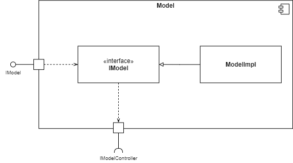

### Whitebox View

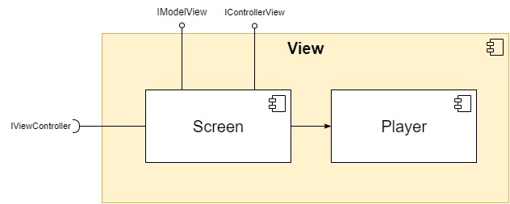

### Whitebox Controller

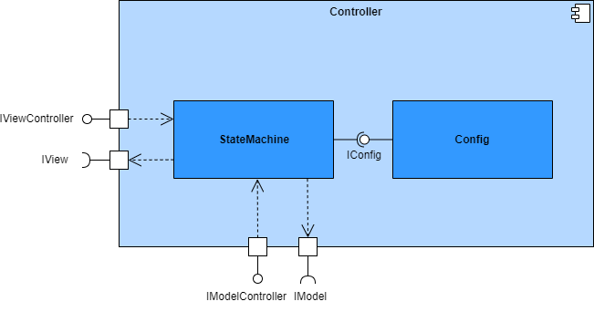
 

### Whitebox Factory

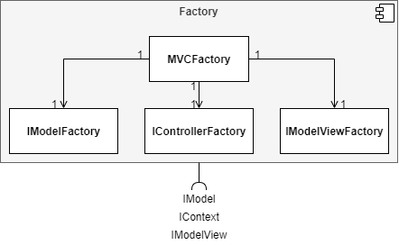

### Whitebox Application Stub

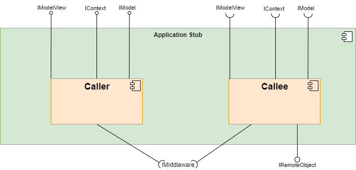

## Ebene 3 

### Whitebox Model

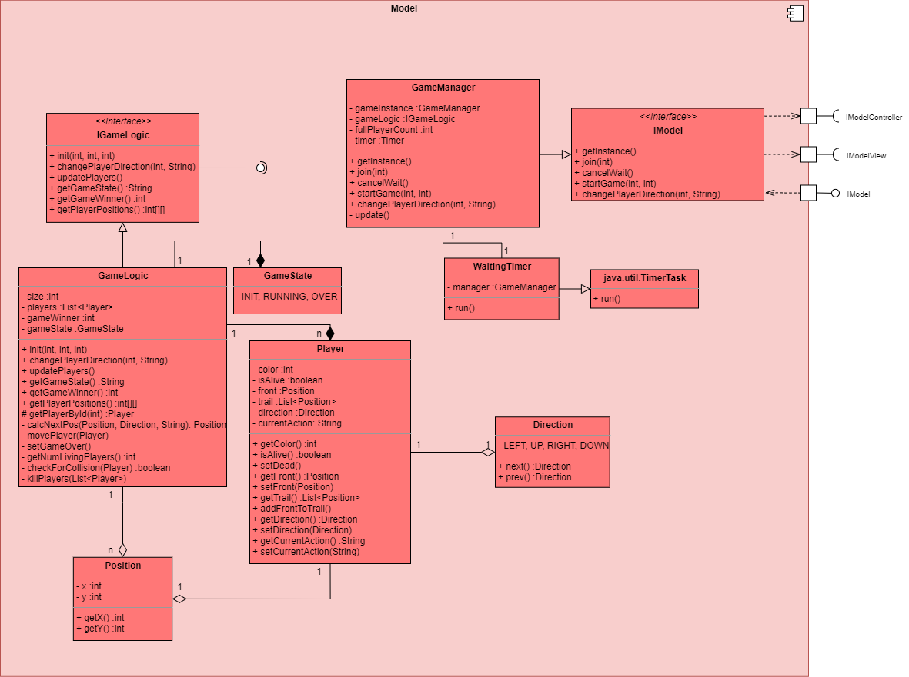

*Öffentlich (GameManager und GameLogic):*
| Methode | Kurzbeschreibung |
| --- | --- |
| ``getInstance()`` | Liefert die IModel-Instanz(Singleton-Pattern)|
| ``initialize(IContext,IModelView)`` | Zum Herstellen der Referenzen |
| ``join(int, int)`` | Zum Erstellen oder Beitreten einer Lobby |
| ``cancelWait()`` | Zum Abbrechen der Lobby durch Ablaufen der Wartezeit oder Drücken auf 'Cancel' |
| ``startGame(int,int)`` | Lässt das Spiel mit den übergebenen Einstellungen (Spielfeldgröße und Spielgeschwindigkeit) starten |
| ``changePlayerDirection(int,String)`` | Für Verarbeitung der Tasteneingaben für einen Spieler|
| ``init(int,int)`` | Wird in `startGame()` aufgerufen und initialisert das Spiel |
| ``updatePlayers()`` | Aktualisiert die Position aller Spieler und bereitet tote Spieler auf ihre Entfernung vor |
| ``getGameState()`` | Liefert den GameState für den Manager als String |
| ``getGameWinner()`` | Liefert die id des Siegers oder -1 bei Unentschieden |
| ``getPlayerPositions()`` | Liefert die Positionen aller Spieler im Format int[4] mit {Spieler-ID,x,y,dir} für die aktuelle Position und Richtung als ordinal und {Spieler-ID,-1,-1,-1} wenn der Spieler tot ist |
| ``setNumPlayers`` | Lässt die Anzahl der Spieler setzen vor Spielstart |

``Player`` und ``Position`` haben nur Getter/ Setter als öffentliche Methoden. ``prev()`` und ``next()`` von ``Direction`` liefern die ordinal vorherige/ nächste Richtung von LEFT,UP,RIGHT,DOWN. In ``run()`` von ``WaitingTimer`` wird ``cancelWait()`` von ``GameManager`` aufgerufen, um das Spiel abzubrechen.

*Privat:*
| Methode | Kurzbeschreibung |
| --- | --- |
| ``update()`` | Der Gameloop/ die tick-Methode des Spiels. Aktualisiert alle Spieler und schickt Updates/ Spielergebnis an die View/ den Controller |
| ``getPlayerById(int)`` | Liefert das Player-Objekt mit der übergebenen id |
| ``calcNextPos(Position,Direction,String)`` | Liefert die berechnete Position aus den übergebenen Parametern |
| ``movePlayer(Player)`` | Bewegt den übergebenen Spieler weiter, indem seine front an den trail gehangen wird |
| ``setGameOver()`` | Setzt den GameState auf OVER |
| ``getNumLivingPlayers()`` | Liefert die Anzahl der noch lebenden (``isAlive=true``) Spielern |
| ``checkForCollision(Player)`` | Gibt zurück, ob ein Spieler eine Kollision hat |
| ``killPlayers(List<Player>)`` | Tötet alle Spieler die sich in der übergebenen Liste befinden |
   
### Whitebox View

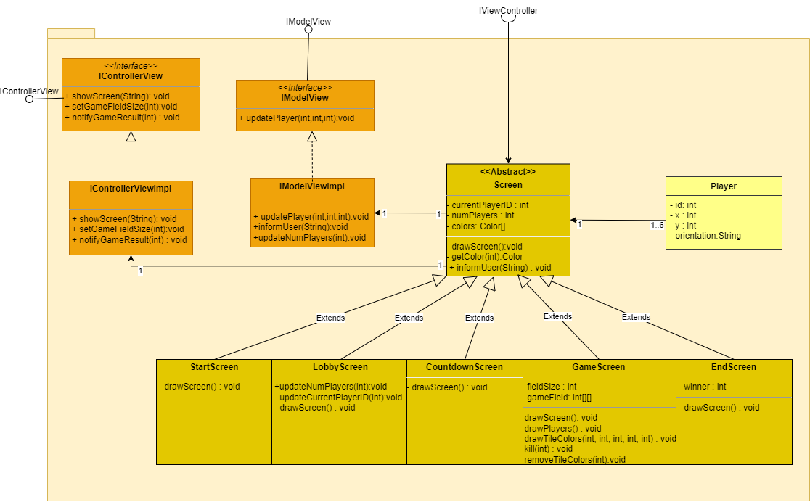

|Methode| Kurzbeschreibung|
| --- | --- |
|drawScreen() | Abstrakte Methode, die in den konkreten Klassen die Bildschirmanzeige zeichnet. |
|informUser(String) | konkrete Methode, die eine Meldung (als String-Aufrufparameter übergebe) dem Nutzer anzeigt. |
|Color getColor(int) |Bildet Spieler-IDs eindeutig auf Anzeigefarben ab und liefert die Farbe zur angefragten ID.|
|drawPlayers() | Zeigt die aktuell lebenden Spieler an ihrer aktuellen Position an. |
|drawTileColors(int, int, int, int, int,String) | Wird mit der Spieler-ID, mit den alten Spielerkoodinaten und der Differenz zwischen den  alten und neuen Spielerkoordinaten aufgerufen. Für die Berechnung wird die Ausrichtung des Spielers benötigt (String-Parameter). Die Methode berechnet die Spielfelder, die von dem Spieler besetzt wurden und aktualisiert die Spielfelddaten entsprechend.|
|kill(int)| Ruft RemoteTileColors auf und entfernt den Spieler aus der Spielerliste|
|updateCurrentPlayerID(int)|Wenn updateNumPlayers(int) aufgerufen wird, wird geprüft, ob eine die currentPlayerID schon gesetzt ist, Wenn nicht, dann wird diese Methode aufgerufen. Dabei wird der übergebene Parameter die aktuelle Spieleranzahl-1 und wird als ID für den Spieler genutzt.|

   
### Whitebox Controller

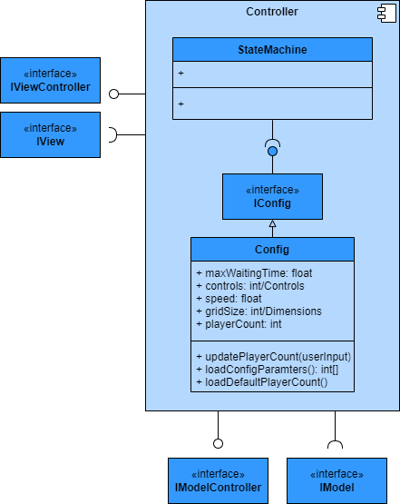

State Machine
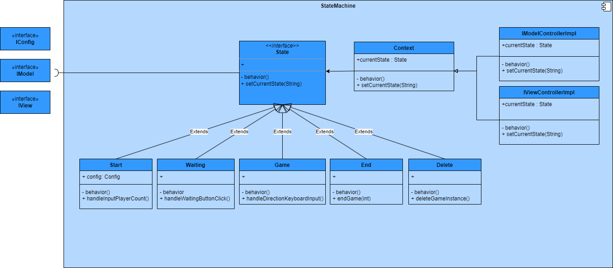

Controller
| Methode | Kurzbeschreibung |
| --- | --- |
| behavior() | Führt nach einem Zustandswechsel die dem aktuellen State entsprechende behavior()-Implementierung aus. |
| deleteGameInstance() | Löscht die aktuelle Spielinstanz. |

IConfig
| Methode | Kurzbeschreibung|
| --- | --- |
| loadConfigParameters() | Liefert die für das Spiel relevanten Parameter aus der Config-Datei in einem Array. |   
| loadDefaultPlayerCount() | Lädt den in der Config gespeicherten Defaultwert für die Spieleranzahl |   

### Whitebox Factory

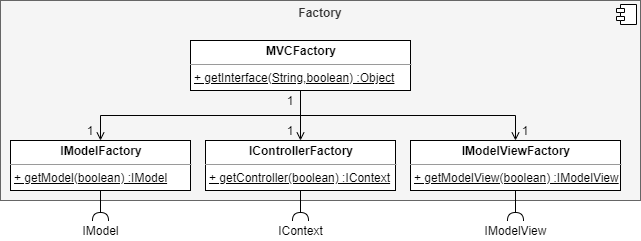

*Öffentlich*:
| Methode | Kurzbeschreibung|
| --- | --- |
| Object getInterface(String, boolean) | Es wird ein Objekt vom Interface im übergebenen String zurückgegeben. Wenn remote gespielt wird, ist der zweite Parameter true und das Caller Objekt wird zurückgegeben, sonst das der Realimplementierung |

*Protected*:
| Methode | Kurzbeschreibung|
| --- | --- |
| IModel getModel(boolean) | Gibt entweder ein Caller- oder Realimplementierungsobjekt, je nach boolean-Wert  |
| IModelView getModelView(boolean) | Gibt entweder ein Caller- oder Realimplementierungsobjekt, je nach boolean-Wert  |
| IContext getController(boolean) | Gibt entweder ein Caller- oder Realimplementierungsobjekt, je nach boolean-Wert  |

### Whitebox AppStub
   
**Caller-Whitebox**
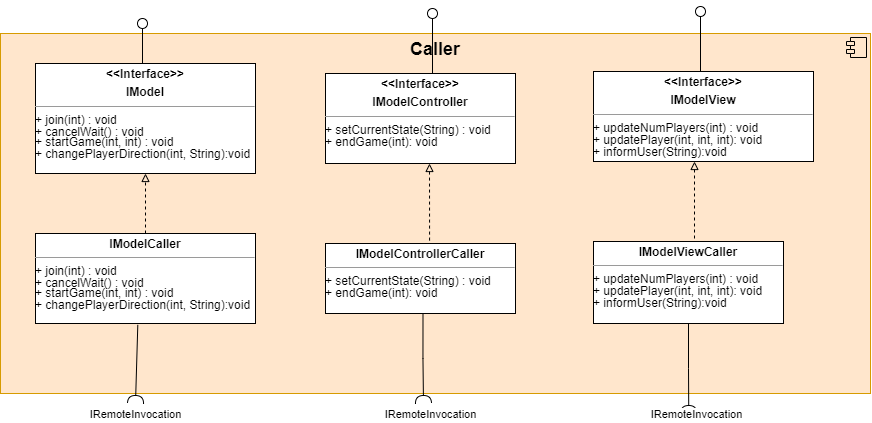

|Methode| Kurzbeschreibung|
| --- | --- |
|join(int)   cancelWait()   startGame(int, int)  changePlayerDirection(int, String)   setCurrentState(String  endGame(int)  updateNumplayers(int)  updatePlayer(int,int,int,int)  informUser(String) | Ruft die invoke(int interfaceID, String methodName, Object[] args)-Schnittstelle der Middleware auf. Für den Aufruf wird das InterfaceID der Caller-Klasse genommen, und die Aufrufparameter der Methode werden in ein Object-Array gepackt.|

 **Callee-Whitebox**
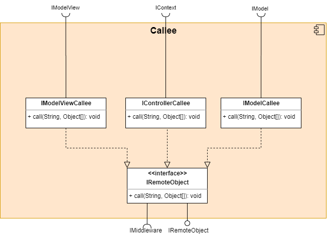

|Methode| Kurzbeschreibung|
| --- | --- |
|call(String methodName, Object[])| Eine zu importierende Schnittstelle wird gefragt, ob eine Methode mit dem Namen "methodName" vorhanden ist. Wenn ja, dann wird diese Methode mit den Aufrufparametern im Array "args" aufgerufen.|

Die komplette Methodenliste ist bereits in der Blackbox-Sicht (#applicationstubblackblox) des Application Stubs beschrieben, da alle Methoden über Schnittstellen nach außen hin angeboten werden.

# Laufzeitsicht

## Usecase 1 Create
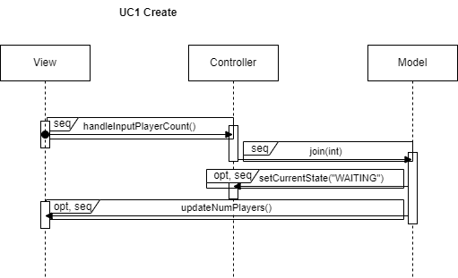
   
## Usecase 2a CancelWait
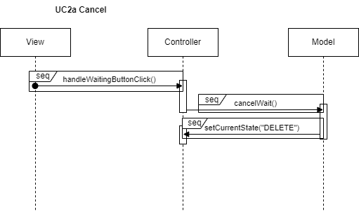

## Usecase 2b TimeUp
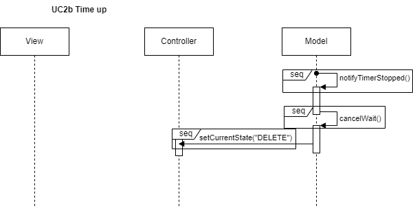

## Usecase 3 Start
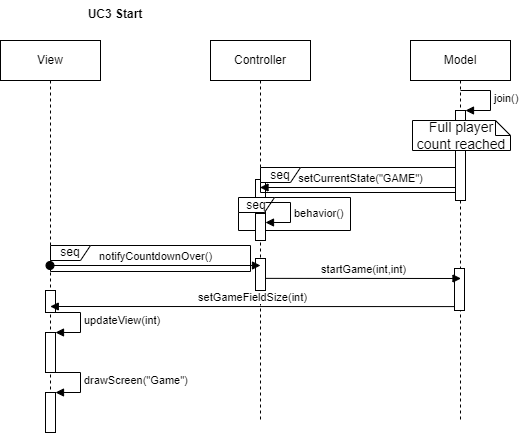

## Usecase 4 Spieler steuern
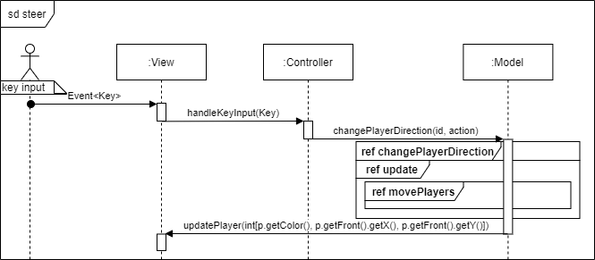

## Usecase 5 gegen Spielobjekt kollidieren
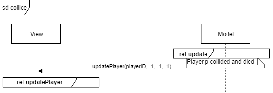

### AD View: updatePlayer()
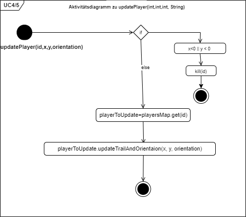

### AD View:  kill()
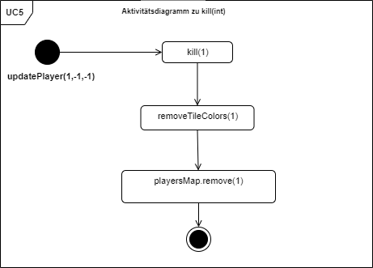

## UC6 Win
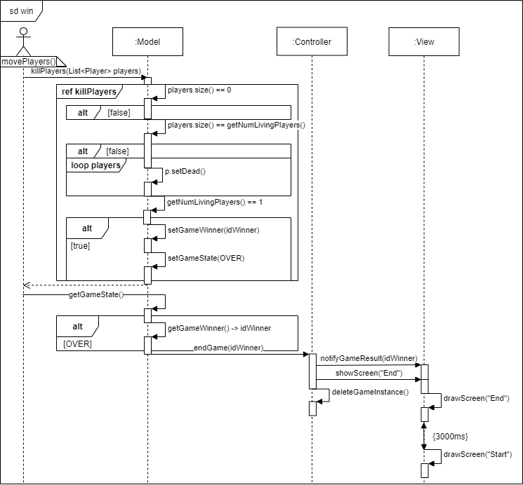

## UC7 Lose
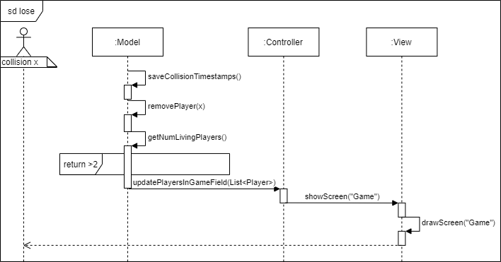

## UC8 Tie
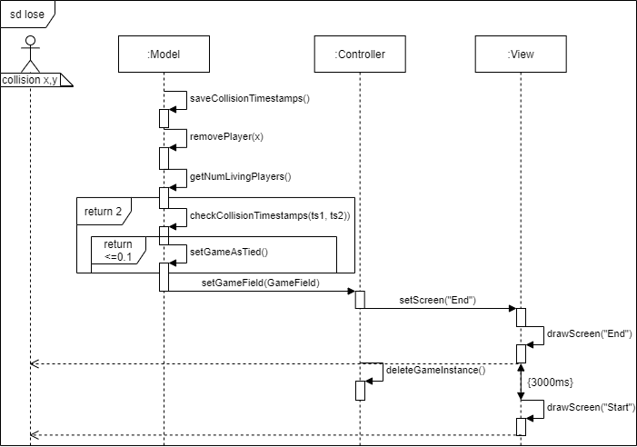

## AD Start Applikation/ Entrypoint
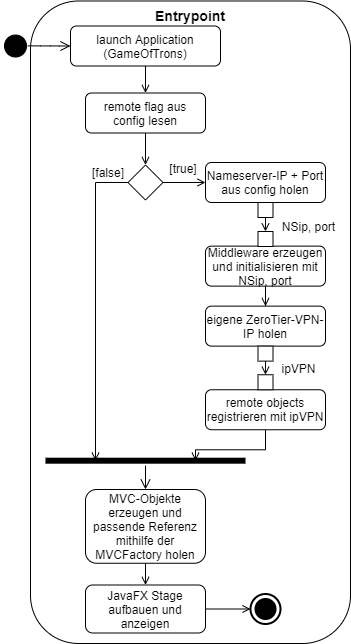

## AD join
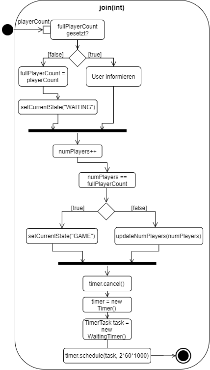

## AD cancelWait
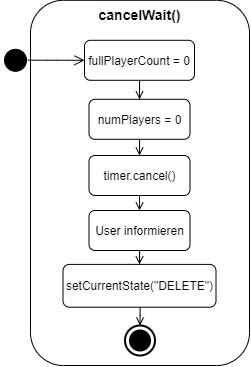

## AD startGame
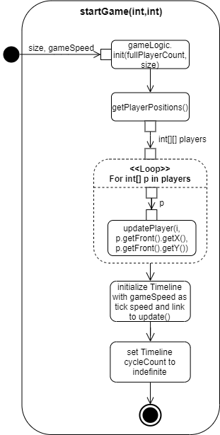

## AD init
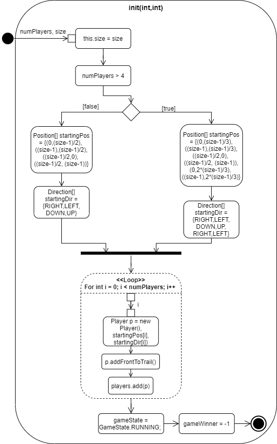

## AD update
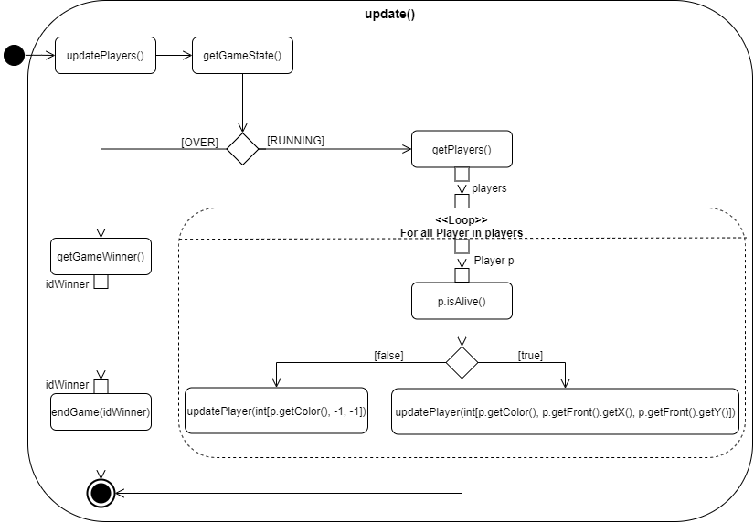

## AD changePlayerDirection
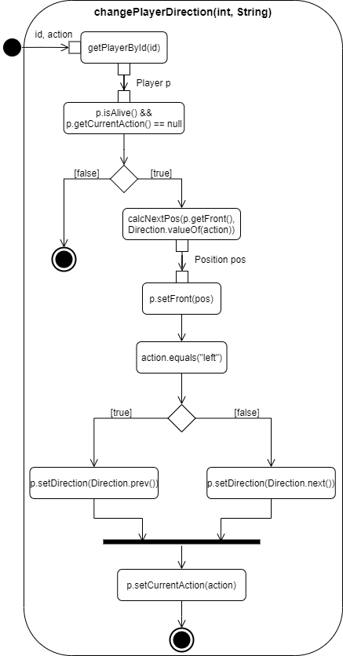

## AD calcNextPos
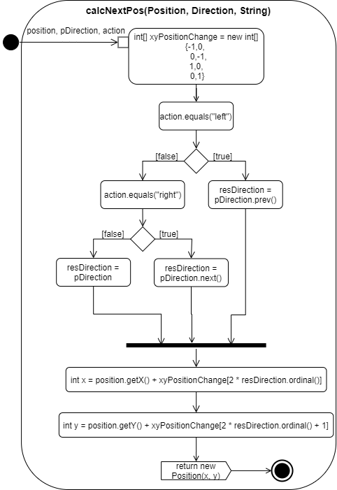

## AD getPlayerPositions
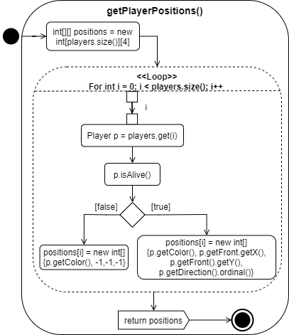

## AD updatePlayers
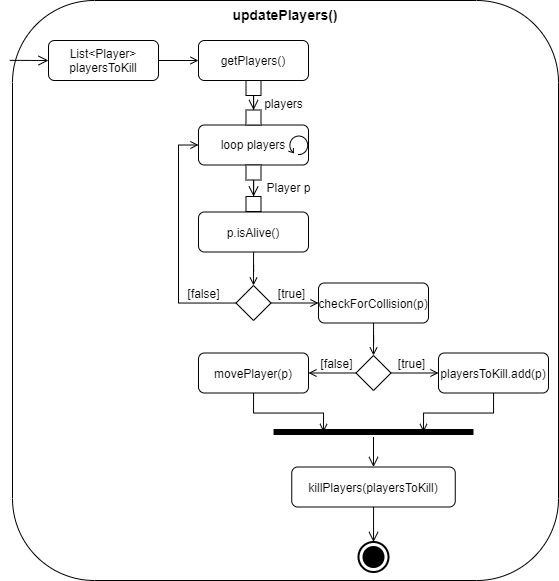

## AD movePlayer
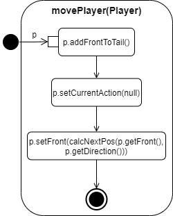

## AD checkForCollision
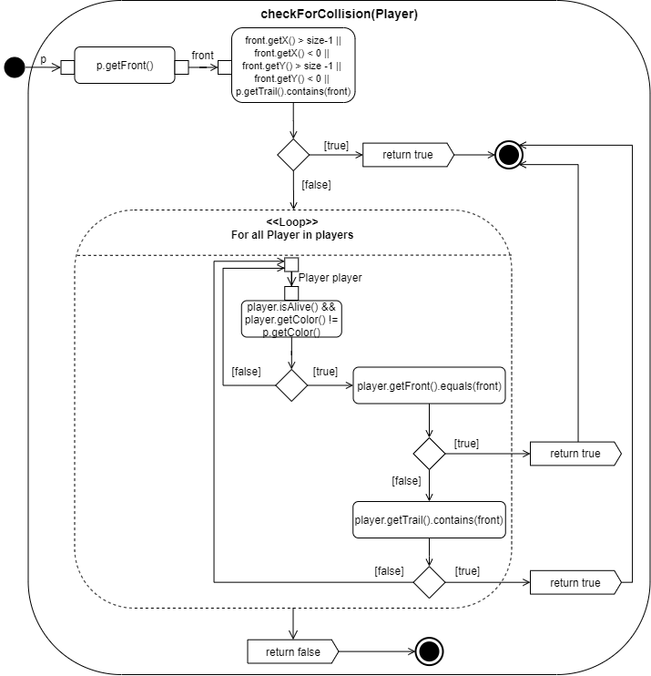

## AD killPlayers
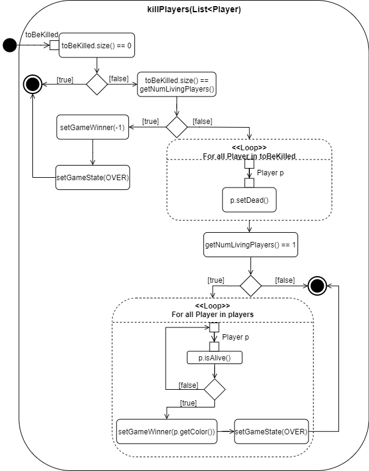

# Verteilungssicht 

# Querschnittliche Konzepte

## Spielfeldaktualisierungen

Das Spielfeld wird immer in Deltas der Positionen der Spieler aktualisiert.

# Architekturentscheidungen 

Ausschlaggebend für die Architektur ist das MVC-Entwurfsmuster, das häufig bei Anwendungen mit Benutzeroberfläche eingesetzt wird, was auch bei der hier behandelten Anwendung der Fall ist.

Dieses Entwurfsmuster implementiert das Prinzip des Separation of Concerns, wodurch die Wartbarbeit und des Systems steigt und Auswirkungen von Änderungen eher lokal bleiben. Diese Eigenschaften führen auch dazu, dass das System erweiterbar ist.

Die Vorteile, die das Einsetzen dieses Patterns bringen, sind für die Entwicklung dieser Software unerlässlich, da der Softwareentwicklungsprozess iterativ gestaltet ist und da Änderungen in der Logik oder Architektur aufgrund von neuen Wunschäußerungen durch die Stakeholder oder aufgrund von Fehleinschätzungen durch das unerfahrene Entwicklungsteam zu erwarten sind.

# Qualitätsanforderungen

## Qualitätsbaum

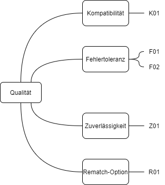

## Qualitätsszenarien

|ID |Szenario|
|---|--------|
|K01|Es lässt sich ein faires Spiel erstellen und starten mit 2-6 Spielern|
|F01|Ein Spieler verliert die Verbindung zum Spiel. Das Spiel geht trotzdem weiter für die anderen Spieler|
|F02|Eingaben eines Spielers kommen verzögert oder unregelmäßig an. Das Spiel registriert trotzdem für jeden Spieler regelmäßig gleich viele Eingaben und geht fair weiter|
|Z01|Pakete im Netzwerk haben Varianz in der Laufzeit (Jittering). Das Spiel geht trotzdem gleich schnell weiter|
|R01|Ein Spiel wurde beendet. Alle Spieler können den Endbildschirm sehen und werden dann zurück zum Startbildschirm geleitet. Die Option dasselbe Spiel zu wiederholen gibt es nicht.|

# Risiken und technische Schulden

| Risiko | Beschreibung |
|-|-|

# Glossar {#section-glossary}

|Begriff    |Definition|
|-----------|----------|
|||
