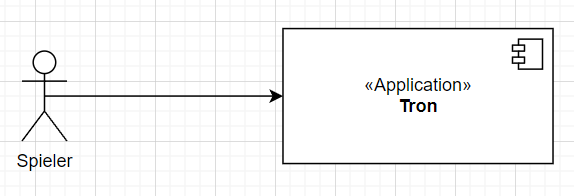
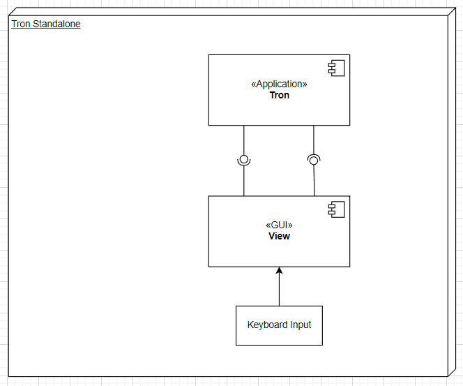
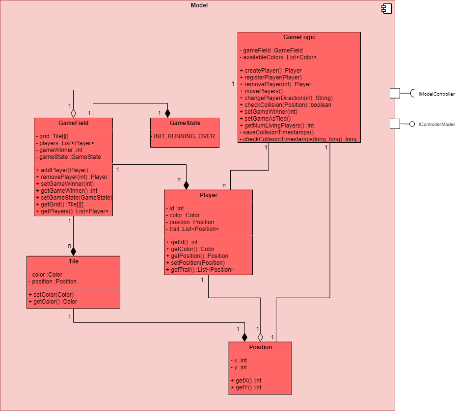
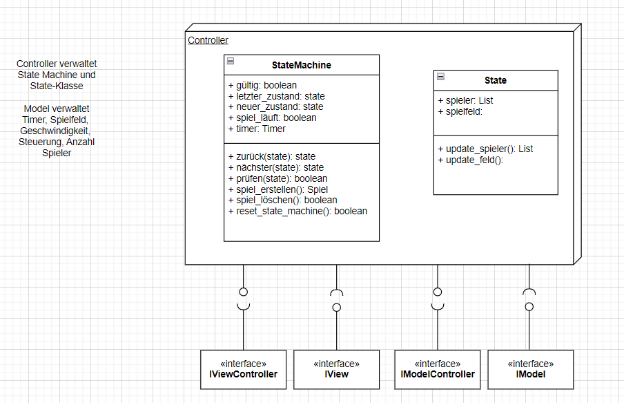
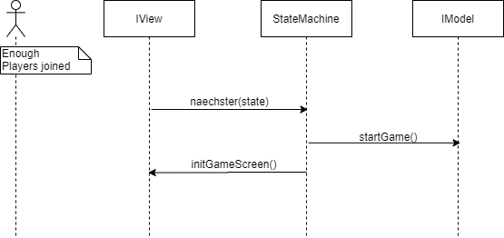
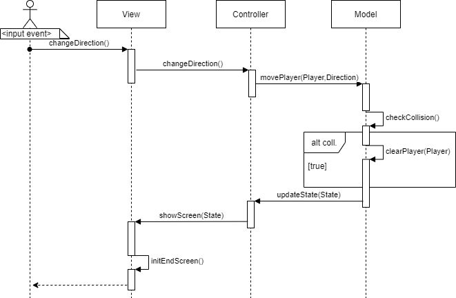

# 

**Über arc42**

arc42, das Template zur Dokumentation von Software- und
Systemarchitekturen.

Template Version 8.1 DE. (basiert auf AsciiDoc Version), Mai 2022

Created, maintained and © by Dr. Peter Hruschka, Dr. Gernot Starke and
contributors. Siehe <https://arc42.org>.

# Einführung und Ziele {#section-introduction-and-goals}

## Aufgabenstellung

Die Anforderungen wurden mit Hilfe der Storyboard-Methode aufgenommen. Dafür wurden die Bildschirmanzeigen aller Use Cases skizziert und die dazu zugehörigen Anforderungen aufgenommen. Die Anforderungen werden in der unteren Tabelle neben der Verlinkung zur zugehörigen Bildschirmskizze aufgeführt.

| Bildschirmanzeige  | Anforderungen |
| --- | --- |
| [Startbildschirm](images/tron1.png) | <ul><li>Der Übergang zum Wartebildschirm erfolgt über das Anklicken des Start-Buttons</li><li>Das Spiel kann mit 2 bis 6 Spielern gespielt werden</li><li>Die gewünschte Anzahl von Spielern wird über ein Eingabefeld eingestellt</li><li>Die Spieleranzahl wird per Default auf 2 gesetzt</li><li>Alle Spieler spielen gegen einander</li></ul> |
| [Wartebildschirm](images/tron2.PNG) | <ul><li>Die maximale Wartezeit auf die gewünschte Anzahl von Spielern ist parametrisierbar</li><li>Das Warten auf anderen Spieler kann abgebrochen werden, wenn man alleine wartet</li><li>Das Spiel startet automatisch, wenn alle Spieler beigetreten sind</li></ul> |
| [Spielbildschirm](images/tron3.PNG) | <ul><li>Das Spielfeld ist rasterförmig mit sichtbarem Raster</li><li>Beim Start des Spiels gibt einen Countdown von 3 Sekunden</li><li>Es müssen faire Startkonditionen für alle Spieler geben</li><li>Ein Spieler stirbt bei Kollision mit einer Wand, einem Motorrad oder einer Spur</li><li>Bei einer Frontalkollision zwischen zwei Spielern sterben beide Spieler</li><li>Wenn die letzten zwei Spieler durch eine Frontalkollision sterben, endet das Spiel unentschieden</li><li>Wenn die letzten zwei Spieler im Spiel gleichzeitig durch Kollision mit einer Wand und/oder Spur sterben, dann ender das Spiel unentschieden</li><li>Die zugehörige Spur stirbt beim Tod des Spielers</li><li>Es soll erkennbar sein, welcher Spieler zum Nutzer gehört</li><li>Die Spielfeldgröße soll parametrisierbar sein</li><li>Die Geschwindigkeit soll zwischen 1-500 Bewegungen pro Sekunde parametrisierbar sein</li><li>Das Motorrad bewegt sich automatisch gerade aus und kann nach rechts oder links gesteuert werden</li></ul> |
| [Endbildschirm Fall 1](images/tron4.PNG)  [Endbildschirm Fall 2](images/tron5.PNG)| <ul><li>Das Endbildschirm erscheint, wenn das Spiel vorbei ist</li><li>Im Endbildschirm wird angezeigt, wer gewonnen hat oder ob das Spiel unentschieden ausgegangen ist</li><li>Nach einigen Sekunden wird zum Startbildschirm gewechselt</li><li>Das Endbildschirm wird erst angezeigt, wenn das Spiel vorbei ist und nicht sobald man stirbt</li></ul>
| Konfiguration | <ul><li>Die Konfigurationsdatei wird beim Start des Spiels geladen</li><li>Darüber wird vom Nutzer die Spieleranzahl zwischen 2 und 6, die maximale Wartezeit bis zum Spielstart, die Spielfeldgröße, die Größe von jedem Feld im Raster, die Geschwindigkeit und die Tastenbelegung für die Steuerung konfiguriert</li></ul>

## Qualitätsziele

|Qualitätsziel  |Erklärung|
|---------------|---------|
|Kompatibilität |Es können mindestens zwei Spieler auf unterschiedlichen Geräten miteinander spielen|
|Fehlertoleranz/ Stabilität| Das Spiel soll bestehen/ stabil bleiben, auch wenn Teilnehmer abstürzen|
|Zuverlässigkeit|Das Spiel soll immer gleich schnell laufen (kein "Jittering")|
|Ein Spiel am Stück (Rematch-Option)|Es reicht aus, wenn ein Spiel am Stück spielbar ist (Keine "direkte" Rematch-Option)|
## Stakeholder

|Rolle  |Kontakt        |Erwartungshaltung|
|-------|---------------|-----------------|
|Kunde  |Martin Becke   |Entwicklung eines Tron-Spiels als verteiltes System, gut dokumentiert (Code <-> Dokumentation), Konzepte aus der Vorlesung sinnvoll angewendet und verstanden|
|Entwickler|Kathleen Neitzel, Kjell May, Viviam Guimaraes| - Das Spiel als verteiltes System entwickeln und dabei die Inhalte aus der Vorlesung praktisch verstehen und anwenden können  - PVL erhalten|

# Randbedingungen {#section-architecture-constraints}
**\<Technische Randbedingungen>**

| Randbedingung           | Erläuterung                                 |
|-------------------------|---------------------------------------------|
| Programmiersprache | Die Vorgabe der Aufgabenstellung erfordert die Nutzung einer objektorientierten Programmiersprache. Die Nutzung von Java wird empfohlen, da in dieser Sprache Code-Beispiele in den Vorlesungen gezeigt werden. Wir haben uns aus diesem Grund für Java entschieden. |
| Versionsverwaltung | Die Nutzung von unserem hochschuleigenen Gitlab ist ebenfalls vorgeschrieben. Wir arbeiten gerne mit dieser Versionsverwaltung, da ein effizientes Zusammenarbeiten im Team ermöglicht und zu intensivem Austausch angeregt wird. |
| Schnittstellen     | Kommunikation RPC und REST |

**\<Organisatorische Randbedingungen>**
| Randbedingung   | Erläuterung |
|-----------------|-------------|
| Team            | Kjell May, Viviam Ribeiro Guimaraes und Kathleen Neitzel aus dem Studiengang der Angewandten Informatik. Fachsemester 6 und 7. |
| Zeit            | Standalone Applikation bis Mitte November, endgültige Abgabe Ende Januar 2023. |

# Kontextabgrenzung {#section-system-scope-and-context}

## Fachlicher Kontext {#_fachlicher_kontext}

**\<Diagramm und/oder Tabelle>**
|Usecase    |Beschreibung   |
|-----------|---------------|
|UC3 Spiel starten|Wenn die gewünschte Anzahl an Spielern dem Spiel beigetreten sind, startet es nach einem Countdown von 3 Sekunden automatisch|
|UC6 Spielende|Sobald nur noch ein Spieler lebt, ist das Spiel vorbei und dieser Spieler hat gewonnen. Sterben hingegen die letzten beiden Spieler gleichzeitig, gibt es ein Unentschieden zwischen diesen. Alle Spieler kommen danach zum Endbildschirm|

**\<optional: Erläuterung der externen fachlichen Schnittstellen>**

## Technischer Kontext {#_technischer_kontext}

**\<Diagramm oder Tabelle>**

**\<optional: Erläuterung der externen technischen Schnittstellen>**

**\<Mapping fachliche auf technische Schnittstellen>**

# Lösungsstrategie

| Qualitätsziel | Lösungsstrategie |
| --- | --- |
| Kompatibilität | <ul></ul> |
| Fehlertoleranz/Stabilität | <ul></ul> |
| Zuverlässigkeit | <ul></ul> |
| Ein Spiel am Stück (Rematch-Option) | <ul><li>Nach Spielende wird automatisch zum Startbildschirm gewechselt, wo die Spieler wieder die gewünschte Spieleranzahl angeben können und über den Start-Button in den Warteraum können</ul> |

# Bausteinsicht {#section-building-block-view}

## Whitebox Gesamtsystem {#_whitebox_gesamtsystem}

***\<Übersichtsdiagramm>***

Begründung

:   *\<Erläuternder Text>*

Enthaltene Bausteine

:   *\<Beschreibung der enthaltenen Bausteine (Blackboxen)>*

Wichtige Schnittstellen

:   *\<Beschreibung wichtiger Schnittstellen>*

### Model

**Zweck/ Verantwortung**

Das Model ist in unserem Spiel sowohl für die Spielelogik, als auch die Lobbylogik zuständig. Es berechnet den aktuellen Spielstand anhand der Eingaben und gibt dies an die View weiter. Die Lobbylogik kümmert sich um das Erstellen und Starten von Spielen, also vom Start- über den Warte- zum Spielbildschirm.

**Schnittstelle(n)**

Um die Tasteneingaben verarbeiten zu können benötigt das Model die angebotene Schnittstelle *ModelController* vom Controller. Um den neuen Spielstand an die View zu übergeben, bietet das Model selbst eine Schnittstelle *ViewModel* an.

*\<(Optional) Qualitäts-/Leistungsmerkmale>*
Einfach solide geschrieben

*\<(Optional) Ablageort/Datei(en)>*
tbd

*\<(Optional) Erfüllte Anforderungen>*

*\<(optional) Offene Punkte/Probleme/Risiken>*

### View (Blackbox) 
 Das View-Subsystem implementiert die gleichnamige View des eingesetzten MVC-Patterns.
 Das Subsystem stellt die grafische Benutzeroberfläche bereit. Es nimmt Aktionen vom Nutzer entgegen und leitet diese zum Controller weiter. 

 Bei Bedarf, im Falle einer Änderung im Datenmodell (Datenmodell wird Subsystem Model verwaltet), informiert der Controller die View über die Änderung. Daraufhin passt die View die angezeigten Inhalte an.

#### Schnittstellen

**IView**

| Methode | Kurzbeschreibung |
| --- | --- |
| initStartScreen() | Zeigt den Startbildschirm an |
| initWaitScreen() | Zeigt den Wartebildschirm an |
| initGameScreen() | Zeigt den Spielbildschirm an |
| initEndScreen() | Zeigt den Endbildschirm an |
| getInputPlayerCount() | Liefert die durch den Nutzer eingegebene Spieleranzahl |
| cancelWaiting() | Bricht das Warten auf anderen Spieler ab |
| changeDirection() | Ändert die Richtung des Motorrades des Nutzers |

**IViewController**

| Methode | Kurzbeschreibung |
| --- | --- |
| getPlayerList()| Liefert
| getLivingPlayers | Entfernt einen Spieler vom Spiel, weil er gestorben ist |
| getTilesArray() | Liefert Informationen des Spielfeldes |
| getTilesAfterDeath() | Liefert aktualisierte Informationen zum Spielfeld nach dem Tod eines Spielers|

*\<Blackbox-Template>*

### \<Name Blackbox n> {#__name_blackbox_n}

*\<Blackbox-Template>*

### \<Name Schnittstelle 1> {#__name_schnittstelle_1}

...

### \<Name Schnittstelle m> {#__name_schnittstelle_m}

## Ebene 2 {#_ebene_2}

### Whitebox Model

### Whitebox *\<Baustein 2>* {#_whitebox_emphasis_baustein_2_emphasis}

*\<Whitebox-Template>*

...

### Whitebox *\<Baustein m>* {#_whitebox_emphasis_baustein_m_emphasis}

*\<Whitebox-Template>*

## Ebene 3 {#_ebene_3}

### Whitebox Model

|Methode    |Kurzbeschreibung|
|-----------|----------------|
|addPlayer  |Diese Methode kümmert sich um das Hinzufügen eines neuen Spielers zum Spiel. Dabei wird ein Player-Objekt initialisiert mit einer noch nicht vergebenen Farbe.|
|cancelWait |Diese Methode bricht die Spielesuche/ das Warten auf weitere Spieler ab|
|startGame  |Diese Methode initialisiert und startet das eigentliche Spiel, sobald alle Spieler beigetreten sind.|
|movePlayer |Mit dieser Methode wird die Bewegung im Spiel modelliert. Tasteneingaben vom Spieler bestimmen seine Richtung. Hier wird außerdem mit internen Methoden weiter überprüft, ob es Kollisionen gab und demnach gehandelt.|
|checkCollision| Diese Methode überprüft, ob es eine Kollision zwischen einem Spieler und einem anderen Spieler, Spur oder Wand gegeben hat.|
|clearPlayer|Wenn ein Spieler kollidiert ist, soll er vom Spielfeld verschwinden.|

### Whitebox \<\_Baustein x.2\_\> {#_whitebox_baustein_x_2}

*\<Whitebox-Template>*

### Whitebox \<\_Baustein y.1\_\> {#_whitebox_baustein_y_1}

*\<Whitebox-Template>*

Methodenliste
| Methode           | Beschreibung                                 |
|-------------------------|---------------------------------------------|
| createGame() | Erstellt eine neue Spielinstanz, nutzt User Input der View für die Spielerzahl und lädt die Config-Datei. Falls bereits eine vorhanden --> bestehende ersetzt. |
| deleteGame() | Löscht die bestehende Spielinstanz. Falls keine vorhanden --> Exception |
| checkState() | Prüft, ob eine gültige Anzahl an Spielern vorhanden sind. Prüft, ob benötigte Spielinstanz für angefragte Operation vorhanden. |
? Model und Controller auseinanderpflücken --> Use Cases überlegen.
| next() | Wechselt in den gültigen angefragten Zustand. Aktualisierung des aktuellen States. Vorheriger State wird auf Stack gespeichert. |
| back() | Lädt den letzten (gültigen) Zustand auf dem Stack als aktuellen State. |
| resetStateMachine() | Löscht alle auf dem Stack gespeicherten States und lädt den Default State als aktuellen State. |
| updateSpieler() | Aktualisiert die Spielerliste. |
| updateField() | Aktualisiert alle Farben des Spielfelds. |
| ...() | ... |

# Laufzeitsicht {#section-runtime-view}

## *\<Bezeichnung Laufzeitszenario 1>* {#__emphasis_bezeichnung_laufzeitszenario_1_emphasis}

-   \<hier Laufzeitdiagramm oder Ablaufbeschreibung einfügen>

-   \<hier Besonderheiten bei dem Zusammenspiel der Bausteine in diesem
    Szenario erläutern>

## *\<Bezeichnung Laufzeitszenario 2>* {#__emphasis_bezeichnung_laufzeitszenario_2_emphasis}

...

## *\<Bezeichnung Laufzeitszenario n>* {#__emphasis_bezeichnung_laufzeitszenario_n_emphasis}

**Usecase 3 Spielstart**

**Usecase 6 Spielende**

...

# Verteilungssicht {#section-deployment-view}

## Infrastruktur Ebene 1 {#_infrastruktur_ebene_1}

***\<Übersichtsdiagramm>***

Begründung

:   *\<Erläuternder Text>*

Qualitäts- und/oder Leistungsmerkmale

:   *\<Erläuternder Text>*

Zuordnung von Bausteinen zu Infrastruktur

:   *\<Beschreibung der Zuordnung>*

## Infrastruktur Ebene 2 {#_infrastruktur_ebene_2}

### *\<Infrastrukturelement 1>* {#__emphasis_infrastrukturelement_1_emphasis}

*\<Diagramm + Erläuterungen>*

### *\<Infrastrukturelement 2>* {#__emphasis_infrastrukturelement_2_emphasis}

*\<Diagramm + Erläuterungen>*

...

### *\<Infrastrukturelement n>* {#__emphasis_infrastrukturelement_n_emphasis}

*\<Diagramm + Erläuterungen>*

# Querschnittliche Konzepte {#section-concepts}

## *\<Konzept 1>* {#__emphasis_konzept_1_emphasis}

*\<Erklärung>*

## *\<Konzept 2>* {#__emphasis_konzept_2_emphasis}

*\<Erklärung>*

...

## *\<Konzept n>* {#__emphasis_konzept_n_emphasis}

*\<Erklärung>*

# Architekturentscheidungen 

Ausschlaggebend für die Architektur ist das MVC-Entwurfsmuster, das häufig bei Anwendungen mit Benutzeroberfläche eingesetzt wird, was auch bei der hier behandelten Anwendung der Fall ist.

Dieses Entwurfsmuster implementiert das Prinzip des Separation of Concerns, wodurch die Wartbarbeit und des Systems steigt und Auswirkungen von Änderungen eher lokal bleiben. Diese Eigenschaften führen auch dazu, dass das System erweiterbar ist.

Die Vorteile, die das Einsetzen dieses Patterns bringen, sind für die Entwicklung dieser Software unerlässlich, da der Softwareentwicklungsprozess iterativ gestaltet ist und da Änderungen in der Logik oder Architektur aufgrund von neuen Wunschäußerungen durch die Stakeholder oder aufgrund von Fehleinschätzungen durch das unerfahrene Entwicklungsteam zu erwarten sind.

# Qualitätsanforderungen

## Qualitätsbaum

## Qualitätsszenarien

|ID |Szenario|
|---|--------|
|K01|Es lässt sich ein faires Spiel erstellen und starten mit 2-6 Spielern|
|F01|Ein Spieler verliert die Verbindung zum Spiel. Das Spiel geht trotzdem weiter für die anderen Spieler|
|F02|Eingaben eines Spielers kommen verzögert oder unregelmäßig an. Das Spiel registriert trotzdem für jeden Spieler regelmäßig gleich viele Eingaben und geht fair weiter|
|Z01|Pakete im Netzwerk haben Varianz in der Laufzeit (Jittering). Das Spiel geht trotzdem gleich schnell weiter|
|R01|Ein Spiel wurde beendet. Alle Spieler können den Endbildschirm sehen und werden dann zurück zum Startbildschirm geleitet. Die Option dasselbe Spiel zu wiederholen gibt es nicht.|

**TODO Wahrscheinlich noch mehr Szenarien**

# Risiken und technische Schulden {#section-technical-risks}

# Glossar {#section-glossary}

|Begriff    |Definition|
|-----------|----------|
|||
