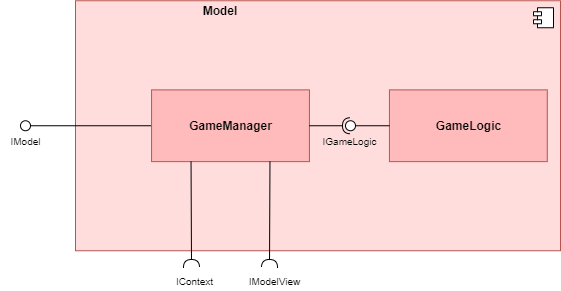
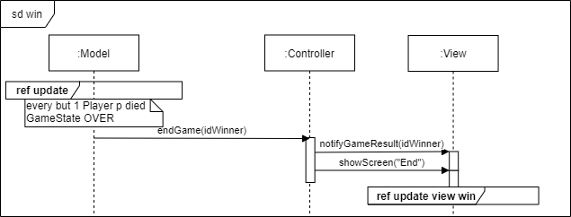

# **Dokumentation Game of Trons**

**Autoren**: Kathleen Neitzel, Kjell May, Viviam Ribeiro  
**Modul**: Verteilte Systeme

# Einführung und Ziele
## Aufgabenstellung

Die Anforderungen wurden mit Hilfe der Storyboard-Methode aufgenommen. Dafür wurden die Bildschirmanzeigen aller Use Cases skizziert und die dazu zugehörigen Anforderungen aufgenommen. Die Anforderungen werden in der unteren Tabelle neben der Verlinkung zur zugehörigen Bildschirmskizze aufgeführt.

| Bildschirmanzeige  | Anforderungen |
| --- | --- |
|  | <ul><li>Der Übergang zum Wartebildschirm erfolgt über das Anklicken des Start-Buttons</li><li>Das Spiel kann mit 2 bis 6 Spielern gespielt werden</li><li>Die gewünschte Anzahl von Spielern wird über ein Eingabefeld eingestellt</li><li>Die Spieleranzahl wird bei falscher Benutzerangabe der Default-Wert aus der Config-Datei geladen</li></ul> |
|  | <ul><li>Der Wartebildschirm zeigt an, wie viele Spieler bereits dem Spiel beigetreten sind und wie viele Spieler fehlen, bis die gewünschte Spieleranzahl erreicht ist.</li><li>Die maximale Wartezeit auf die gewünschte Anzahl von Spielern ist parametrisierbar (Default: 120 Sekunden)</li><li>Das Warten wird automatisch abgebrochen nach Ablauf der maximalen Wartezeit.</li><li>Das Warten auf anderen Spieler kann über den Cancel-Button abgebrochen werden, wenn man alleine wartet</li><li>Wenn das Warten abgebrochen wird, wird automatisch zum Startbildschirm gewechselt.</li><li>Das Spiel startet automatisch, wenn alle Spieler beigetreten sind</li></ul> |
|  | <ul><li>Alle Spieler spielen gegen einander</li><li>Das Spielfeld ist rasterförmig mit sichtbarem Raster</li><li>Die Spielfeldgröße soll über die Config-Datei parametrisierbar sein</li><li>Der Parameter der Spielfeldgröße bestimmt die Anzahl der Reihen und Spalten (Default: Geschwindkeit * 5, Minimum:Geschwindigkeit * 5 , Maximum: Geschwindigkeit * 12)</li><li>Beim Start des Spiels gibt es einen Countdown von 3 Sekunden</li><li>Es müssen faire Startkonditionen für alle Spieler geben</li><li>Ein Spieler stirbt bei Kollision mit einer Wand, einem Motorrad oder einer Spur</li><li>Bei einer Frontalkollision zwischen zwei Spielern sterben beide Spieler</li><li>Wenn die letzten zwei Spieler durch eine Frontalkollision sterben, endet das Spiel unentschieden</li><li>Wenn die letzten zwei Spieler im Spiel gleichzeitig durch Kollision mit einer Wand und/oder Spur sterben, dann endet das Spiel unentschieden</li><li>Die zugehörige Spur verschwindet beim Tod des Spielers</li><li>Es soll erkennbar sein, welcher Spieler zum Nutzer gehört</li><li>Die Geschwindigkeit soll zwischen 1-500 Bewegungen pro Sekunde parametrisierbar sein. Bei ungültiger Eingabe, wird Geschwindigkeit auf den Default-Wert 100 gesetzt.</li><li>Das Motorrad bewegt sich automatisch geradeaus und kann nach rechts oder links gesteuert werden</li></ul> |
|   | <ul><li>Der Endbildschirm erscheint, wenn das Spiel vorbei ist</li><li>Im Endbildschirm wird angezeigt, wer gewonnen hat oder ob das Spiel unentschieden ausgegangen ist</li><li>Nach 3 Sekunden wird zum Startbildschirm gewechselt</li><li>Der Endbildschirm wird erst angezeigt, wenn das Spiel vorbei ist und nicht sobald man stirbt</li></ul>
| Konfiguration | <ul><li>Die Konfigurationsdatei wird beim Start des Spiels geladen</li><li>Die Konfigurationsdatei kann vom Nutzer bearbeitet werden</li><li>Darüber wird der Default-Wert 2 der Spieleranzahl, die maximale Wartezeit bis zum Spielstart, die Spielfeldgröße, die Geschwindigkeit und die Tastenbelegung für die Steuerung konfiguriert</li></ul>

### **Weitere Storyboard Ansichten**

**Spielstart**

 

**Im Spiel**

 

**Kollision mit der Wand**

 

**Gleichzeitige Kollision zweier Spieler**

 

**Frontalkollision**

 

### **UseCases**

| Usecase | Objekt/Klasse | Vorbedingungen | Nachbedingungen |Erfolgsfall | Erweiterungsfälle| Fehlerfälle |
|---|---|---|---|---|---|---|
|**UC1** Create|Game|Der Spieler befindet sich im Startbildschirm.|Ein Spiel wurde erstellt und es wird auf weitere Spieler gewartet. Der Wartebildschirm wird angezeigt. Dem Spieler wird seine Farbe im Spiel angezeigt|**1.** Der Nutzer gibt die gewünschte Spieleranzahl in das Eingabefeld ein und klickt den Start-Knopf an.   **2.** Das System erzeugt eine Spielinstanz mit den Parametern aus der Config-Datei und dem Feld vom Startbildschirm.  **3.** Das System registriert den Nutzer im Spiel.   **4.** Das System zeigt den Wartebildschirm an||**1a** Die vom Nutzer eingegebene Spieleranzahl ist nicht zwischen 2-6.    **1a.1** Das System übernimmt den Default-Wert aus der Config-Datei    **1a.2** Das System informiert den Nutzer über die altenative Spieleranzahl über eine Fehlermeldung   **2a** Ein Parameter in der Config-Datei ist nicht gültig    **2a.1** Für alle ungültigen Parameter werden Default-Werte eingesetzt   **2a.2** Der Nutzer wird über eine Meldung darüber informiert, dass Parameter auf ihren Default-Wert gesetzt wurden|
|**UC2** Cancel Wait|Game|Der Spieler befindet sich in der Lobby (Wartebildschirm).|Der Spieler befindet sich wieder im Startbildschirm. Die Spielinstanz wurde gelöscht.|**1.** Der Nutzer drückt auf den Button "Cancel".  **2.** Das System leitet ihn zum Startbildschirm zurück.  **3.** Das System löscht die Spielinstanz inkl. des Spielers.|**1a.1** Die maximale Wartezeit aus der Config-Datei ist abgelaufen.    **1a.2** Das System informiert den Nutzer über eine Meldung, dass die maximale Wartezeit abgelaufen ist. |**1a.1** Der Nutzer wartet nicht allein und klickt auf "Cancel".    **1a.2** Das System zeigt eine Fehlermeldung an, da der Nutzer nicht alleine wartet und somit das Warten nicht beenden kann.|
|**UC3** Start|Game|Alle bis auf den letzten Mitspieler befinden sich im Warteraum. Der letzte fehlende Spieler betritt den Warteraum.|Das Spiel wurde gestartet und allen Spielern wird der Spielbildschirm angezeigt.|**1.** Das System fügt den letzten Spieler der Spielerliste der Spielinstanz hinzu.  **2.** Das System zeigt den 3-Sekunden-Countdown an.  **3.** Das System wechselt zum Spielbildschirm und zeigt die Farbe des Spielers an.|||
|**UC4** Steer|Spieler|Der Spieler befindet sich im Spiel und ist noch am Leben.|Das Motorrad des Spielers bewegt sich in einer Richtung weiter|**1.** Der Nutzer drückt keine Taste an    **2.** Das System zeigt die Bewegung des Motorrades in der aktuellen Richtung und Geschwindigkeit an| **1.a** Der Nutzer drückt auf eine der Steuerungstasten gemäß der angegebenen Tastenbelegung in der Config-Datei.    **1.a.2** Das System registriert den Tastendruck    **1.a.3** Das System berechnet die neue Richtung und aktualisiert die Richtung des Spielers entsprechend der gedrückten Taste    **1.a.4** Das System zeigt die neue Richtung des Motorrads des Spielers an.||
|**UC5** Collide on|Game Field|Der Spieler ist noch am Leben und bewegt sich auf dem Spielfeld|Der Spieler ist gestorben und wurde aus dem Spiel inkl. seiner Spur entfernt.|**1.** Das System stellt fest, dass sich auf der neuen Position des Motorrads des Spielers eine Wand, eine Spur oder ein anderes Motorrad befindet.   **2.** Das System entfernt die Spur des Spielers und entfernt den Spieler aus dem Spiel.   **3.** Das System zeigt eine Meldung an, um den Nutzer zu informieren, dass er gestorben ist.|||
|**UC6** Win |Game|Der Spieler befindet sich mit nur einem weiteren Spieler auf dem Spielfeld|Das Spiel wurde gelöscht und alle Nutzer wurden zum Startbildschirm weitergeleitet.|**1.** Der andere Spieler kollidiert (siehe UC5).   **2.** Das System legt den letzten überlebenden Spieler als Sieger fest    **3.** Das System zeigt allen Nutzern den Endschirm an, wo angezeigt wird, welcher Spieler gewonnen hat.   **4.** Nach 3 Sekunden löscht das System die Spielinstanz und zeigt allen wieder den Startbildschirm an.| |
|**UC7** Lose|Game|Der Spieler befindet sich mit mindestens einem weiteren Spieler auf dem Spielfeld|Der Spieler wurde aus dem Spiel entfernt|**1.** Der Spieler kollidiert (siehe UC5).   **2.** Das System entfernt den Spieler aus dem Spiel| | |
|**UC8** Tie|Game|Der Spieler befindet sich mit nur einem weiteren Spieler auf dem Spielfeld|Das Spiel wurde gelöscht und alle Nutzer wurden zum Startbildschirm weitergeleitet.|**1.** Beide Spieler kollidieren gleichzeitig (siehe UC5).   **2.** Das System legt fest, dass das Spiel unentschieden ist.   **3.** Das System zeigt allen Nutzern den Endschirm an, wo angezeigt wird, dass das Spiel unentschieden ist.   **4.** Nach 3 Sekunden löscht das System die Spielinstanz und zeigt allen wieder den Startbildschirm an.| |

## Qualitätsziele

|Qualitätsziel  |Erklärung|
|---------------|---------|
|Kompatibilität |Es können mindestens zwei Spieler auf unterschiedlichen Geräten miteinander spielen|
|Fehlertoleranz/ Stabilität| Das Spiel soll bestehen/ stabil bleiben, auch wenn Teilnehmer abstürzen|
|Zuverlässigkeit|Das Spiel soll immer gleich schnell laufen (kein "Jittering")|
|Ein Spiel am Stück (Rematch-Option)|Es reicht aus, wenn ein Spiel am Stück spielbar ist (Keine "direkte" Rematch-Option)|
## Stakeholder

|Rolle  |Kontakt        |Erwartungshaltung|
|-------|---------------|-----------------|
|Kunde  |Martin Becke   |Entwicklung eines Tron-Spiels als verteiltes System, gut dokumentiert (Code <-> Dokumentation), Konzepte aus der Vorlesung sinnvoll angewendet und verstanden|
|Entwickler|Kathleen Neitzel, Kjell May, Viviam Ribeiro| - Das Spiel als verteiltes System entwickeln und dabei die Inhalte aus der Vorlesung praktisch verstehen und anwenden können  - PVL erhalten|

# Randbedingungen
**Technische Randbedingungen**

| Randbedingung           | Erläuterung                                 |
|-------------------------|---------------------------------------------|
| Programmiersprache | Die Vorgabe der Aufgabenstellung erfordert die Nutzung einer objektorientierten Programmiersprache. Die Nutzung von Java wird empfohlen, da in dieser Sprache Code-Beispiele in den Vorlesungen gezeigt werden. Wir haben uns aus diesem Grund für Java entschieden. |
| Versionsverwaltung | Die Nutzung von unserem hochschuleigenen Gitlab ist ebenfalls vorgeschrieben. Wir arbeiten gerne mit dieser Versionsverwaltung, da ein effizientes Zusammenarbeiten im Team ermöglicht und zu intensivem Austausch angeregt wird. |
| Schnittstellen     | Kommunikation RPC und REST |

**\<Organisatorische Randbedingungen>**
| Randbedingung   | Erläuterung |
|-----------------|-------------|
| Team            | Kjell May, Viviam Ribeiro und Kathleen Neitzel aus dem Studiengang der Angewandten Informatik. Fachsemester 6 und 7. |
| Zeit            | Standalone Applikation bis Mitte November, endgültige Abgabe Ende Januar 2023. |

# Kontextabgrenzung

## Fachlicher Kontext

**Diagramm und Tabelle**

**\<optional: Erläuterung der externen fachlichen Schnittstellen>**

## Technischer Kontext

**\<Diagramm oder Tabelle>**

**\<optional: Erläuterung der externen technischen Schnittstellen>**

**\<Mapping fachliche auf technische Schnittstellen>**

# Lösungsstrategie

Aufgabe des Models: Spiellogik!!
Aufgabe des Controllers: Logik außerhalb der Spiellogik: State Machine (Zustandsprüfung und Wechsel), Config-Datei laden, Spiel instanziieren  Weiterleiten von Daten an Model und View

View: Holt sich die benötigten Daten über Controller

TODO: Vor- und Nachbedingungen

|Use Case| Akteur | Funktionssignatur | Ablaufsemantik | Fehlersemantik |
| --- | --- | --- | --- | --- |
|UC1 | Model | int getPlayerCount() | Die Methode liefert die durch den Benutzer eingegebenen Spieleranzahl | Wenn die Spieleranzahl keine Zahl zwischen 2 und 6 ist, wird die Methode loadDefaultPlayerCount() aufgerufen |
|UC1 | Model | int loadDefaultPlayerCount() | Die Methode liefert den Default-Wert für die Spieleranzahl aus der Config-Datei und ruft die Methode informUser("Spieleranzahl muss eine Zahl zwischen 2 und 6 sein. Der Default-Wert <<Default-Wert>> wird gesetzt") | Wenn keine Zahl geladen werden konnte, wird eine Exception mit Fehlerbeschreibung geworfen. |
|UC1 | Controller |int[] loadConfigParams() | Die Methode liefert die Parameter aus der Config-Datei in einem int-Array der Länge 4.   **Index 0:** Die maximale Wartezeit   **Index 1:** Die Tastenbelegung (0: Steuerung über die Pfeiltasten rechts/links; 1: Steuerung über die Tasten 'A'/'D')   **Index 2:** Die Geschwindigkeit  **Index 3:** Die Spielfeldgröße | Wenn ein Parameter nicht im gültigen Wertebereich liegt oder nicht geladen werden konnte, wird der entsprechende Default-Wert gesetzt:   **Default maximale Wartezeit:** 120 Sekunden  **Default Geschwindkeit:** 100 (Einheit: Bewegungen/Sekunde)   **Default Spielfeldgröße:** Geschwindigkeit * 5    Anschließend wird die Methode informUser("Ein oder mehr Parameter aus der Konfigurationsdatei waren ungültig oder konnten nicht geladen werden. Die betroffenen Parameter wurde auf Default-Werte gesetzt.") aufgerufen |
|UC1 | Controller | static Game createGameInstance() | Die Methode ruft die Methode loadConfigParams() auf und erstellt eine neue Spielinstanz mit den geladenen Parametern. Die Methode gibt die erstellte Spielinstanz zurück| Die Methode wirft eine Exception mit Fehlerbeschreibung. Die Fehlerbeschreibung dient ebenfalls als Meldung für den Nutzer und wird als Parameter für den Aufruf der Methode informUser() genutzt. |
|UC1 | Model | Player createPlayer() | Die Methode wird aufgerufen, wenn ein Spieler dem Warteraum beitritt. Die Methode erstellt einen neuen Spieler, indem dem Spieler eine noch nicht vergebene ID und Farbe vergeben wird. Die Methode gibt den erstellten Spieler zurück | Wenn kein Spieler erstellt werden konnte wird eine Exception mit Fehlerbeschreibung geworfen|
|UC1 | Model | void registerPlayer(Player) | Die Methode wird aufgerufen, nachdem ein Spieler erstellt wurde. Die Methode fügt die als Parameter übergebene Spielerinstanz in die Spielerliste hinzu.| Wenn der übergebene Player null ist, wird eine NullPointerException geworfen. Wenn der übergebene Player eine Farbe hat, die bereits vergeben ist, wird eine Exception mit Fehlerbeschreibung geworfen Wenn der übergebene Player eine bereits vergebene ID hat, wird eine Exception mit Fehlerbeschreibung geworfen|
|UC1, UC2, UC5 | View | void informUser(String) | Zeigt Fehlerbeschreibung der Exception dem Nutzer an | |
|UC1, UC2, UC6, UC8 | View |void drawScreen(String) | Die Methode zeigt den Bildschirm an, der zum übergebenen Bildschirmzustand passt.  | Wenn zum übergebenen Zustandsparameter kein anzuzeigenden Bildschirm gehört, wird eine Exception mit einer Fehlerbeschreibung geworfen. |
|UC2 | Controller | void cancelWaitingButtonClick() | Die Methode bricht den Wartevorgang als Folge des Anklicken des Cancel-Buttons ab | Wenn mehr als ein Spieler warten, wird die Methode informUser("Wartevorgang kann nicht abgebrochen werdne, wenn mehrere Spieler warten") aufgerufen und anschließend eine Exception mit Fehlerbeschreibung geworfen.|
|UC2, UC6, UC8 | Controller | void deleteGameInstance() | Die Methode löscht die aktuelle Spielinstanz. | Wenn Spielinstanz nicht erfolgreich gelöscht werden kann, wird eine Exception mit Fehlerbeschreibung geworfen. |
|UC2 | Controller| void cancelWaitingTimer() | Die Methode bricht den Wartevorgang als Folge des Timer-Ablaufs ab und informiert den Nutzer über den Aufruf der Methode informUser("Wartezeit zu lang. Der Wartevorgang wird abgebrochen ...").| Wenn der Wartevorgang nicht erfolgreich abgebrochen werden kann, wird eine Exception mit Fehlerbeschreibung geworfen.|
|UC3 |View | void showCountdown() | Die Methode zeigt den 3 Sekunden Countdown an| Eine Exception wird mit Fehlerbeschreibung geworfen |
|UC3 | View | Color getPlayerColor(int) | Die Methode gibt die Farbe des Spieler zurück, dessen ID als Parameter übergeben wurde |Wenn die übergebene ID keinem Spieler gehört, wird eine Exception mit Fehlerbeschribung geworfen |
|UC3 | View | void showPlayerColor(Color) | Die Methode zeigt die Spielerfarbe an, die als Parameter übergeben wird | | 
|UC4 | Model | void movePlayers() | Die Methode bewegt alle Spieler geradeaus entsprechend ihrer aktuellen Richtung | Eine Exception mit Fehlerbschreibung wird geworfen, wenn die Positionsänderung nicht erfolgreich war|
|UC4 |View | List<Player> getPlayersInGameField() | Die Methode liefert eine Liste mit allen Spielern, die noch nicht verloren haben und deshalb noch auf dem Spielfeld sind | Im Fehlerfall wird eine Exception mit Fehlerbschreibung geworfen |
|UC4 | View | void drawPlayers() | Die Methode ruft die Methode getPlayersinGameField() auf, um Informationen über die aktuellen Spieler zu erhalten. Anhand dieser Informationen zeigt die Spieler an ihrer aktuellen Position und Ausrichtung an. | Im Fehlerfall wird eine Exception mit Fehlerbeschreibung geworfen |
|UC4| Model | String getDirectionKeyboardInput() | Die Methode wird aufgerufen, wenn eine der Tasten entsprechend konfigurierten Tastenbelegung gedrückt wurde. Die Methode liefert die Richtung, die über die Tastatur vom Nutzer eingegeben wurde. Wenn die entsprechende Tastenbelegung für die Steuerung des Motorrads nach links gedrückt wurde, gibt die Methode den String 'left' zurück.   Wenn die entsprechende Tastenbelegung für die Steuerung des Motorrads nach rechts gedrückt wurde, gibt die Methode den String 'right' zurück.| Im Fehlerfall wird eine Exception mit Fehlerbeschreibung geworfen |
|UC4 | Model | void changePlayerDirection(int, String) | Der wird als Parameter die Spieler-ID übergeben. Die Methode ändert die Richtung des Spielers mit der übergebenen Spieler-ID nach links oder rechts. Der übergebene String liefert die Information, ob der Spieler nach links oder nach rechts gesteuert wird. | Im Fehlerfall wird eine Exception mit Fehlerbeschreibung geworfen. |
|UC5 | Model | boolean checkCollision(Position) | Die Methode prüft, ob es eine Kollision an der übergebenen Position gegeben hat. Sie gibt true zurück, wenn eine Kollision stattgefunden hat, sonst false. | Im Fehlerfall wird eine Exception mit Fehlerbeschreibung geworfen|
|UC5|  Model| Player removePlayer(int) | Die Methode entfernt den Spieler mit der übergebenen Spieler-ID aus dem Spielfeld. Die Methode informUser("You lose...Du wurdest aus dem Spiel entfernt"), um den Nutzer zu informieren und gibt den entfernten Spieler zurück. | |
|UC6 |Model |boolean checkOnlyOnePlayerLeft ()| Die Methode wird aufgerufen, wenn eine Kollision stattgefunden hat. Die Methode liefert die Information, ob sich nur noch ein Spieler im Spiel befindet. Sie gibt, true zurück, wenn es nur noch ein Spieler gibt, sonst false. | Im Fehlerfall wird eine Exception mit Fehlerbeschreibung geworfen|
|UC6 | Model |int setGameWinner(Player) | Die Methode wird aufgerufen, wenn es nur noch einen Spieler im Spiel gibt. Der übergebene Player ist der letzte im Spie. Seine Spieler-ID wird von der Methode als Sieger registriert. | |
|UC6 | View | Player getGameWinner()| Die Methode wird aufgerufen, wenn ein Gewinner festgelegt wurde. Die Methode gibt den festgelegten Gewinner zurück| Wenn kein Gewinner festgelegt wurde, wird eine NullPointerException geworfen.|
|UC8| Model | boolean checkOnlyTwoLeft() | Die Methode wird in jedem Durchlauf des Game Loops aufgerufen. Die Methode gibt true zurück, wenn es nur noch zwei Spieler auf dem Spielfeld gibt, sonst false.| |
|UC8| Model | Long setCollisionTimeStamps() |Diese Methode wird aufgerufen, wenn es nur noch zwei Spieler auf dem Spielfeld gibt und eine Kollision stattgefunden hat. Die Methode speichert den Zeitpunkt der Kollision und gibt den gespeicherten Zeitpunkt zurück. | |
|UC8| Model| boolean checkCollisionTimeStamps(Long, Long) | Diese Methode wird aufgerufen, wenn es nur noch zwei Spieler auf dem Spielfeld gibt und eine Kollision stattgefunden hat. Sie prüft, ob die Differenz der beiden übergebenen Zeitpunkte <= 0,1 ist. Wenn ja, dann gibt sie true zurück, sonst false.|Wenn einer der übergeben Parameter null ist, wird eine NullPointerException mit Fehlerbeschreibung geworfen. |
|UC8| Model | int setGameAsTied() | Die Methode wird aufgerufen, wenn zwei Kollisionen"gleichzeitig" (Zeitabstand <=0,1: Methode checkCollision() gibt true zurück). Die Methode setzt den Gewinner auf -1, um zu zeigen, dass das Spiel unentschieden ausgegangen ist.| |
|UC6, UC8| View |int getGameResult() | Die Methode wird aufgerufen, wenn ein Gewinner registriert wurde oder das Spiel als unentschieden markiert wurde. Die Methode liefert entweder die Spieler-ID des Gewinners oder -1, wenn das Spiel unentschieden ausgegangen ist.| |

# Bausteinsicht

## Whitebox Gesamtsystem

***\<Übersichtsdiagramm>***

Begründung

:   *\<Erläuternder Text>*

Enthaltene Bausteine

:   *\<Beschreibung der enthaltenen Bausteine (Blackboxen)>*

Wichtige Schnittstellen

:   *\<Beschreibung wichtiger Schnittstellen>*

### Model

**Zweck/ Verantwortung**

Das Model ist in unserem Spiel sowohl für die Spielelogik, als auch die Lobbylogik zuständig. Es berechnet den aktuellen Spielstand anhand der Eingaben und gibt dies an die View weiter. Die Lobbylogik kümmert sich um das Erstellen und Starten von Spielen, also vom Start- über den Warte- zum Spielbildschirm.

**Schnittstelle(n)**

Um die Tasteneingaben verarbeiten zu können benötigt das Model die angebotene Schnittstelle *ModelController* vom Controller. Um den neuen Spielstand an die View zu übergeben, bietet das Model selbst eine Schnittstelle *ViewModel* an.

*\<(Optional) Qualitäts-/Leistungsmerkmale>*
Einfach solide geschrieben

*\<(Optional) Ablageort/Datei(en)>*
tbd

*\<(Optional) Erfüllte Anforderungen>*

*\<(optional) Offene Punkte/Probleme/Risiken>*

### View (Blackbox) 
 Das View-Subsystem implementiert die gleichnamige View des eingesetzten MVC-Patterns.
 Das Subsystem stellt die grafische Benutzeroberfläche bereit. Es nimmt Aktionen vom Nutzer entgegen und leitet diese zum Controller weiter. 

 Bei Bedarf, im Falle einer Änderung im Datenmodell (Datenmodell wird Subsystem Model verwaltet), informiert der Controller die View über die Änderung. Daraufhin passt die View die angezeigten Inhalte an.

#### Schnittstellen

**IView**

| Methode | Kurzbeschreibung |
| --- | --- |
| showScreen() | Zeigt den Bildschirm an, der zum aktuellen Programmzustand passt |
| getInputPlayerCount() | Liefert die durch den Nutzer eingegebene Spieleranzahl |
| cancelWaiting() | Bricht das Warten auf anderen Spieler ab |
| changeDirection() | Ändert die Richtung des Motorrades des Nutzers |

**IViewController**

| Methode | Kurzbeschreibung |
| --- | --- |
|sendPlayerList()| Liefert die instanziierten Spieler |
|sendTilesArray() | Liefert Informationen des Spielfeldes |

**IModelController**
| Methode | Kurzbeschreibung |
| --- | --- |
| setPlayerList() | Liefert |
| updateState() | |

*\<Blackbox-Template>*

### \<Name Blackbox n> {#__name_blackbox_n}

*\<Blackbox-Template>*

### \<Name Schnittstelle 1> {#__name_schnittstelle_1}

...

### \<Name Schnittstelle m> {#__name_schnittstelle_m}

## Ebene 2 {#_ebene_2}

### Whitebox Model

### Whitebox *\<Baustein 2>* {#_whitebox_emphasis_baustein_2_emphasis}

*\<Whitebox-Template>*

...

### Whitebox *\<Baustein m>* {#_whitebox_emphasis_baustein_m_emphasis}

*\<Whitebox-Template>*

## Ebene 3 {#_ebene_3}

### Whitebox Model

|Methode    |Kurzbeschreibung|
|-----------|----------------|
|addPlayer()|Diese Methode kümmert sich um das Hinzufügen eines neuen Spielers zum Spiel. Dabei wird ein Player-Objekt initialisiert mit einer noch nicht vergebenen Farbe.|
|cancelWait()|Diese Methode bricht die Spielesuche/ das Warten auf weitere Spieler ab|
|startGame()|Diese Methode initialisiert und startet das eigentliche Spiel, sobald alle Spieler beigetreten sind.|
|movePlayer()|Mit dieser Methode wird die Bewegung im Spiel modelliert. Tasteneingaben vom Spieler bestimmen seine Richtung. Hier wird außerdem mit internen Methoden weiter überprüft, ob es Kollisionen gab und demnach gehandelt.|
|checkCollision()| Diese Methode überprüft, ob es eine Kollision zwischen einem Spieler und einem anderen Spieler, Spur oder Wand gegeben hat.|
|clearPlayer()|Wenn ein Spieler kollidiert ist, soll er vom Spielfeld verschwinden.|

### Whitebox \<\_Baustein x.2\_\> {#_whitebox_baustein_x_2}

*\<Whitebox-Template>*

### Whitebox \<\_Baustein y.1\_\> {#_whitebox_baustein_y_1}

*\<Whitebox-Template>*

Methodenliste
| Methode           | Beschreibung                                 |
|-------------------------|---------------------------------------------|
| createGame() | Erstellt eine neue Spielinstanz, nutzt User Input der View für die Spielerzahl und lädt die Config-Datei. Falls bereits eine vorhanden --> bestehende ersetzt. |
| deleteGame() | Löscht die bestehende Spielinstanz. Falls keine vorhanden --> Exception |
| checkState() | Prüft, ob eine gültige Anzahl an Spielern vorhanden sind. Prüft, ob benötigte Spielinstanz für angefragte Operation vorhanden. |
? Model und Controller auseinanderpflücken --> Use Cases überlegen.
| next() | Wechselt in den gültigen angefragten Zustand. Aktualisierung des aktuellen States. Vorheriger State wird auf Stack gespeichert. |
| back() | Lädt den letzten (gültigen) Zustand auf dem Stack als aktuellen State. |
| resetStateMachine() | Löscht alle auf dem Stack gespeicherten States und lädt den Default State als aktuellen State. |
| updateSpieler() | Aktualisiert die Spielerliste. |
| updateField() | Aktualisiert alle Farben des Spielfelds. |
| ...() | ... |

# Laufzeitsicht

## *\<Bezeichnung Laufzeitszenario 1>* {#__emphasis_bezeichnung_laufzeitszenario_1_emphasis}

-   \<hier Laufzeitdiagramm oder Ablaufbeschreibung einfügen>

-   \<hier Besonderheiten bei dem Zusammenspiel der Bausteine in diesem
    Szenario erläutern>

## *\<Bezeichnung Laufzeitszenario 2>* {#__emphasis_bezeichnung_laufzeitszenario_2_emphasis}

...

## *\<Bezeichnung Laufzeitszenario n>* {#__emphasis_bezeichnung_laufzeitszenario_n_emphasis}

## Usecase 3 Spielstart

## Usecase 6 Spielende

## UC6 Win

...

# Verteilungssicht {#section-deployment-view}

## Infrastruktur Ebene 1 {#_infrastruktur_ebene_1}

***\<Übersichtsdiagramm>***

Begründung

:   *\<Erläuternder Text>*

Qualitäts- und/oder Leistungsmerkmale

:   *\<Erläuternder Text>*

Zuordnung von Bausteinen zu Infrastruktur

:   *\<Beschreibung der Zuordnung>*

## Infrastruktur Ebene 2 {#_infrastruktur_ebene_2}

### *\<Infrastrukturelement 1>* {#__emphasis_infrastrukturelement_1_emphasis}

*\<Diagramm + Erläuterungen>*

### *\<Infrastrukturelement 2>* {#__emphasis_infrastrukturelement_2_emphasis}

*\<Diagramm + Erläuterungen>*

...

### *\<Infrastrukturelement n>* {#__emphasis_infrastrukturelement_n_emphasis}

*\<Diagramm + Erläuterungen>*

# Querschnittliche Konzepte {#section-concepts}

## *\<Konzept 1>* {#__emphasis_konzept_1_emphasis}

*\<Erklärung>*

## *\<Konzept 2>* {#__emphasis_konzept_2_emphasis}

*\<Erklärung>*

...

## *\<Konzept n>* {#__emphasis_konzept_n_emphasis}

*\<Erklärung>*

# Architekturentscheidungen 

Ausschlaggebend für die Architektur ist das MVC-Entwurfsmuster, das häufig bei Anwendungen mit Benutzeroberfläche eingesetzt wird, was auch bei der hier behandelten Anwendung der Fall ist.

Dieses Entwurfsmuster implementiert das Prinzip des Separation of Concerns, wodurch die Wartbarbeit und des Systems steigt und Auswirkungen von Änderungen eher lokal bleiben. Diese Eigenschaften führen auch dazu, dass das System erweiterbar ist.

Die Vorteile, die das Einsetzen dieses Patterns bringen, sind für die Entwicklung dieser Software unerlässlich, da der Softwareentwicklungsprozess iterativ gestaltet ist und da Änderungen in der Logik oder Architektur aufgrund von neuen Wunschäußerungen durch die Stakeholder oder aufgrund von Fehleinschätzungen durch das unerfahrene Entwicklungsteam zu erwarten sind.

# Qualitätsanforderungen

## Qualitätsbaum

## Qualitätsszenarien

|ID |Szenario|
|---|--------|
|K01|Es lässt sich ein faires Spiel erstellen und starten mit 2-6 Spielern|
|F01|Ein Spieler verliert die Verbindung zum Spiel. Das Spiel geht trotzdem weiter für die anderen Spieler|
|F02|Eingaben eines Spielers kommen verzögert oder unregelmäßig an. Das Spiel registriert trotzdem für jeden Spieler regelmäßig gleich viele Eingaben und geht fair weiter|
|Z01|Pakete im Netzwerk haben Varianz in der Laufzeit (Jittering). Das Spiel geht trotzdem gleich schnell weiter|
|R01|Ein Spiel wurde beendet. Alle Spieler können den Endbildschirm sehen und werden dann zurück zum Startbildschirm geleitet. Die Option dasselbe Spiel zu wiederholen gibt es nicht.|

**TODO Wahrscheinlich noch mehr Szenarien**

# Risiken und technische Schulden {#section-technical-risks}

# Glossar {#section-glossary}

|Begriff    |Definition|
|-----------|----------|
|||
