# **Dokumentation Game of Trons**

**Autoren**: Kathleen Neitzel, Kjell May, Viviam Ribeiro  
**Modul**: Verteilte Systeme

- [**Dokumentation Game of Trons**](#dokumentation-game-of-trons)
- [Einführung und Ziele](#einführung-und-ziele)
  - [Aufgabenstellung](#aufgabenstellung)
    - [**Weitere Storyboard Ansichten**](#weitere-storyboard-ansichten)
    - [**UseCases**](#usecases)
  - [Qualitätsziele](#qualitätsziele)
  - [Stakeholder](#stakeholder)
- [Randbedingungen](#randbedingungen)
  - [Technisch](#technisch)
  - [Organisatorisch](#organisatorisch)
- [Kontextabgrenzung](#kontextabgrenzung)
  - [Fachlicher Kontext](#fachlicher-kontext)
  - [Technischer Kontext](#technischer-kontext)
- [Lösungsstrategie](#lösungsstrategie)
- [Bausteinsicht](#bausteinsicht)
  - [Ebene 1](#ebene-1)
    - [Whitebox Gesamtsystem](#whitebox-gesamtsystem)
    - [Model (Blackbox)](#model-blackbox)
    - [View (Blackbox)](#view-blackbox)
    - [Controller (Blackbox)](#controller-blackbox)
    - [Factory](#factory)
    - [Application Stub (Blackbox)](#application-stub-blackbox)
  - [Ebene 2](#ebene-2)
    - [Whitebox Model](#whitebox-model)
    - [Whitebox View](#whitebox-view)
    - [Whitebox Controller](#whitebox-controller)
    - [Whitebox Factory](#whitebox-factory)
    - [Whitebox Application Stub](#whitebox-application-stub)
  - [Ebene 3](#ebene-3)
    - [Whitebox Model](#whitebox-model-1)
    - [Whitebox View](#whitebox-view-1)
    - [Whitebox Controller](#whitebox-controller-1)
    - [Whitebox Factory](#whitebox-factory-1)
    - [Whitebox AppStub](#whitebox-appstub)
- [Laufzeitsicht](#laufzeitsicht)
  - [Usecase 1 Create](#usecase-1-create)
  - [Usecase 2a CancelWait](#usecase-2a-cancelwait)
  - [Usecase 2b TimeUp](#usecase-2b-timeup)
  - [Usecase 3 Start](#usecase-3-start)
  - [Usecase 4 Spieler steuern](#usecase-4-spieler-steuern)
  - [Usecase 5 gegen Spielobjekt kollidieren](#usecase-5-gegen-spielobjekt-kollidieren)
  - [UC6 Win](#uc6-win)
  - [UC7 Lose](#uc7-lose)
  - [UC8 Tie](#uc8-tie)
  - [AD Start Applikation/ Entrypoint](#ad-start-applikation-entrypoint)
  - [Model: AD join()](#model-ad-join)
  - [Model: AD cancelWait()](#model-ad-cancelwait)
  - [Model: AD startGame()](#model-ad-startgame)
  - [Model: AD init()](#model-ad-init)
  - [Model: AD update()](#model-ad-update)
  - [Model: AD changePlayerDirection()](#model-ad-changeplayerdirection)
  - [Model: AD calcNextPos()](#model-ad-calcnextpos)
  - [Model: AD getPlayerPositions()](#model-ad-getplayerpositions)
  - [Model: AD updatePlayers()](#model-ad-updateplayers)
  - [Model: AD movePlayer()](#model-ad-moveplayer)
  - [Model: AD checkForCollision()](#model-ad-checkforcollision)
  - [Model: AD killPlayers()](#model-ad-killplayers)
  - [View: AD updatePlayer()](#view-ad-updateplayer)
  - [View: AD kill()](#view-ad-kill)
  - [View: AD updateTrailAndOrientation()](#view-ad-updatetrailandorientation)
  - [Controller: AD handleDirectionKeyboardInput()](#controller-ad-handledirectionkeyboardinput)
  - [Controller: AD handleInputPlayerCount()](#controller-ad-handleinputplayercount)
  - [Controller: SEQ behavior()](#controller-seq-behavior)
  - [Controller: SEQ handleWaitingButtonClick()](#controller-seq-handlewaitingbuttonclick)
  - [Controller: SEQ notifyCountdownOver()](#controller-seq-notifycountdownover)
  - [Controller: SEQ endGame()](#controller-seq-endgame)
- [Verteilungssicht](#verteilungssicht)
- [Querschnittliche Konzepte](#querschnittliche-konzepte)
  - [Spielfeldaktualisierungen](#spielfeldaktualisierungen)
- [Architekturentscheidungen](#architekturentscheidungen)
- [Qualitätsanforderungen](#qualitätsanforderungen)
  - [Qualitätsbaum](#qualitätsbaum)
  - [Qualitätsszenarien](#qualitätsszenarien)
- [Risiken und technische Schulden](#risiken-und-technische-schulden)
- [Glossar {#section-glossary}](#glossar-section-glossary)

# Einführung und Ziele
## Aufgabenstellung

Die Anforderungen wurden mit Hilfe der Storyboard-Methode aufgenommen. Dafür wurden die Bildschirmanzeigen aller Use Cases skizziert und die dazu zugehörigen Anforderungen aufgenommen. Die Anforderungen werden in der unteren Tabelle neben der Verlinkung zur zugehörigen Bildschirmskizze aufgeführt.

| Bildschirmanzeige  | Anforderungen |
| --- | --- |
|  | <ul><li>Der Übergang zum Wartebildschirm erfolgt über das Anklicken des Start-Buttons</li><li>Das Spiel kann mit 2 bis 6 Spielern gespielt werden</li><li>Die gewünschte Anzahl von Spielern wird über ein Eingabefeld eingestellt</li><li>Die Spieleranzahl wird bei falscher Benutzerangabe der Default-Wert aus der Config-Datei geladen</li></ul> |
|  | <ul><li>Der Wartebildschirm zeigt an, wie viele Spieler bereits dem Spiel beigetreten sind und wie viele Spieler fehlen, bis die gewünschte Spieleranzahl erreicht ist.</li><li>Die maximale Wartezeit auf die gewünschte Anzahl von Spielern ist parametrisierbar (Default: 120 Sekunden)</li><li>Das Warten wird automatisch abgebrochen nach Ablauf der maximalen Wartezeit.</li><li>Das Warten auf anderen Spieler kann über den Cancel-Button abgebrochen werden, wenn man alleine wartet</li><li>Wenn das Warten abgebrochen wird, wird automatisch zum Startbildschirm gewechselt.</li><li>Das Spiel startet automatisch, wenn alle Spieler beigetreten sind</li></ul> |
|  | <ul><li>Alle Spieler spielen gegen einander</li><li>Das Spielfeld ist rasterförmig mit sichtbarem Raster</li><li>Die Spielfeldgröße soll über die Config-Datei parametrisierbar sein</li><li>Der Parameter der Spielfeldgröße bestimmt die Anzahl der Reihen und Spalten (Default: Geschwindkeit * 5, Minimum:Geschwindigkeit * 5 , Maximum: Geschwindigkeit * 12)</li><li>Beim Start des Spiels gibt es einen Countdown von 3 Sekunden</li><li>Es müssen faire Startkonditionen für alle Spieler geben</li><li>Ein Spieler stirbt bei Kollision mit einer Wand, einem Motorrad oder einer Spur</li><li>Bei einer Frontalkollision zwischen zwei Spielern sterben beide Spieler</li><li>Wenn die letzten zwei Spieler durch eine Frontalkollision sterben, endet das Spiel unentschieden</li><li>Wenn die letzten zwei Spieler im Spiel gleichzeitig durch Kollision mit einer Wand und/oder Spur sterben, dann endet das Spiel unentschieden</li><li>Die zugehörige Spur verschwindet beim Tod des Spielers</li><li>Es soll erkennbar sein, welcher Spieler zum Nutzer gehört</li><li>Die Geschwindigkeit soll zwischen 1-500 Bewegungen pro Sekunde parametrisierbar sein. Bei ungültiger Eingabe, wird Geschwindigkeit auf den Default-Wert 100 gesetzt.</li><li>Das Motorrad bewegt sich automatisch geradeaus und kann nach rechts oder links gesteuert werden</li></ul> |
|   | <ul><li>Der Endbildschirm erscheint, wenn das Spiel vorbei ist</li><li>Im Endbildschirm wird angezeigt, wer gewonnen hat oder ob das Spiel unentschieden ausgegangen ist</li><li>Nach 3 Sekunden wird zum Startbildschirm gewechselt</li><li>Der Endbildschirm wird erst angezeigt, wenn das Spiel vorbei ist und nicht sobald man stirbt</li></ul>
| **Konfiguration** | <ul><li>Die Konfigurationsdatei wird beim Start des Spiels geladen</li><li>Die Konfigurationsdatei kann vom Nutzer bearbeitet werden</li><li>Darüber wird der Default-Wert 2 der Spieleranzahl, die maximale Wartezeit bis zum Spielstart, die Spielfeldgröße, die Geschwindigkeit und die Tastenbelegung für die Steuerung konfiguriert</li></ul>

### **Weitere Storyboard Ansichten**

**Spielstart**

 

**Im Spiel**

 

**Kollision mit der Wand**

 

**Gleichzeitige Kollision zweier Spieler**

 

**Frontalkollision**

 

### **UseCases**

| Usecase | Objekt/Klasse | Vorbedingungen | Nachbedingungen |Erfolgsfall | Erweiterungsfälle| Fehlerfälle |
|---|---|---|---|---|---|---|
|**UC1** Create|Game|Der Spieler befindet sich im Startbildschirm.|Der Spieler befindet sich in der Lobby und wartet auf weitere Spieler. Der Wartebildschirm wird angezeigt. Die Spieleranzahl in der Lobby wurde aktualisiert. Dem Spieler wird seine Farbe im Spiel angezeigt|**1.** Der Nutzer gibt die gewünschte Spieleranzahl in das Eingabefeld ein und klickt den Start-Knopf an.   **2.** Falls der betreffende Spieler der Erste ist, eröffnet das System eine Lobby für die entsprechende Spieleranzahl und startet einen Timer mit der maximalen Wartezeit aus der Config.   **3.** Es wird geprüft, ob die festgelegte Spieleranzahl bereits erreicht wurde. Falls dies nicht der Fall ist, tritt der Spieler der Lobby bei und ihm wird der Wartebildschirm angezeigt.   **4.** Das System zeigt den Wartebildschirm an||**1a** Die vom Nutzer eingegebene Spieleranzahl ist nicht zwischen 2-6.    **1a.1** Das System übernimmt den Default-Wert aus der Config-Datei    **1a.2** Das System informiert den Nutzer über die altenative Spieleranzahl über eine Fehlermeldung   **2a** Die maximale Wartezeit in der Config-Datei ist nicht gültig    **2a.1** Der hinterlegte Default-Wert wird eingesetzt.   **2a.2** Der Nutzer wird über eine Meldung darüber informiert, dass die Wartezeit auf ihren Default-Wert gesetzt wurde.|
|**UC2a** Cancel Wait|Game|Der Spieler befindet sich alleine in der Lobby (Wartebildschirm).|Der Spieler befindet sich wieder im Startbildschirm. Die Spielinstanz wurde gelöscht.|**1.** Der Nutzer drückt auf den Button "Cancel".  **2.** Das System leitet ihn zum Startbildschirm zurück.  **3.** Das System löscht die Spielinstanz inkl. des Spielers. | |
|**UC2b** Time Up|Game|Eine unzureichende Spieleranzahl befindet sich in der Lobby (Wartebildschirm).|Alle Spieler befinden sich wieder im Startbildschirm. Die Spielinstanz inkl. der Spieler wurde gelöscht.|**1.** Die maximale Wartezeit aus der Config-Datei ist abgelaufen.  **2.** Das System informiert alle wartenden Spieler, dass die Wartezeit überschritten wurde.  **3.** Das System löscht die Spielinstanz und alle Spieler. | |
|**UC3** Start|Game|Alle bis auf den letzten Mitspieler befinden sich im Warteraum. Der letzte fehlende Spieler betritt den Warteraum.|Das Spiel wurde gestartet und allen Spielern wird der Spielbildschirm angezeigt.|**1.** Die benötigte Spieleranzahl wird erreicht.  **2.** Das System zeigt den 3-Sekunden-Countdown an.  **3.** Das System wechselt zum Spielbildschirm und zeigt die Farbe des Spielers an.|||
|**UC4** Steer|Spieler|Der Spieler befindet sich im Spiel und ist noch am Leben.|Das Motorrad des Spielers bewegt sich in einer Richtung weiter|**1.** Der Nutzer drückt keine Taste an    **2.** Das System zeigt die Bewegung des Motorrades in der aktuellen Richtung und Geschwindigkeit an| **1.a** Der Nutzer drückt auf eine der Steuerungstasten gemäß der angegebenen Tastenbelegung in der Config-Datei.    **1.a.2** Das System registriert den Tastendruck    **1.a.3** Das System berechnet die neue Richtung und aktualisiert die Richtung des Spielers entsprechend der gedrückten Taste    **1.a.4** Das System zeigt die neue Richtung des Motorrads des Spielers an.||
|**UC5** Collide on|Game Field|Der Spieler ist noch am Leben und bewegt sich auf dem Spielfeld|Der Spieler ist gestorben und wurde aus dem Spiel inkl. seiner Spur entfernt.|**1.** Das System stellt fest, dass sich auf der neuen Position des Motorrads des Spielers eine Wand, eine Spur oder ein anderes Motorrad befindet.   **2.** Das System entfernt die Spur des Spielers und entfernt den Spieler aus dem Spiel.   **3.** Das System zeigt eine Meldung an, um den Nutzer zu informieren, dass er gestorben ist.|||
|**UC6** Win |Game|Der Spieler befindet sich mit nur einem weiteren Spieler auf dem Spielfeld|Das Spiel wurde gelöscht und alle Nutzer wurden zum Startbildschirm weitergeleitet.|**1.** Der andere Spieler kollidiert (siehe UC5).   **2.** Das System legt den letzten überlebenden Spieler als Sieger fest    **3.** Das System zeigt allen Nutzern den Endschirm an, wo angezeigt wird, welcher Spieler gewonnen hat.   **4.** Nach 3 Sekunden löscht das System die Spielinstanz und zeigt allen wieder den Startbildschirm an.| |
|**UC7** Lose|Game|Der Spieler befindet sich mit mindestens einem weiteren Spieler auf dem Spielfeld|Der Spieler wurde aus dem Spiel entfernt|**1.** Der Spieler kollidiert (siehe UC5).   **2.** Das System entfernt den Spieler aus dem Spiel| | |
|**UC8** Tie|Game|Der Spieler befindet sich mit nur einem weiteren Spieler auf dem Spielfeld|Das Spiel wurde gelöscht und alle Nutzer wurden zum Startbildschirm weitergeleitet.|**1.** Beide Spieler kollidieren gleichzeitig (siehe UC5).   **2.** Das System legt fest, dass das Spiel unentschieden ist.   **3.** Das System zeigt allen Nutzern den Endschirm an, wo angezeigt wird, dass das Spiel unentschieden ist.   **4.** Nach 3 Sekunden löscht das System die Spielinstanz und zeigt allen wieder den Startbildschirm an.| |

## Qualitätsziele

|Qualitätsziel  |Erklärung|
|---------------|---------|
|Kompatibilität |Es können mindestens zwei Spieler auf unterschiedlichen Geräten miteinander spielen|
|Fehlertoleranz/ Stabilität| Das Spiel soll bestehen/ stabil bleiben, auch wenn Teilnehmer abstürzen|
|Zuverlässigkeit|Das Spiel soll immer gleich schnell laufen (kein "Jittering")|
|Ein Spiel am Stück (Rematch-Option)|Es reicht aus, wenn ein Spiel am Stück spielbar ist (Keine "direkte" Rematch-Option)|

## Stakeholder

|Rolle  |Kontakt        |Erwartungshaltung|
|-------|---------------|-----------------|
|Kunde  |Martin Becke   |Entwicklung eines Tron-Spiels als verteiltes System, gut dokumentiert (Code <-> Dokumentation), Konzepte aus der Vorlesung sinnvoll angewendet und verstanden|
|Entwickler|Kathleen Neitzel, Kjell May, Viviam Ribeiro| - Das Spiel als verteiltes System entwickeln und dabei die Inhalte aus der Vorlesung praktisch verstehen und anwenden können  - PVL erhalten|

# Randbedingungen

## Technisch

| Randbedingung           | Erläuterung                                 |
|-------------------------|---------------------------------------------|
| Programmiersprache | Die Vorgabe der Aufgabenstellung erfordert die Nutzung einer objektorientierten Programmiersprache. Die Nutzung von Java wird empfohlen, da in dieser Sprache Code-Beispiele in den Vorlesungen gezeigt werden. Wir haben uns aus diesem Grund für Java entschieden. |
| Versionsverwaltung | Die Nutzung von unserem hochschuleigenen Gitlab ist ebenfalls vorgeschrieben. Aufgrund eines Hackerangriffs in der Hochschule sind wir später im Projekt auf GitHub umgestiegen. |
| Schnittstellen     | Kommunikation mit RPC  |

## Organisatorisch

| Randbedingung   | Erläuterung |
|-----------------|-------------|
| Team            | Kjell May, Viviam Ribeiro und Kathleen Neitzel aus dem Studiengang der Angewandten Informatik. Fachsemester 6 und 7. |
| Zeit            |Abgabe am 19. Januar 2023. |
| Vorgehensmodell | Die Entwicklung wird iterativ und inkrementell betrieben. Zur Dokumentation wird arc42 genutzt|

# Kontextabgrenzung

## Fachlicher Kontext

## Technischer Kontext

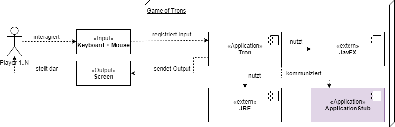

# Lösungsstrategie

|Use Case| Akteur | Funktionssignatur |Vorbedingung| Nachbedingung | Ablaufsemantik | Fehlersemantik |
| --- | --- | --- | --- | --- | --- | --- |
|UC1 | Controller | void handleInputPlayerCount(int playerCount) | Der Nutzer hat die gewünschte Spieleranzahl eingegeben und auf den Button "Start" gedrückt. | Der Nutzer befindet sich in der Lobby. | Der Controller lädt alle für das Spiel benötigten Parameter aus der Config-Datei. Der Controller schickt spezifische Parameter jeweils an die View und an das Model, sodass der User in der Lobby auf weitere Mitspieler warten kann. | Wenn die Spieleranzahl keine Zahl zwischen 2 und 6 ist, wird die Methode loadDefaultPlayerCount() aufgerufen |
|UC1 | Controller | int loadDefaultPlayerCount() | Der Nutzer hat eine ungültige Spieleranzahl eingegeben. | Die Default-Spieleranzahl wird im Controller gespeichert. | Die Methode liefert den Default-Wert für die Spieleranzahl aus der Config-Datei. |  |
|UC1 | Controller |int[] loadConfigParameters() | Der User hat den "Start"-Button angeklickt. | Es wurde eine Liste mit Spielparametern erzeugt. |Die Methode liefert die Parameter aus der Config-Datei in einem int-Array der Länge 8.   **Index 0:** Die Spieleranzahl   **Index 1:** Die maximale Wartezeit   **Index 2:** Die Geschwindigkeit   **Index 3:** Die Spielfeldgröße   **Index 4:** Der minimale Wert der gültigen Spieleranzahlen   **Index 5:** Der maximale Wert der gültigen Spieleranzahlen   **Index 6:** Das Flag für den remote-Spielmodus   **Index 7:** Das Flag für den partner-Spielmodus   |  |
|UC1 | Controller | HashMap<Integer, String[]> loadControls() | Der User hat den "Start"-Button angeklickt. | Die Steuerungen für alle Spieler wurden aus der Config geladen. |  **Spieler 1:** 'A'/'D'   **Spieler 2:** 'LEFT'/'RIGHT'  **Spieler 3:** 'G'/'J'  **Spieler 4:** 'DIGIT1'/'DIGIT3'  **Spieler 5:** 'DIGIT5'/'DIGIT9'  **Spieler 6:** 'I'/'P'    | |
|UC2 | Controller | void handleWaitingButtonClick() | Der Nutzer befindet sich alleine in der Lobby und hat auf den Button "Cancel" geklickt.| Der Spieler wird  zum Startbildschirm zurückgeleitet. | Die Methode bricht den Wartevorgang ab. Der Controller wechselt in den DELETE Zustand. | |
|UC3 | Controller | void notifyCountdownOver() | Der Countdown wurde von der View dem Nutzer angezeigt. | Die View und das Model laden den Spielstart. | Der Countdown ist vorbei und der Controller ruft die startGame()-Methoden des Models und der View auf. |  |
|UC4| Controller | void handleDirectionKeyboardInput(String key) |Der Nutzer hat eine Taste zur Steuerung seines Spielers gedrückt.| Die gewünschte Bewegung des Spielers wird im Model berechnet. | Es wird geprüft, ob für die gedrückte Taste eine Steuerung hinterlegt wurde. Die Richtung wird zusammen mit der Spielerid an das Model weitergeleitet. | Wenn eine Taste gedrückt wird für die keine Steuerung hinterlegt wurde, wird die Tasteneingabe ignoriert und nicht zum Model für weitere Berechnungen weitergeleitet. |
| UC1,2a,2b,3,6,7,8 | Controller | void setCurrentState(String) | Der Controller wurde gestartet oder ist bereits am laufen und befindet sich in einem State. | Der State des Controllers wurde gewechselt und die behavior() Methode des aktuellen States kann ausgeführt werden. | Die Methode kann vom Controller (bzw. der State Machine) selbst innerhalb der behavior() Methode aufgerufen werden oder von außen durch das Model. In einem String wird der Folgezustand übergeben. Beim Setzen des nächsten States wird direkt die behavior()-Methode ausgeführt. |  |   
| UC1,2a,2b,3,6,7,8 | Controller | void behavior() | Die State Machine hat ihren Zustand gewechselt und führt die behavior Methode aus. | Die behavior()-Methode wurde ausgeführt und ggf. der Zustand gewechselt. | Je nachdem in welchem State sich die State Machine aktuell befindet, wird die entsprechende behvior()-Methodenimplementierung ausgewählt und ausgeführt. |  |  
|UC6,7,8| Controller| void endGame(int result)| Im Model wurde ein Gewinner festgelegt oder das Spiel wurde als unentschieden entschieden. | Die State Machine im Controller befindet sich im Zustand "End" | Die Methode leitet das Spielergebnis an die View weiter und die State Machine wechselt zum Zustand "End"| |
|UC1| Model | ``void join(int, int)`` | Ein Spieler möchte dem Spiel durch Drücken auf Start beitreten oder ist der erste und erstellt damit ein Spiel | Der Spieler wurde im Spiel registriert. Wenn das Spiel voll ist, wird es gestartet | Nach Klick auf Start wird diese Methode mit der Anzahl der Spieler aus dem Feld des Startbildschirms und der maximalen Wartezeit aufgerufen. Ist noch kein `fullPlayerCount` gesetzt, ist die übergebene Anzahl die Lobbygröße. Die Anzahl der Spieler in der Lobby werden hochgezählt. Dann wird geschaut, ob die Lobby voll ist und dann entweder das Spiel gestartet oder die Anzahl der wartenden Spieler in der View aktualisiert und der Warte-Timer zurückgesetzt | 1. Ein Spieler tritt mit seiner eingetragenen Anzahl an Spielern bei, die Lobby hat aber schon eine gesetzte Größe. Dann wird der Spieler darüber informiert (`informUser()`) |
|UC2a+b | Model | ``void cancelWait()`` | Der Cancel-Button wurde gedrückt oder die maximale Wartezeit ist abgelaufen | Das Spiel wurde abgebrochen und alles zurückgesetzt | fullPlayerCount und numPlayers werden auf 0 gesetzt, der Timer abgebrochen, der User informiert und die Spielinstanz im Controller gelöscht | |
|UC3| Model |``void startGame(int, int)``| Es sind genug Spieler beigetreten|Das Spiel wurde initialisiert und alle Spieler befinden sich auf ihrer Startposition und sehen den Spielbildschirm | startGame() wird mit Anzahl Reihen (Spalten entfallen, da das Spielfeld quadratisch ist) und Spielgeschwindigkeit aufgerufen. Das Spielfeld und die Spieler werden initialisiert und die Spieler auf ihre Startpositionen gesetzt ||
|UC4 | Model | ``void changePlayerDirection(int, String)`` | Der Nutzer hat eine Taste für die Richtungsänderung gedrückt und die gewünschte Richtung wurde ermittelt. | Der Spieler wurde um 90° in die gewünschte Richtung gedreht.|Der Methode werden als Parameter die Spieler-ID und ein String übergeben, welche die Information liefert, ob der Spieler nach links oder nach rechts gesteuert wird. Der Spieler mit der ID wird in der Liste der Spieler gesucht. Es wird überprüft, ob der Spieler noch am Leben ist und ob er in diesem Tick bereits eine Aktion getätigt hat. Aus der aktuellen front und der Richtung des Spielers bezogen aufs Spielfeld werden die neue front und die neue Richtung berechnet und gesetzt. Außerdem wird gespeichert, dass der Spieler diesen Tick eine Aktion getätigt hat. | Wenn der Spieler mit der übergebenen ID nicht unter den Spielern gefunden wurde, nicht am Leben ist oder bereits eine Aktion diesen Tick gemacht hat, wird die Eingabe ignoriert. |
|UC4,5,6,7,8 | Model | ``void update()`` | Das Spiel befindet sich im Zustand RUNNING. | Alle lebenden Spieler wurden bewegt, das Spiel ist möglicherweise vorbei. | Diese Methode ist die tick-Methode/ der Gameloop des Spiels. Sie wird also in festen Zeitintervallen ausgeführt. Diese Methode ruft intern `updatePlayers()` zum Aktualisieren der Spieler auf (Bewegen und Töten). Dann wird der GameState geprüft. Ist das Spiel RUNNING, werden alle neuen Positionen der Spieler an die View mittels `getPlayerPositions()` und ``updatePlayer()`` übermittelt. Tote Spieler werden hier auch mitgeschickt mit der Info, dass sie entfernt werden sollen. Ist das Spiel OVER wird stattdessen der Sieger erfragt und an den Controller übermittelt, um das Spiel zu beenden.||
|UC4,5,6,7,8 | Model | ``void updatePlayers()`` | Das Spiel befindet sich im Zustand RUNNING. Diese Methode wurde in ``update()`` aufgerufen. | Alle Spieler wurden bewegt und eventuell Spieler getötet. | Es wird zu Beginn eine leere Liste initialisiert für Spieler, die diesen Zug sterben könnten. Dann werden alle Spieler bewegt, von denen diesen Tick kein Input kam (mit ``movePlayersNoInput()``). Danach wird über alle lebenden Spieler iteriert. Spieler werden der Liste hinzugefügt, wenn es eine Kollision an ihrer front gibt (geprüft durch ``checkForCollision()``). Wenn es keine Kollision für den aktuell betrachteten Spieler gibt, wird `movePlayer` aufgerufen, um den Spieler zu bewegen. Wurden alle Spieler abgehandelt, werden in der Methode ``killPlayers()`` alle Spieler in der Liste getötet.||
|UC4 | Model | ``void movePlayersNoInput()`` | Das Spiel befindet sich im Zustand RUNNING. Diese Methode wurde in ``updatePlayers()`` aufgerufen. | Alle Spieler wurden diesen tick bewegt | Es wird über alle Spieler iteriert. Für jeden, der keine `currentAction` hat, wird mit ``calcNextPos()`` die nächste Position in der aktuellen Richtung berechnet und als front des Spielers gesetzt |  |
|UC4 | Model | ``Position calcNextPos(Position, Direction, String)`` | Die neue Position eines Spielers soll ermittelt werden | Die neue Position wurde berechnet und zurückgegeben | Zuerst wird ein int[] initialisert mit den Änderungen für x und y je nach Richtung (LEFT,UP,RIGHT,DOWN). Dann wird anhand der übergebenen Richtung und der `action` als String die resultierende Richtung ermittelt. Anhand der ordinalen Ordnung dieser Richtung im enum werden die Änderungen für x und y mithilfe des int[] bestimmt und zurückgegeben | |
|UC5 | Model | ``boolean checkForCollision(Position)`` | Das Spiel befindet sich im Zustand RUNNING. Diese Methode wurde in ``updatePlayers()`` aufgerufen. | Eine Kollision wurde korrekt erkannt und zurückgegeben. | Der Methode wird die front eines Spielers übergeben. Befindet sich diese außerhalb des Spielfelds - x > Anzahl Spalten oder y > Anzahl Reihen oder eins der beiden < 0 - wird true zurückgegeben. Wenn  front gleich der front eines anderen lebenden Spielers ist, wird auch true zurückgegeben. Ist das nicht der Fall wird geschaut, ob sich die front in einem trail eines lebenden Spielers (auch des Spielers selbst) befindet. Auch hier wird demnach true zurückgegeben, sonst false. ||
|UC4 | Model | ``void movePlayer(Player)`` | Das Spiel befindet sich im Zustand RUNNING. Diese Methode wurde in ``updatePlayers()`` aufgerufen.| Der Spieler wurde bewegt, indem die front dem trail angefügt wurde | Die front des übergebenen Spielers wird an den trail angehangen. Die currentAction wird auf null gesetzt ||
|UC4,5,6,7,8 | Model | ``void killPlayers(List<Player>)`` | Das Spiel befindet sich im Zustand RUNNING. Diese Methode wurde in ``updatePlayers()`` aufgerufen. | Zu tötende Spieler wurden getötet und eventuell ein Sieger des Spiels bestimmt. | Ist die übergebene Liste leer, wird einfach zurückgekehrt. Dann wird geprüft, ob die Listengröße gleich Anzahl lebender Spieler ist. In dem Fall hat man ein Unentschieden, der gameWinner wird auf -1 und der GameState auf OVER gesetzt und es wird returned. Andernfalls werden alle Spieler der Liste auf tot gesetzt. Ist danach nur noch ein Spieler übrig, ist dies der Gewinner, gameWinner wird auf seine ID und der GameState auf OVER gesetzt. ||
|UC1, UC2, UC5 | View | void informUser(String) | Ein Fehler ist aufgetreten | Dem Nutzer wird ein Meldungsfenster mit der entsprechenden Fehlerbeschreibung angezeigt. |Zeigt die übergebene Fehlerbeschreibung dem Nutzer an | |
|UC1, UC2, UC6, UC8 | View |void showScreen(String) | Der Spielzustand wurde im Controller gewechselt. | Dem Nutzer wird einen anderen Bildschirm angezeigt. |Die Methode zeigt den Bildschirm an, der zum übergebenen Bildschirmzustand passt.  | Wenn zum übergebenen Zustandsparameter kein anzuzeigenden Bildschirm gehört, wird eine Exception mit einer Fehlerbeschreibung geworfen. |
|UC4 | View | void initPlayersInPositions() | Die Methode initializeGameField() wurde aufgerufen. | Die Spieler wurden mit den berechneten Startpositionen und Ausrichtungen instanziiert. |Die Methode berechnet die Startpositionen für jeden Spieler je nach Spieleranzahl, die möglichst fair sind, d.h. alle Spieler haben den gleichen Abstand von einander und von den Wänden. Die berechneten Ausrichtungen werden so berechnet, dass alle Spieler dem Zentrum des Spielfeldes gewendet sind. | |
|UC4 | View | void drawTileColors(Player) | Das Spiel hat begonnen. |Das Spielfeld wirm im aktuellen Spielzustand angezeigt. |Die Methode iteriert über die Tiles,die mit der Farbe des übergebenen Spielers eingefärbt werden sollen und füllt sie mit der Farbe des Spielers. | |
|UC5, UC7| View |removeTileColors(Player) | Ein Spieler ist gestorben und die Methode kill() wurde in der View aufgerufen. | Die Felder, die zum Trail des übergebenen Spielers gehören sind nicht mehr eingefärbt, sondern haben die gleiche Farbe wie der Spielhintergrund.| Die Farbe der Felder, die zum Trail des übergebenen Spielers gehören, wird gelöscht. | |
|UC5, UC7| View |kill(int) | Die View wurde informiert, dass ein Spieler gestorben ist. | Der tote Spieler wurde aus der Spielerliste entfernt und seine eingefärbten Felder wurden zurückgesetzt.| Ruft die Methode removeTileColosr() auf und entfernt den Spieler aus der Spielerliste. |   |
| UC1-8 | View |updatePlayer(int ID, int X, int Y, int orientation) |Im Model wurden Daten zu den Spielern geändert. | Die View zeigt die aktualisierten Daten an. | Die Methode prüft, ob x == -1 oder ob y == -1 ist. In dem Fall ist der Spieler kollidiert und muss aus dem Spiel entfernt werden. Dafür wird die Methode kill(int ID) aufgerufen. Wenn der Spieler nicht kollidiert ist, dann wird die als Integer übergebene Spielerorientierung in einen String übersetzt und der Methode updateTrailAndOrientation() übergeben, damit die Spielerdaten aktualisiert werden. Im Anschluss wird die Bildschirmanzeige aktualisiert durch den Aufruf von drawTileColors()  | |
| UC3 | View | startGame(int, int)| Alle Spieler haben den Warteraum betreten.|Die View zeigt das Spielfeld und die Spieler an ihren Startpositionen an. |Die Methode setzt die Spielfeldgröße in der View, die aus der Config-Datei geladen wurde. Anhand der Spielfeldgröße und der Spieleranzahl wird das Spielfeld erzeugt, die Spieler werden instanziiert und positioniert.| |
|UC6,7,8|View|notifyGameResult(int)| Die State Maschine des Controllers befindet sich im Zustand "End"| Die View weiß, wie das Spiel ausgegangen ist und zeigt im  den Endbildschirm mit dem Spielergebnis an.| Die Methode setzt den Gewinner des Spiels in der View-Komponente und zeigt den Endbildschirm an. Wenn das Ergebnis keine SpielerID ist, sondern eine -1, dann ist das Spiel unentschieden ausgegangen. Darüber wird der Spieler über den Endbildschirm informiert.| |
| UC3 | View |updateNumPlayers(int)| Ein weiterer Spieler hat die Lobby betreten| Die Lobbybildschirmanzeige zeigt die aktuelle Anzahl wartender Spieler an. Alle wartende Spieler haben eine SpielerID.  |Die Methode setzt die Anzahl der Spieler in der View auf den übergebenen Wert. Die registrierten Listener werden aktiv und führen die Event-Handler aus. Die Methode updateCurrentPlayerID() wird aufgerufen| |
|UC3 | View | updateCurrentPlayerID(int) | Wenn der Spieler die SpielerID -1 ist, wird die SpielerID auf den übergebenen Wert -1 gesetzt. | |

# Bausteinsicht
## Ebene 1

### Whitebox Gesamtsystem

Game Of Trons ist in drei Komponenten aufgeteilt, die in der unteren Abbildung zu sehen sind.
Die Komponenten bieten über Schnittstellen ihre Funktionalitäten an und nutzen ebenso über Schnittstellen die Funktionalitäten anderer Komponenten.

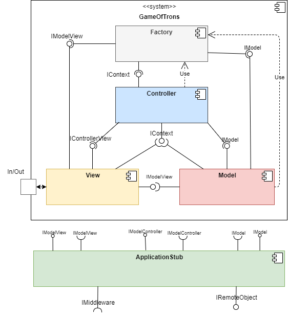 

Die Komponentenaufteilung richtet sich nach dem eingesetzten MVC-Architekturmuster. 

**Enthaltene Bausteine**

| Baustein | Kurzbeschreibung |
| --- | --- |
| Model | Enthält das Datenmodell und die Spielelogik |
| View | Verantwortlich für die GUI-Anzeige und das Empfangen von Nutzereingaben|
|Controller | Regelt die Ablaufsemantik außerhalb des Spiels und vermittelt zwischen Model und View.|
| Application Stub | Fängt Methodenaufrufe auf und leite sie an die Middleware weiter. Wird von der Middleware aufgerufen, um Methodenaufrufe an die aufgerufene Klasse weiterzuleiten. |

### Model (Blackbox)

**Zweck/ Verantwortung**

Das Model ist in unserem Spiel für die Lobby- und die Spielelogik zuständig. Für die Lobby registriert es neue Spieler und startet das Spiel bei voller Lobby oder bricht es im Bedarfsfall ab. Für das Spiel berechnet es den aktuellen Spielstand anhand der Eingaben und gibt die Informationen an die View weiter

**Schnittstelle(n)**

Um einen Spielstart und ein Spielende zu signalisieren, benötigt das Model die angebotene Schnittstelle *IContext* vom Controller. Um die angezeigten Daten in der View zu aktualisieren, benötigt das Model die Schnittstelle *IModelView* von der View. Das Model selbst bietet die Schnittstelle *IModel* für den Controller an, um die Lobby zu steuern, das Spiel zu initialisieren und über Tasteneingaben informiert zu werden.

| Methode | Kurzbeschreibung |
| --- | --- |
| ``join(int, int)`` | Zum Erstellen oder Beitreten einer Lobby |
| ``cancelWait()`` | Zum Abbrechen der Lobby durch Ablaufen der Wartezeit oder Drücken auf 'Cancel' |
| ``startGame(int,int)`` | Lässt das Spiel mit den übergebenen Einstellungen (Spielfeldgröße und Spielgeschwindigkeit) starten |
| ``changePlayerDirection(int,String)`` | Für Verarbeitung der Tasteneingaben für einen Spieler |
| ``setNumPlayers`` | Zum Setzen der Spieleranzahl |

### View (Blackbox) 

**Zweck/ Verantwortung**

 Das View-Subsystem implementiert die gleichnamige View des eingesetzten MVC-Patterns.
 Die Komponente stellt die grafische Benutzeroberfläche bereit. Es nimmt Aktionen vom Nutzer entgegen und leitet diese zum Controller weiter. 

 Bei Bedarf, im Falle einer Änderung im Datenmodell (Datenmodell wird im Subsystem Model verwaltet), wird die View darüber informiert und passt die angezeigten Inhalte an.

**Schnittstelle(n)**

Die View bietet die Bildschirmanzeigefunktionalität, das Setzen der Spielfeldgröße und das Setzen des Spielergebnisses über die Schnittstelle **IControllerView** an.

| Methode | Kurzbeschreibung |
| --- | --- |
| showScreen(String) | Zeigt den Bildschirm an, der zum als String übergebenen Programmzustand passt. |
| startGame(int playerCount, int fieldSize) | Initialisiert das Spielfeld mit der übergebenen Spieleranzahl und Spielfeldgröße. Das Spielfeld wird angezeigt.|
| notifyGameResult(int) | setzt ein Spielergebnis in der View. Die Methode wird mit der SpielerID des Gewinners aufgerufen oder mit -1, wenn das Spiel unentschieden ist. |

Die View erlaubt das Aktualisieren der Spielerdaten und die Anzeige von Meldungen über die Schnittstelle **IModelView**

| Methode | Kurzbeschreibung |
| --- | --- |
|updatePlayer(int, int, int, int) | Aktualisiert die Spielerliste, die in der View gehalten wird. Der erste Parameter ist die ID des zu aktualisierenden Spielers. Der zweite und dritte Parameter sind die neuen X- und Y-Koordinate des Spielers. Wenn die Koordinaten -1 und -1 betragen, dann ist der Spieler tot. |
|informUser(String message) | Erzeugt ein Alert-Fenster mit der übergebenen Nachricht als Inhalt.|
|updateNumPlayers(int) | Aktualisiert die Anzahl der Spieler in der View und weist wartenden Spielern ohne SpielerID eine neue SpielerID zu. |

### Controller (Blackbox) 

**Zweck/ Verantwortung**

Der Controller steuert den gesamten Ablauf rund um das Spiel. Diese Aufgabe umfasst das Laden der Spielparameter aus der Config, das Weiterleiten zwischen den verschiedenen Screens und an vielen Stellen Kommunikation mit und zwischen Model und View. In der Vorbereitung des Spiels, koordiniert der Controller das Informieren der View und des Models über alle Spielparameter. Während des Spiels nimmt der Controller die Benutzereingaben zur Steuerung des Spielers an, verarbeitet diese und leitet sie an das Model weiter. Nach dem Spiel informiert der Controller die View über das Spielergebnis und leitet das Löschen des Spiels ein.

**Schnittstelle(n)**

Der Controller bietet Funktionalitäten für das Model und die View über die Schnittstelle **IContext** an.

| Methode | Kurzbeschreibung |
| --- | --- |
| void setCurrentState(String state)| Den Übergang der State Machine in den nächsten Zustand kann das Model anstoßen oder der Controller selbst bewirken. Die behavior()-Methode wird durch den Zustandswechsel gestartet. |
| void handleInputPlayerCount(int playerCount) | Der Nutzer drückt den Start-Button. Das Laden und die Verarbeitung der Config-Parameter wird eingeleitet. Der Spieler tritt der Lobby bei. |
| void handleWaitingButtonClick()| Der Nutzer drückt den Cancel-Button. Wartevorgang wird abgebrochen. |
| void handleDirectionKeyboardInput(String key)| Der Nutzer tätigt  eine Tastatureingabe zur Steuerung seines Spielers. Wenn eine Richtung für die Taste in der Config hinterlegt wurde, wird die Richtung zusammen mit der Spielerid an das Model geschickt. |
| void notifyCountdownOver() | Die View hat die Countdownanzeige abgeschlossen und benachrichtigt den Controller, dass der Countdown vorbei ist. Der Controller ruft die startGame()-Methoden des Models und der View auf und leitet den Spielstart ein. |
| void endGame(int result)| Das Model ruft die Methode endGame() auf und übergibt als Parameter das Spielergebnis in Form eines int. Das Spielergebnis wird an die View weitergeleitet. Die State Machine wechselt vom Zustand GAME in den Zustand END. |

### Factory

**Zweck/ Verantwortung**

Die Komponente Factory bietet eine Factory nach außen an, um Caller-/ Realimplementierungsreferenzen zurückzugeben. Dabei wird das gewünschte Interface und ob remote gespielt wird übergeben.

**Schnittstelle(n)**

Die einzige von außen aufrufbare Klasse heißt MVCFactory, die in den Klassen genutzt werden kann.

| Methode | Kurzbeschreibung |
|-|-|
| Object getInterface(String, boolean) | Es wird ein Objekt vom Interface im übergebenen String zurückgegeben. Wenn remote gespielt wird, ist der zweite Parameter true und das Caller Objekt wird zurückgegeben, sonst das der Realimplementierung |

### Application Stub (Blackbox) 

**Zweck/ Verantwortung**

Der Application Stub fängt Methodenaufrufe auf, die Schnittstellen von Remote-Komponenten aufrufen. Beim Auffangen wird die Middleware aufgerufen.

Außerdem leitet der Application Stub einen durch die Middleware empfangenen Methodenaufruf an die richtuge Komponentenschnittstelle weiter, wo der Aufruf abgearbeitet wird.

**Schnittstelle(n)**

Die Schnittstelle **IRemoteObject** bietet die Funktionalität zum Empfangen von Remote-Methodenaufrufen an. 

| Methode | Kurzbeschreibung |
| - | - |
|call(String methodName, Object[] args) | Eine zu importierende Schnittstelle wird gefragt, ob eine Methode mit dem Namen "methodName" vorhanden ist. Wenn ja, dann wird diese Methode mit den Aufrufparametern im Array "args" aufgerufen.|

## Ebene 2 

### Whitebox Model

### Whitebox View

### Whitebox Controller

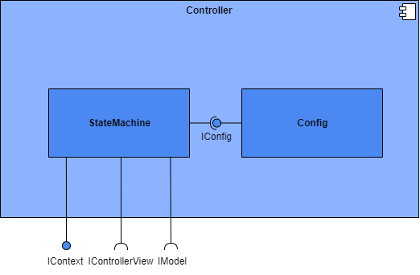
 

### Whitebox Factory

### Whitebox Application Stub

## Ebene 3 

### Whitebox Model

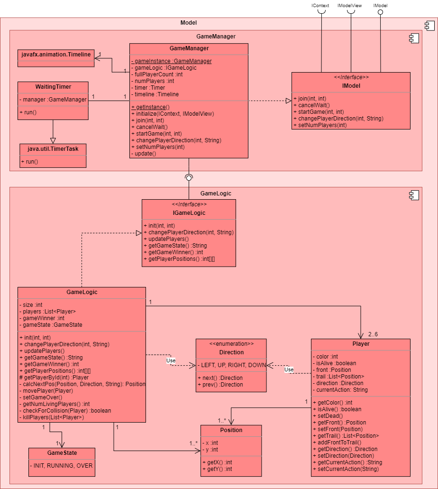

*Öffentlich (GameManager und GameLogic):*
| Methode | Kurzbeschreibung |
| --- | --- |
| ``getInstance()`` | Liefert die IModel-Instanz(Singleton-Pattern)|
| ``initialize(IContext,IModelView)`` | Zum Herstellen der Referenzen |
| ``join(int, int)`` | Zum Erstellen oder Beitreten einer Lobby |
| ``cancelWait()`` | Zum Abbrechen der Lobby durch Ablaufen der Wartezeit oder Drücken auf 'Cancel' |
| ``startGame(int,int)`` | Lässt das Spiel mit den übergebenen Einstellungen (Spielfeldgröße und Spielgeschwindigkeit) starten |
| ``changePlayerDirection(int,String)`` | Für Verarbeitung der Tasteneingaben für einen Spieler|
| ``init(int,int)`` | Wird in `startGame()` aufgerufen und initialisert das Spiel |
| ``updatePlayers()`` | Aktualisiert die Position aller Spieler und bereitet tote Spieler auf ihre Entfernung vor |
| ``getGameState()`` | Liefert den GameState für den Manager als String |
| ``getGameWinner()`` | Liefert die id des Siegers oder -1 bei Unentschieden |
| ``getPlayerPositions()`` | Liefert die Positionen aller Spieler im Format int[4] mit {Spieler-ID,x,y,dir} für die aktuelle Position und Richtung als ordinal und {Spieler-ID,-1,-1,-1} wenn der Spieler tot ist |
| ``setNumPlayers`` | Lässt die Anzahl der Spieler setzen vor Spielstart |

``Player`` und ``Position`` haben nur Getter/ Setter als öffentliche Methoden. ``prev()`` und ``next()`` von ``Direction`` liefern die ordinal vorherige/ nächste Richtung von LEFT,UP,RIGHT,DOWN. In ``run()`` von ``WaitingTimer`` wird ``cancelWait()`` von ``GameManager`` aufgerufen, um das Spiel abzubrechen.

*Privat:*
| Methode | Kurzbeschreibung |
| --- | --- |
| ``update()`` | Der Gameloop/ die tick-Methode des Spiels. Aktualisiert alle Spieler und schickt Updates/ Spielergebnis an die View/ den Controller |
| ``getPlayerById(int)`` | Liefert das Player-Objekt mit der übergebenen id |
| ``calcNextPos(Position,Direction,String)`` | Liefert die berechnete Position aus den übergebenen Parametern |
| ``movePlayer(Player)`` | Bewegt den übergebenen Spieler weiter, indem seine front an den trail gehangen wird |
| ``setGameOver()`` | Setzt den GameState auf OVER |
| ``getNumLivingPlayers()`` | Liefert die Anzahl der noch lebenden (``isAlive=true``) Spielern |
| ``checkForCollision(Player)`` | Gibt zurück, ob ein Spieler eine Kollision hat |
| ``killPlayers(List<Player>)`` | Tötet alle Spieler die sich in der übergebenen Liste befinden |
   
### Whitebox View

  
  
 *ScreenManager* 

|Methode| Kurzbeschreibung|
| --- | --- |
|drawScreen(String screenName) | Wenn der übergebene Bildschirmname vorhanden ist, werden alle anderen Bildschirminstanzen auf unsichtbar gemacht (Aufruf resetScreen(). Die Instanz, die zum übergebenen Bildschirmnamen passt, wird sichtbar gemacht.|
|resetScreen() | Iteriert über alle vorhandenen Screens und macht sie unsichtbar. |
| showCountdown() | Holt die CountdownScreen-Instanz und ruft darauf die Methode startCountdown() auf. |
| updateView(int playerCount, int fieldSize) | Holt die GameScreen-Instanz, setzt die Spieleranzahl und die Spielfeldgröße und ruft initializeGameField() auf die GameScreen-Instanz auf.|
|updatePlayer(int id, int x, int y, int orientation | Prüft, ob x oder y -1 ist. Wenn ja dann wird kill() aufgerufen. Sonst wird die Player-Instanz mit der übergebenen ID geholt, die "orientation" wird in ein String-Format übersetzt und damit wird updateTrailAndOrientation aufgerufen. |
|informUser(String message) | Zeigt die ein Meldungsfenster mit der übergebenen Message als Inhalt dem Nutzer an.|
|drawTileColors(Player playerToDraw) | Iteriert über den Trail des übergebenen Spielers und malt jedes Feld, das zum Trail gehört in der Farbe des übergebenen Spielers.|
|kill(int playerID)| Entfernt den Spieler aus der Spielerliste und ruft remoteTileColors() mit dem betroffenen Spieler auf.|
|updateCurrentPlayerID(int id)|Es wird geprüft, ob eine die currentPlayerID schon gesetzt ist. Wenn nicht, dann wird die aktuelle ID auf den übergebenen Wert gesetzt.|
|endGame(int) | Setzt die Id des Gewinners in der EndScreen-Instanz und ruft drawScreen("end") auf. |
  
  
*StartScreen*
  
|Methode| Kurzbeschreibung|
| --- | --- |
|registerStartButtonEventHandler(TextField textfield, Button startButton) | Registriert einen Event-Handler, um die Controller-Schnittstelle aufzurufen, wenn der Start-Button gedrückt wird. Der Inhalt des Textfeldes wird dem Controller übergeben, wenn er nicht leer ist.|
  
*LobbyScreen*
|Methode| Kurzbeschreibung|
| --- | --- |
|registerCancelButtonEventHandler(Button cancelButton)| Registriert einen Event-Handler, um die Controller-Schnittstelle aufzurufen, wenn der Cancel-Button gedrückt wird.|
|addPlayerCounterListener(ObservableInteger playersInLobby) |Registriert einen Listener auf die Anzahl der wartenden Spieler. Wenn diese aktualisiert wird, dann wird der aktuelle Wert im Lobby-Bildschirm angezeigt. |
|addCurrentPlayerIDListener(ObservableInteger currentPlayerID) | Registriert einen Listener auf die PlayerID des Spielers. Wenn die gesetzt wird, dann wir din der Lobby seine Spielerfarbe und Steuerungstastaturbelegung angezeigt. |
 
  
*CountdownScreen*
|Methode| Kurzbeschreibung|
| --- | --- |
| startCountdown() | Startet den Countdown von 5 bis 0 für alle Spieler, die in der Lobby sind. |
  
   
*EndScreen*
|Methode| Kurzbeschreibung|
| --- | --- |
|registerWinnerListener() |Registriert einen Listener auf das Spielergebnis. Wenn das Ergebnis gesetzt wird, wird es in dem Endbildschirm angezeigt. |
 
*GameScreen*
|Methode| Kurzbeschreibung|
| --- | --- |
|registerKEyEventHandler()| Registriert einen Event-Handler, um die Controller-Schnittstelle aufzurufen.|
|initializeGameField(int playerNumber) | Zeichnet das Spielfeldraster, ruft initPlayersInPositions() und drawTileColors() auf alle Spieler auf. |
| initPlayersInPositions(int playerNumber)| Berechnet faire Startpositionen für jeden Spieler (abhängig von der Spieleranzahl). Berechnet die Startausrichtung von jedem Spieler, sodass jeder Spieler zum Zentrum des Spielfeldes ausgerichtet ist. Instanziiert die Spieler mit den berechneten Startpositionen- und Ausrichtungen und fügt sie der Spielerliste hinzu.|
| updatePlayer(int id,int x,int y,int orientation)| Prüft, ob der Spieler kollidiert ist. Wenn ja, dann wird kill() aufgerufen. Wenn nicht, wird die Ausrichtung in ein String-Format umgewandelt und updateCurrentTrailAndOrientation() aufgerufen. |
| removeTileColors(Player) | Entfernt die Einfärbung des Trails des übergebenen Spielers aus dem Spielfeld.|
| drawTileColors(Player) | Färbt die Felder des Spielfeldes, die zum Trail des übergebenen Spielers gehören in der Farbe des Spielers ein.|
| kill(int) | Entfernt den Spieler mit der übergebenen SpielerID aus der Spielerliste und ruft removeTileColors() auf. |

*ScreenCommons*
|Methode| Kurzbeschreibung|
| --- | --- |
|Color getColor(int) |Liefert die Farbe-Instanz zur angefragten SpielerID.|
| String getColorName(int) | Liefert den Farbennamen zur angefragten SpielerID. |
|String getPlayerControls(int) | Liefert eine Stringdarstellung der Steuerungstastaturbelegung zur angefragten SpielerID. |
  
  
*Player*
|Methode| Kurzbeschreibung|
| --- | --- |
|updateTrailAndOrientation(int x, int x, String orientation) | Fügt die neu hinzugekommenen Positionen dem Trail des Spielers zu. Ruft rotateImage(orientation) auf. |
|rotateImage(orientation) | Prüft, ob sich die Ausrichtung des Spielers verändert hat. Wenn ja, dann wird das Bild des Spielers entsprechende gedreht und die orientation wird auf den übergebenen Wert gesetzt. |
   
  
*IViewImpl*
|Methode| Kurzbeschreibung|
| --- | --- |
|IViewImpl getInstance() | Implementierung des Singleton-Patterns. Liefert die IViewImpl-Instanz zurück.|
| showScreen(String screenName) | Zeigt den Bildschirm an, der zum als String übergebenen Programmzustand passt. Wenn der Bildschirmname "countdown" ist, wird auch startCountdown() aufgerufen. |
| startGame(int playerCount, int fieldSize) | Ruft updateView() in ScreenManager auf.|
| notifyGameResult(int) | setzt ein Spielergebnis in der View. Die Methode wird mit der SpielerID des Gewinners aufgerufen oder mit -1, wenn das Spiel unentschieden ist. Ruft endGame() im Endbildschirm auf. |
|updatePlayer(int, int, int, int) | Ruft updatePlayer() in GameScreen auf. |
|informUser(String message) | Erzeugt ein Alert-Fenster mit der übergebenen Nachricht als Inhalt.|
|updateNumPlayers(int) | Aktualisiert die Anzahl der Spieler in der View und weist wartenden Spielern ohne SpielerID eine neue SpielerID zu. |
 
  
### Whitebox Controller

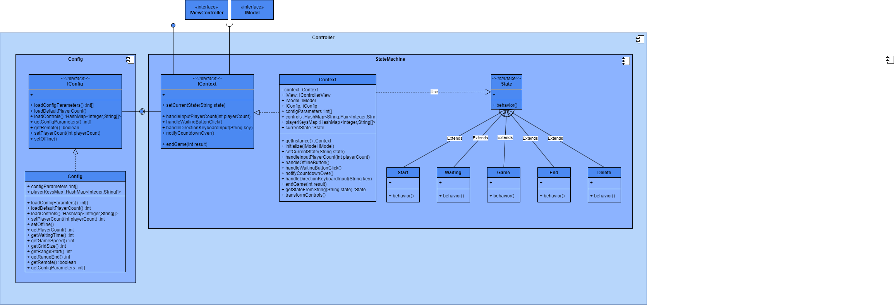

Controller
| Methode | Kurzbeschreibung |
| --- | --- |
| void behavior() | Führt nach einem Zustandswechsel die dem aktuellen State entsprechende behavior()-Implementierung aus. |

IConfig
| Methode | Kurzbeschreibung|
| --- | --- |
| int[] loadConfigParameters() | Liefert die für das Spiel relevanten Parameter aus der Config-Datei in einem Array. |   
| int loadDefaultPlayerCount() | Lädt den in der Config gespeicherten Defaultwert für die Spieleranzahl |   
| HashMap<Integer,String[]> loadControls() | Lädt die in der Config gespeicherten Tastensteuerungen für die Spieler. |

### Whitebox Factory

*Öffentlich*:
| Methode | Kurzbeschreibung|
| --- | --- |
| Object getInterface(String, boolean) | Es wird ein Objekt vom Interface im übergebenen String zurückgegeben. Wenn remote gespielt wird, ist der zweite Parameter true und das Caller Objekt wird zurückgegeben, sonst das der Realimplementierung |

*Protected*:
| Methode | Kurzbeschreibung|
| --- | --- |
| IModel getModel(boolean) | Gibt entweder ein Caller- oder Realimplementierungsobjekt, je nach boolean-Wert  |
| IModelView getModelView(boolean) | Gibt entweder ein Caller- oder Realimplementierungsobjekt, je nach boolean-Wert  |
| IContext getController(boolean) | Gibt entweder ein Caller- oder Realimplementierungsobjekt, je nach boolean-Wert  |

### Whitebox AppStub
   
**Caller-Whitebox**
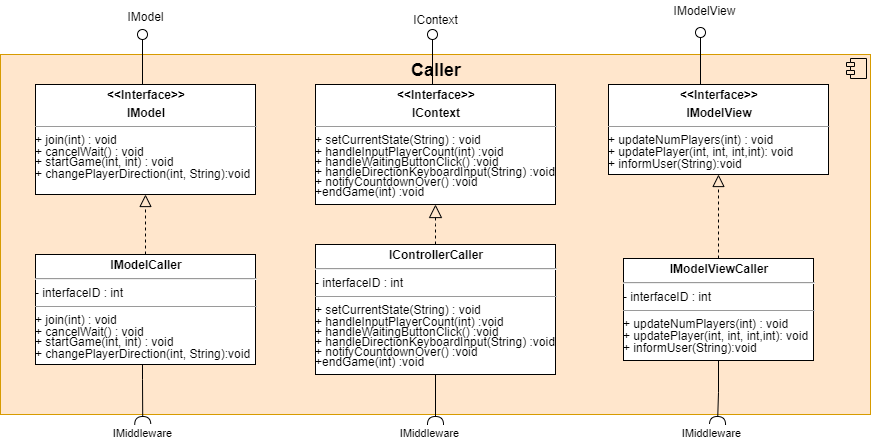

|Methode| Kurzbeschreibung|
| --- | --- |
|join(int)   cancelWait()   startGame(int, int)  changePlayerDirection(int, String)   setCurrentState(String  endGame(int)  updateNumplayers(int)  updatePlayer(int,int,int,int)  informUser(String) | Ruft die invoke(int interfaceID, String methodName, Object[] args)-Schnittstelle der Middleware auf. Für den Aufruf wird das InterfaceID der Caller-Klasse genommen, und die Aufrufparameter der Methode werden in ein Object-Array gepackt.|

 **Callee-Whitebox**

|Methode| Kurzbeschreibung|
| --- | --- |
|call(String methodName, Object[])| Eine zu importierende Schnittstelle wird gefragt, ob eine Methode mit dem Namen "methodName" vorhanden ist. Wenn ja, dann wird diese Methode mit den Aufrufparametern im Array "args" aufgerufen.|

Die komplette Methodenliste ist bereits in der Blackbox-Sicht (#applicationstubblackblox) des Application Stubs beschrieben, da alle Methoden über Schnittstellen nach außen hin angeboten werden.

# Laufzeitsicht

## Usecase 1 Create
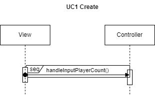
   
## Usecase 2a CancelWait
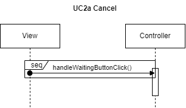

## Usecase 2b TimeUp
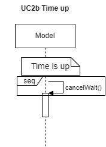

## Usecase 3 Start
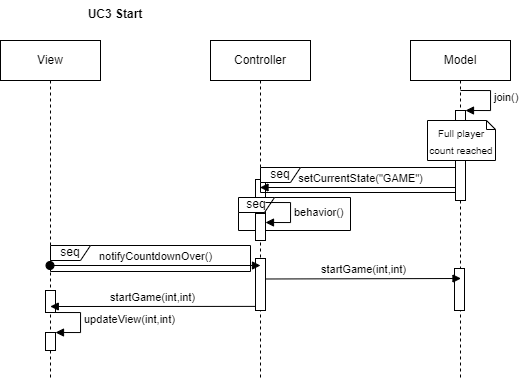

## Usecase 4 Spieler steuern

## Usecase 5 gegen Spielobjekt kollidieren

## UC6 Win

## UC7 Lose
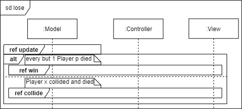

## UC8 Tie

## AD Start Applikation/ Entrypoint

## Model: AD join()
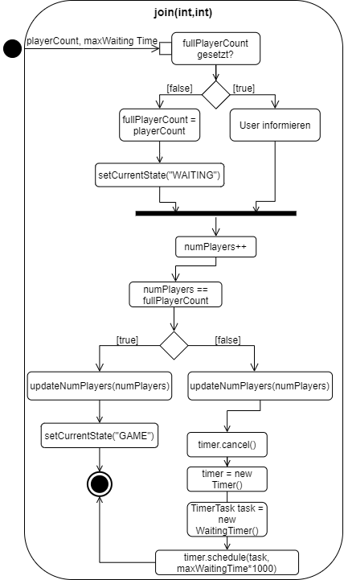

## Model: AD cancelWait()

## Model: AD startGame()
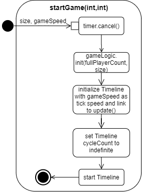

## Model: AD init()

## Model: AD update()
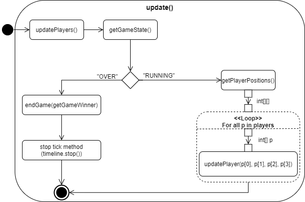

## Model: AD changePlayerDirection()
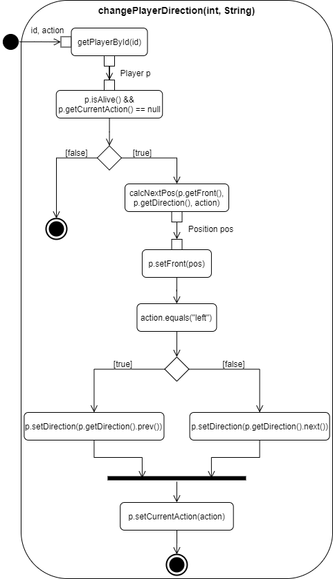

## Model: AD calcNextPos()

## Model: AD getPlayerPositions()

## Model: AD updatePlayers()
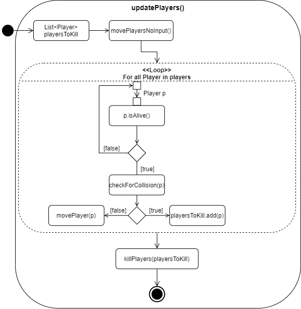

## Model: AD movePlayer()
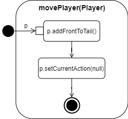

## Model: AD checkForCollision()

## Model: AD killPlayers()

  
## View: AD updatePlayer()

## View: AD kill()
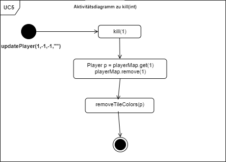
  
## View: AD updateTrailAndOrientation()
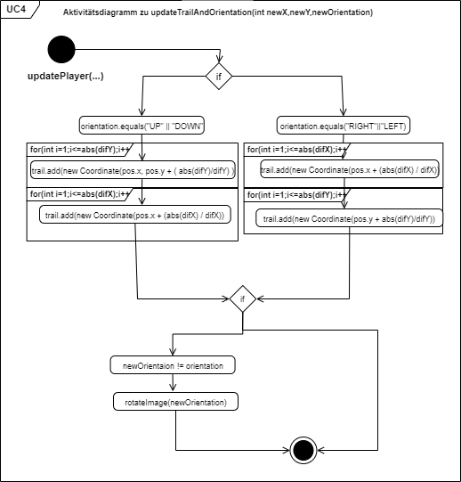

## Controller: AD handleDirectionKeyboardInput()
.png)
  
## Controller: AD handleInputPlayerCount()
.png)
  
## Controller: SEQ behavior()
.png)
  
## Controller: SEQ handleWaitingButtonClick()
.png)  
  
## Controller: SEQ notifyCountdownOver()
.png)
  
## Controller: SEQ endGame()
.png)
  
# Verteilungssicht 

# Querschnittliche Konzepte
  
## GUI
  
Die graphische Benutzeroberfläche wird mit dem JavaFX-Framework implementiert. Zu jedem Spielzustand gibt es eine separate Bildschirm-Klasse, die von einem JavaFx-Node ableitet.
 
Es gibt eine Klasse *ScreenManager*, die die Bildschirmklassen verwaltet und als "root" fungiert. Je nach Spielzustand, wird ein Bildschirm sichtbar oder unsichtbar gemacht. Außerdem wird über ScreenManager die Daten der Bildschirm aktualisiert und Methoden der Bildschirme aufgerufen.
  
## Daten
  
In unserer Applikation werden Daten nicht persistiert. Die Spieldaten sind also ausschließlich zur Laufzeit vorhanden. Dabei ist die Model-Komponente zuständig für die Datenhaltung und Datenoperationen. 
  
## Fehler- / Ausnahmesituationen
  
Wenn eine Fehler- oder Ausnahmesituation auftritt, z.B. fehlerhafte Nutzereingabe, tritt vordefiniertes Default-Verhalten in Kraft. Darüber wird der Nutzer über eine Meldung informiert.

## Spielfeldaktualisierungen

Das Spielfeld wird immer in Deltas der Positionen der Spieler aktualisiert.

# Architekturentscheidungen 

Ausschlaggebend für die Architektur ist das MVC-Entwurfsmuster, das häufig bei Anwendungen mit Benutzeroberfläche eingesetzt wird, was auch bei der hier behandelten Anwendung der Fall ist.

Dieses Entwurfsmuster implementiert das Prinzip des Separation of Concerns, wodurch die Wartbarbeit und des Systems steigt und Auswirkungen von Änderungen eher lokal bleiben. Diese Eigenschaften führen auch dazu, dass das System erweiterbar ist.

Die Vorteile, die das Einsetzen dieses Patterns bringen, sind für die Entwicklung dieser Software unerlässlich, da der Softwareentwicklungsprozess iterativ gestaltet ist und da Änderungen in der Logik oder Architektur aufgrund von neuen Wunschäußerungen durch die Stakeholder oder aufgrund von Fehleinschätzungen durch das unerfahrene Entwicklungsteam zu erwarten sind.

# Qualitätsanforderungen

## Qualitätsbaum

## Qualitätsszenarien

|ID |Szenario|
|---|--------|
|K01|Es lässt sich ein faires Spiel erstellen und starten mit 2-6 Spielern|
|F01|Ein Spieler verliert die Verbindung zum Spiel. Das Spiel geht trotzdem weiter für die anderen Spieler|
|F02|Eingaben eines Spielers kommen verzögert oder unregelmäßig an. Das Spiel registriert trotzdem für jeden Spieler regelmäßig gleich viele Eingaben und geht fair weiter|
|Z01|Pakete im Netzwerk haben Varianz in der Laufzeit (Jittering). Das Spiel geht trotzdem gleich schnell weiter|
|R01|Ein Spiel wurde beendet. Alle Spieler können den Endbildschirm sehen und werden dann zurück zum Startbildschirm geleitet. Die Option dasselbe Spiel zu wiederholen gibt es nicht.|

# Risiken und technische Schulden
  
Im Folgenden führen wir tabellarisch auf, welche Risiken wir im Vorfeld identifizieren konnten.

| Risiko | Beschreibung | Risikominderung |
| --- | --- | --- |
| Deadlineeinhaltung | Es liegen begrenzt Kenntnisse über Spielenticklung und vor allem Spiel-GUI-Entwicklung vor. Das könnte die Entwicklungszeit in die Länge ziehen und die Deadline-Einhaltung verlängern. | Wir bauen auf eine vorhandene Spiel-GUI auf und holen uns externen technischen Rat von Prof. Martin Becke. | 
| Mitarbeiterausfall | Die Entwicklungszeit liegt in der Grippe-Saison, was zu Ausfällen in unserem kleinen Team führen kann. Es besteht das Risiko, dass die Entwicklung einiger Komponenten zu kurz kommen. | Gesund Teammitglider springen nach Möglichkeit ein.|
| Schlechte Spielperformance | Durch die vielen Spielfelddatenaktualisierungen und das fehlende Wissen über Frontend-Technologien ist die Spielperformance im Voraus schlecht abzuschätzen und könnte sich für das Spielerlebnis als störend erweisen. | Spielperformance wird bei der Entwicklung beachtet und möglichst optimiert. |

# Glossar {#section-glossary}

|Begriff    |Definition|
|-----------|----------|
|Game Of Trons | Unser Spielname lehnt sich an die Fernsehserie "Game Of Thrones" an, da das Spielkonzept aus dem Film "TRONS" stammt. |
|Trail | Die Spur, die ein Spieler beim Bewegen auf dem Spielfeld hinterlässt. |
|Config-Datei | Einige Spieleinstellungen können textuell über diese Datei festgelegt werden. |
